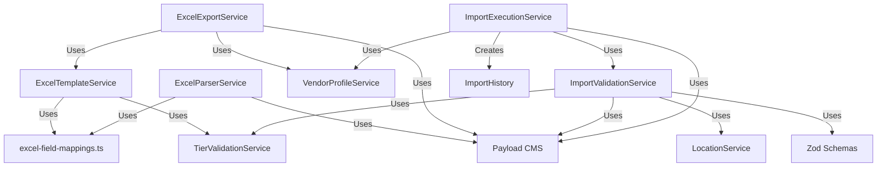
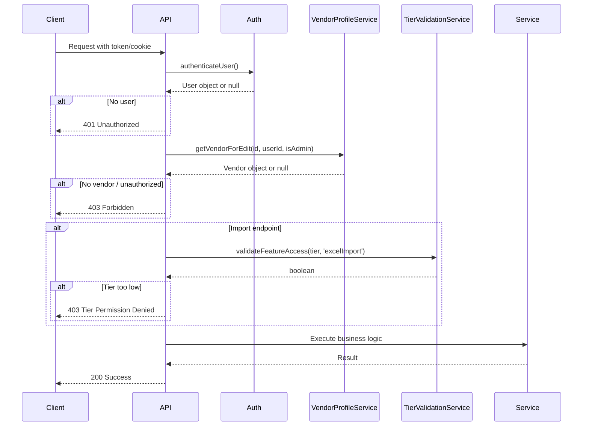
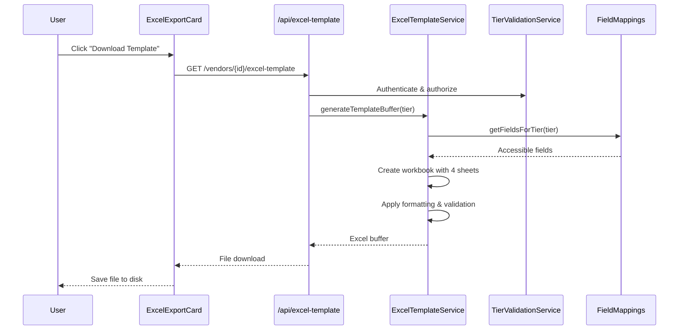
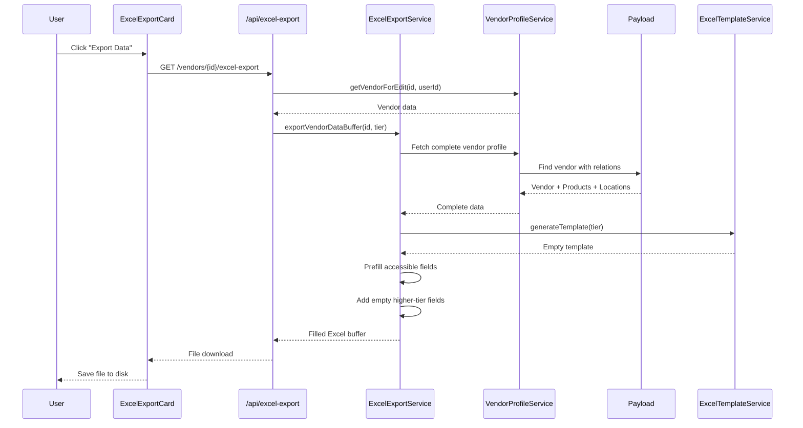
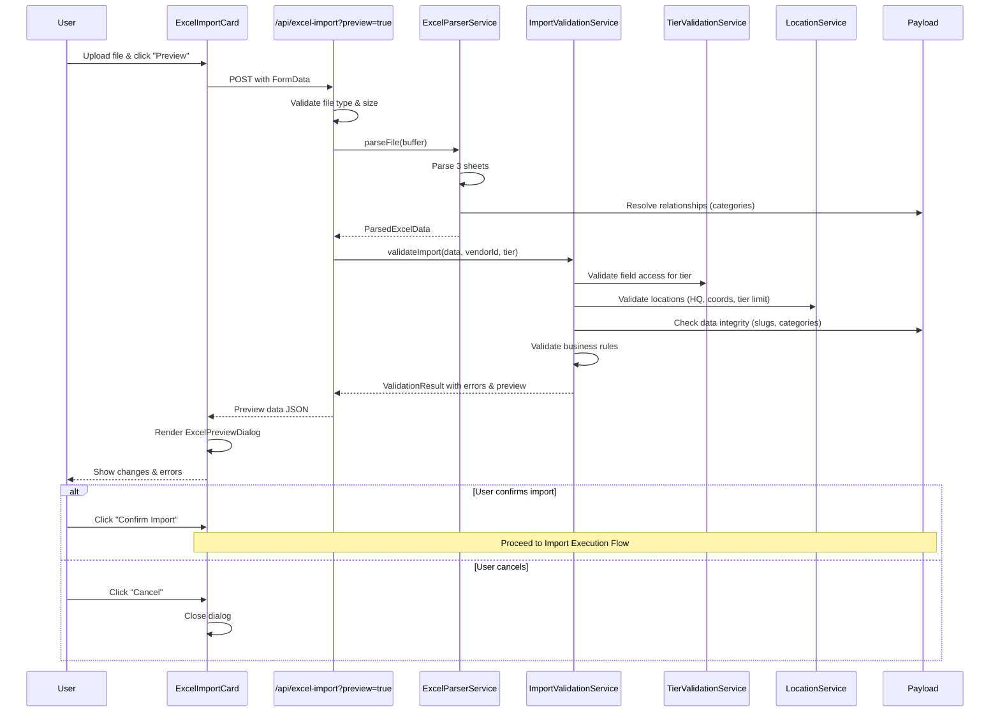
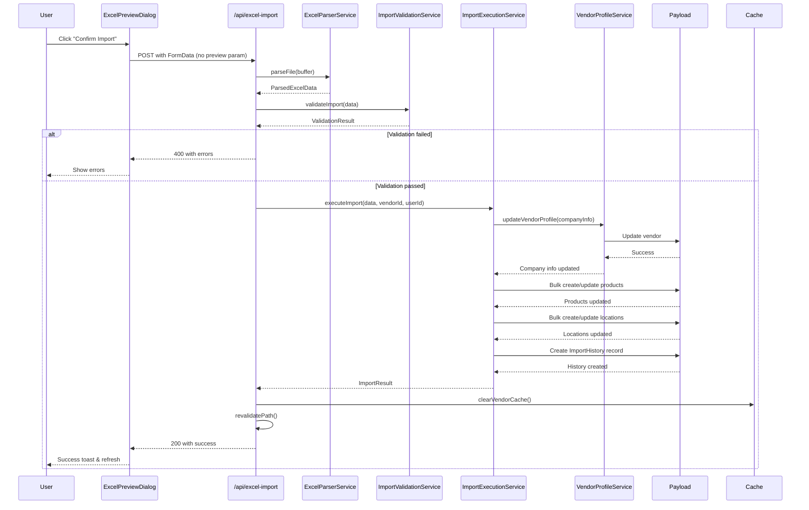
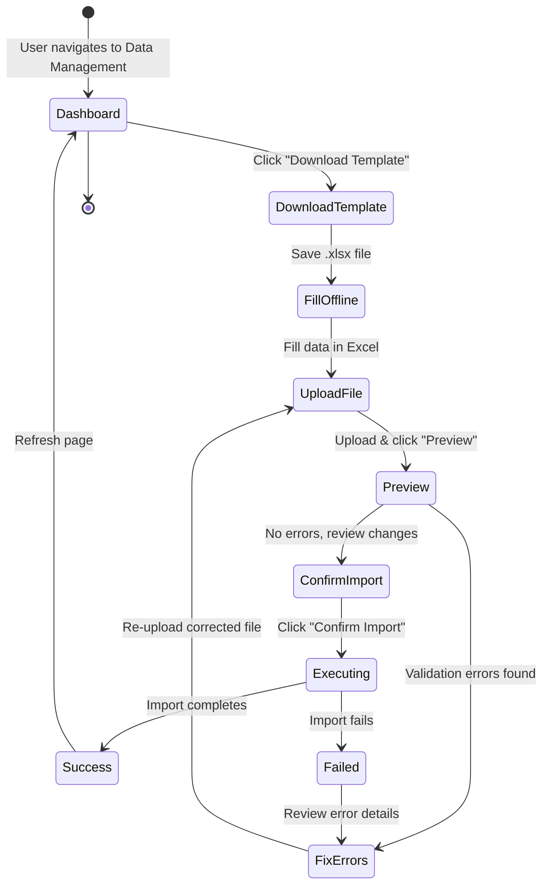

# Integration Strategy: Excel Vendor Import/Export Feature

**Version:** 1.0
**Created:** 2025-11-06
**Status:** Active
**Spec:** @.agent-os/specs/2025-11-06-excel-vendor-import-export/spec.md

---

## Executive Summary

This document defines the complete integration strategy for implementing the Excel vendor import/export feature into the existing Paul Thames Superyacht Technology platform. The feature enables vendors to bulk upload/update their company information, products, and locations through tier-based Excel templates with validation preview and atomic import execution.

**Integration Approach:**
- Leverage existing service patterns (TierValidationService, VendorProfileService, LocationService)
- Follow established authentication and authorization patterns
- Extend Payload CMS with new ImportHistory collection
- Integrate into existing vendor dashboard using tab-based navigation
- Maintain tier-based access control throughout all operations

---

## 1. Service Layer Architecture

### 1.1 New Services to Create

#### ExcelTemplateService
**Location:** `/lib/services/ExcelTemplateService.ts`

**Purpose:** Generate tier-appropriate Excel templates with proper structure, validation rules, and instructions.

**Key Methods:**
```typescript
class ExcelTemplateService {
  static async generateTemplate(tier: Tier, options?: TemplateOptions): Promise<ExcelJS.Workbook>
  static async generateTemplateBuffer(tier: Tier, options?: TemplateOptions): Promise<Buffer>
  private static createCompanyInfoSheet(workbook: ExcelJS.Workbook, tier: Tier): void
  private static createProductsSheet(workbook: ExcelJS.Workbook, tier: Tier): void
  private static createLocationsSheet(workbook: ExcelJS.Workbook, tier: Tier): void
  private static createInstructionsSheet(workbook: ExcelJS.Workbook, tier: Tier): void
  private static applyColumnFormatting(sheet: ExcelJS.Worksheet, fieldConfig: FieldConfig[]): void
  private static addDataValidation(sheet: ExcelJS.Worksheet, fieldConfig: FieldConfig[]): void
}
```

**Dependencies:**
- `lib/config/excel-field-mappings.ts` - Field configuration
- `TierValidationService` - Field access validation
- `exceljs` - Excel generation

**Integration Points:**
- Uses field mappings to determine tier-appropriate columns
- Applies Excel data validation rules (dropdowns, date formats, etc.)
- Includes tier-specific instructions

---

#### ExcelParserService
**Location:** `/lib/services/ExcelParserService.ts`

**Purpose:** Parse uploaded Excel files into structured data objects with type conversion and relationship resolution.

**Key Methods:**
```typescript
class ExcelParserService {
  static async parseFile(buffer: Buffer): Promise<ParsedExcelData>
  static async parseCompanyInfo(sheet: ExcelJS.Worksheet): Promise<ParsedCompanyData>
  static async parseProducts(sheet: ExcelJS.Worksheet): Promise<ParsedProduct[]>
  static async parseLocations(sheet: ExcelJS.Worksheet): Promise<ParsedLocation[]>
  private static convertCellValue(cell: ExcelJS.Cell, expectedType: FieldType): any
  private static resolveRelationships(data: ParsedData, payload: Payload): Promise<ResolvedData>
  private static sanitizeFormulaInjection(value: string): string
}
```

**Dependencies:**
- `exceljs` - Excel parsing
- `lib/config/excel-field-mappings.ts` - Field configuration
- Payload CMS - Relationship resolution (categories, etc.)

**Integration Points:**
- Converts Excel data types to TypeScript types
- Resolves category names to category IDs
- Strips Excel formulas to prevent injection attacks
- Handles multi-line text (descriptions)

---

#### ExcelExportService
**Location:** `/lib/services/ExcelExportService.ts`

**Purpose:** Export vendor data to Excel with current data pre-filled and tier-upgrade preview fields empty.

**Key Methods:**
```typescript
class ExcelExportService {
  static async exportVendorData(
    vendorId: string,
    currentTier: Tier,
    payload: Payload
  ): Promise<ExcelJS.Workbook>
  static async exportVendorDataBuffer(
    vendorId: string,
    currentTier: Tier,
    payload: Payload
  ): Promise<Buffer>
  private static prefillCompanyInfo(sheet: ExcelJS.Worksheet, vendor: Vendor, tier: Tier): void
  private static prefillProducts(sheet: ExcelJS.Worksheet, products: Product[], tier: Tier): void
  private static prefillLocations(sheet: ExcelJS.Worksheet, locations: VendorLocation[], tier: Tier): void
  private static addEmptyTierPreviewFields(sheet: ExcelJS.Worksheet, currentTier: Tier): void
}
```

**Dependencies:**
- `ExcelTemplateService` - Base template generation
- `VendorProfileService` - Fetch vendor data
- `TierValidationService` - Determine field access
- Payload CMS - Fetch products and locations

**Integration Points:**
- Fetches complete vendor profile with relationships
- Pre-fills accessible fields with current data
- Adds empty columns for higher-tier fields (preview)
- Annotates tier-locked fields in column headers

---

#### ImportValidationService
**Location:** `/lib/services/ImportValidationService.ts`

**Purpose:** Comprehensive validation of parsed Excel data against business rules, tier restrictions, and data integrity constraints.

**Key Methods:**
```typescript
class ImportValidationService {
  static async validateImport(
    parsedData: ParsedExcelData,
    vendorId: string,
    tier: Tier,
    payload: Payload
  ): Promise<ValidationResult>
  private static validateCompanyInfo(data: ParsedCompanyData, tier: Tier): ValidationError[]
  private static validateProducts(products: ParsedProduct[], tier: Tier): ValidationError[]
  private static validateLocations(locations: ParsedLocation[], tier: Tier): ValidationError[]
  private static validateTierAccess(fieldName: string, tier: Tier): boolean
  private static validateBusinessRules(data: ParsedData): ValidationError[]
  private static validateDataIntegrity(data: ParsedData, payload: Payload): Promise<ValidationError[]>
}
```

**Dependencies:**
- `TierValidationService` - Field access validation
- `LocationService` - Location-specific validation (HQ, coordinates, tier limits)
- `lib/validation/excel-import-schema.ts` - Zod schemas
- Payload CMS - Data integrity checks (unique slugs, category existence)

**Integration Points:**
- Reuses TierValidationService for all tier checks
- Leverages LocationService.validateVendorLocations() for location validation
- Applies Zod schemas for type and format validation
- Checks for duplicate products, invalid categories, etc.

**Validation Layers:**
1. **Schema Validation** - Type, format, required fields (Zod)
2. **Tier Validation** - Field access based on subscription tier
3. **Business Rules** - Single HQ, unique product names, valid categories
4. **Data Integrity** - No duplicate slugs, category IDs exist, location count within tier limit

---

#### ImportExecutionService
**Location:** `/lib/services/ImportExecutionService.ts`

**Purpose:** Execute atomic import of validated data into Payload CMS with proper error handling and rollback capability.

**Key Methods:**
```typescript
class ImportExecutionService {
  static async executeImport(
    validatedData: ValidatedExcelData,
    vendorId: string,
    userId: string,
    payload: Payload
  ): Promise<ImportResult>
  private static async importCompanyInfo(
    data: ParsedCompanyData,
    vendorId: string,
    payload: Payload
  ): Promise<ImportStepResult>
  private static async importProducts(
    products: ParsedProduct[],
    vendorId: string,
    payload: Payload
  ): Promise<ImportStepResult>
  private static async importLocations(
    locations: ParsedLocation[],
    vendorId: string,
    payload: Payload
  ): Promise<ImportStepResult>
  private static async createImportHistoryRecord(
    vendorId: string,
    userId: string,
    result: ImportResult,
    payload: Payload
  ): Promise<void>
  private static async rollbackOnFailure(
    completedSteps: ImportStep[],
    payload: Payload
  ): Promise<void>
}
```

**Dependencies:**
- `VendorProfileService` - Update vendor profile
- Payload CMS - Database operations
- `ImportValidationService` - Pre-execution validation
- ImportHistory collection - Audit trail

**Integration Points:**
- Uses VendorProfileService.updateVendorProfile() for company info updates
- Direct Payload operations for products and locations (bulk inserts)
- Creates ImportHistory record for audit trail
- Implements transaction-like rollback on failure

**Import Order (Critical):**
1. Company Information (vendor profile update)
2. Products (requires vendor to exist)
3. Locations (requires vendor to exist)

**Atomicity Strategy:**
- All validation MUST pass before any database writes
- If ANY step fails, attempt rollback of completed steps
- Return comprehensive error report with failed step details

---

### 1.2 Service Dependency Graph



**Critical Dependencies (Must Exist First):**
- `lib/config/excel-field-mappings.ts` - Required by all services
- `TierValidationService` - Already exists (no changes needed)
- `VendorProfileService` - Already exists (no changes needed)
- `LocationService` - Already exists (no changes needed)
- `payload/collections/ImportHistory.ts` - Must be created before import execution

---

### 1.3 Integration with Existing Services

#### TierValidationService Integration
**Pattern:** Direct method calls for field access validation

**Usage in ExcelTemplateService:**
```typescript
const accessibleFields = TierValidationService.getAccessibleFields(tier, 'vendor');
const companyFields = fieldMappings.companyInfo.filter(field =>
  accessibleFields.includes(field.name)
);
```

**Usage in ImportValidationService:**
```typescript
for (const field of Object.keys(data)) {
  const hasAccess = TierValidationService.validateFieldAccess(tier, field);
  if (!hasAccess) {
    errors.push({
      sheet: 'Company Information',
      field,
      message: `Field '${field}' requires higher tier subscription`,
      severity: 'error'
    });
  }
}
```

---

#### VendorProfileService Integration
**Pattern:** Use for all vendor profile updates to maintain existing validation logic

**Usage in ImportExecutionService:**
```typescript
const updateResult = await VendorProfileService.updateVendorProfile(
  vendorId,
  parsedData.companyInfo,
  {
    userId,
    skipTierValidation: false, // Always validate tier
    revalidate: true
  }
);
```

**Benefits:**
- Automatic computed field enrichment (via VendorComputedFieldsService)
- Consistent validation logic
- Cache invalidation handled automatically
- Path revalidation included

---

#### LocationService Integration
**Pattern:** Delegate all location-specific validation

**Usage in ImportValidationService:**
```typescript
const locationValidation = LocationService.validateVendorLocations(
  parsedData.locations
);

const tierValidation = await LocationService.checkTierLocationAccess(
  tier,
  parsedData.locations
);

// Auto-designate HQ if none specified
const locationsWithHQ = LocationService.autoDesignateHQLocation(
  parsedData.locations
);
```

---

## 2. API Route Structure

### 2.1 Route Definitions

All routes follow the existing pattern: `/app/api/portal/vendors/[id]/[action]/route.ts`

#### Route 1: Excel Template Download
**Path:** `/api/portal/vendors/[id]/excel-template`
**Method:** `GET`
**File:** `/app/api/portal/vendors/[id]/excel-template/route.ts`

**Request:**
- Headers: `Authorization: Bearer <token>` OR Cookie: `access_token=<token>`
- Path params: `id` (vendor ID)
- Query params: None

**Response (Success - 200):**
- Headers:
  - `Content-Type: application/vnd.openxmlformats-officedocument.spreadsheetml.sheet`
  - `Content-Disposition: attachment; filename="vendor-template-tier{N}.xlsx"`
- Body: Excel file buffer

**Response (Error - 401/403/404/500):**
```typescript
{
  success: false,
  error: {
    code: 'UNAUTHORIZED' | 'FORBIDDEN' | 'NOT_FOUND' | 'SERVER_ERROR',
    message: string
  }
}
```

**Implementation Pattern:**
```typescript
export async function GET(
  request: NextRequest,
  context: RouteContext
): Promise<NextResponse> {
  // 1. Authenticate user
  const user = await authenticateUser(request);
  if (!user) return unauthorized();

  // 2. Get vendor and authorize
  const { id } = await context.params;
  const vendor = await VendorProfileService.getVendorForEdit(id, user.id, user.isAdmin);
  if (!vendor) return forbidden();

  // 3. Generate template
  const buffer = await ExcelTemplateService.generateTemplateBuffer(vendor.tier);

  // 4. Return file
  return new NextResponse(buffer, {
    headers: {
      'Content-Type': 'application/vnd.openxmlformats-officedocument.spreadsheetml.sheet',
      'Content-Disposition': `attachment; filename="vendor-template-tier${vendor.tier}.xlsx"`
    }
  });
}
```

---

#### Route 2: Vendor Data Export
**Path:** `/api/portal/vendors/[id]/excel-export`
**Method:** `GET`
**File:** `/app/api/portal/vendors/[id]/excel-export/route.ts`

**Request:**
- Headers: `Authorization: Bearer <token>` OR Cookie: `access_token=<token>`
- Path params: `id` (vendor ID)
- Query params: None

**Response (Success - 200):**
- Headers:
  - `Content-Type: application/vnd.openxmlformats-officedocument.spreadsheetml.sheet`
  - `Content-Disposition: attachment; filename="vendor-data-export-{timestamp}.xlsx"`
- Body: Excel file buffer with pre-filled data

**Response (Error):** Same as template download

**Implementation Pattern:**
```typescript
export async function GET(
  request: NextRequest,
  context: RouteContext
): Promise<NextResponse> {
  const user = await authenticateUser(request);
  if (!user) return unauthorized();

  const { id } = await context.params;
  const vendor = await VendorProfileService.getVendorForEdit(id, user.id, user.isAdmin);
  if (!vendor) return forbidden();

  const payload = await getPayload({ config });
  const buffer = await ExcelExportService.exportVendorDataBuffer(
    id,
    vendor.tier,
    payload
  );

  const timestamp = new Date().toISOString().split('T')[0];
  return new NextResponse(buffer, {
    headers: {
      'Content-Type': 'application/vnd.openxmlformats-officedocument.spreadsheetml.sheet',
      'Content-Disposition': `attachment; filename="vendor-data-export-${timestamp}.xlsx"`
    }
  });
}
```

---

#### Route 3: Excel Import
**Path:** `/api/portal/vendors/[id]/excel-import`
**Method:** `POST`
**File:** `/app/api/portal/vendors/[id]/excel-import/route.ts`

**Request:**
- Headers:
  - `Authorization: Bearer <token>` OR Cookie: `access_token=<token>`
  - `Content-Type: multipart/form-data`
- Path params: `id` (vendor ID)
- Query params: `preview=true|false` (default: false)
- Body: FormData with `file` field (Excel file)

**Response (Preview Mode - 200):**
```typescript
{
  success: true,
  data: {
    preview: {
      companyInfo: {
        changes: { field: string, oldValue: any, newValue: any }[],
        errors: ValidationError[]
      },
      products: {
        toCreate: ParsedProduct[],
        toUpdate: ParsedProduct[],
        errors: ValidationError[]
      },
      locations: {
        toCreate: ParsedLocation[],
        toUpdate: ParsedLocation[],
        errors: ValidationError[]
      },
      summary: {
        totalChanges: number,
        totalErrors: number,
        canProceed: boolean
      }
    }
  }
}
```

**Response (Import Mode - 200):**
```typescript
{
  success: true,
  data: {
    result: {
      companyInfoUpdated: boolean,
      productsCreated: number,
      productsUpdated: number,
      locationsCreated: number,
      locationsUpdated: number,
      importHistoryId: string
    },
    message: 'Import completed successfully'
  }
}
```

**Response (Validation Errors - 400):**
```typescript
{
  success: false,
  error: {
    code: 'VALIDATION_ERROR',
    message: 'Import validation failed',
    fields: {
      sheet: string,
      row: number,
      column: string,
      field: string,
      message: string,
      severity: 'error' | 'warning'
    }[]
  }
}
```

**Response (Tier Permission Denied - 403):**
```typescript
{
  success: false,
  error: {
    code: 'TIER_PERMISSION_DENIED',
    message: 'Excel import requires Tier 2+ subscription',
    details: 'Current tier: Tier 1, Required tier: Tier 2+'
  }
}
```

**Implementation Pattern:**
```typescript
export async function POST(
  request: NextRequest,
  context: RouteContext
): Promise<NextResponse> {
  // 1. Authenticate
  const user = await authenticateUser(request);
  if (!user) return unauthorized();

  // 2. Authorize
  const { id } = await context.params;
  const vendor = await VendorProfileService.getVendorForEdit(id, user.id, user.isAdmin);
  if (!vendor) return forbidden();

  // 3. Check tier access (Tier 2+ required for import)
  if (vendor.tier < 2) {
    return NextResponse.json({
      success: false,
      error: {
        code: 'TIER_PERMISSION_DENIED',
        message: 'Excel import requires Tier 2+ subscription',
        details: `Current tier: Tier ${vendor.tier}, Required tier: Tier 2+`
      }
    }, { status: 403 });
  }

  // 4. Parse file upload
  const formData = await request.formData();
  const file = formData.get('file') as File;
  if (!file) return badRequest('No file uploaded');

  // 5. Validate file type and size
  if (!file.name.endsWith('.xlsx')) {
    return badRequest('Only .xlsx files are supported');
  }
  if (file.size > 10 * 1024 * 1024) { // 10MB limit
    return badRequest('File size exceeds 10MB limit');
  }

  // 6. Parse Excel file
  const arrayBuffer = await file.arrayBuffer();
  const buffer = Buffer.from(arrayBuffer);
  const parsedData = await ExcelParserService.parseFile(buffer);

  // 7. Validate data
  const payload = await getPayload({ config });
  const validationResult = await ImportValidationService.validateImport(
    parsedData,
    id,
    vendor.tier,
    payload
  );

  // 8. Check preview mode
  const { searchParams } = new URL(request.url);
  const isPreview = searchParams.get('preview') === 'true';

  if (isPreview) {
    // Return preview with validation results
    return NextResponse.json({
      success: true,
      data: {
        preview: validationResult.preview
      }
    });
  }

  // 9. Execute import if validation passed
  if (!validationResult.canProceed) {
    return NextResponse.json({
      success: false,
      error: {
        code: 'VALIDATION_ERROR',
        message: 'Import validation failed',
        fields: validationResult.errors
      }
    }, { status: 400 });
  }

  const importResult = await ImportExecutionService.executeImport(
    parsedData,
    id,
    user.id,
    payload
  );

  // 10. Clear cache and revalidate
  payloadCMSDataService.clearVendorCache();
  revalidatePath(`/vendors/${vendor.slug}`);
  revalidatePath('/vendors');

  // 11. Return success
  return NextResponse.json({
    success: true,
    data: {
      result: importResult,
      message: 'Import completed successfully'
    }
  });
}
```

---

#### Route 4: Import History
**Path:** `/api/portal/vendors/[id]/import-history`
**Method:** `GET`
**File:** `/app/api/portal/vendors/[id]/import-history/route.ts`

**Request:**
- Headers: `Authorization: Bearer <token>` OR Cookie: `access_token=<token>`
- Path params: `id` (vendor ID)
- Query params:
  - `page` (number, default: 1)
  - `limit` (number, default: 10, max: 50)

**Response (Success - 200):**
```typescript
{
  success: true,
  data: {
    imports: {
      id: string,
      createdAt: string,
      status: 'success' | 'partial' | 'failed',
      recordsProcessed: number,
      recordsSucceeded: number,
      recordsFailed: number,
      executedBy: {
        id: string,
        email: string,
        name: string
      },
      summary: string
    }[],
    pagination: {
      page: number,
      limit: number,
      total: number,
      totalPages: number
    }
  }
}
```

**Implementation Pattern:**
```typescript
export async function GET(
  request: NextRequest,
  context: RouteContext
): Promise<NextResponse> {
  const user = await authenticateUser(request);
  if (!user) return unauthorized();

  const { id } = await context.params;
  const vendor = await VendorProfileService.getVendorForEdit(id, user.id, user.isAdmin);
  if (!vendor) return forbidden();

  const { searchParams } = new URL(request.url);
  const page = parseInt(searchParams.get('page') || '1');
  const limit = Math.min(parseInt(searchParams.get('limit') || '10'), 50);

  const payload = await getPayload({ config });
  const result = await payload.find({
    collection: 'import-history',
    where: {
      vendor: { equals: id }
    },
    sort: '-createdAt',
    page,
    limit,
    depth: 1 // Include user relationship
  });

  return NextResponse.json({
    success: true,
    data: {
      imports: result.docs.map(doc => ({
        id: doc.id,
        createdAt: doc.createdAt,
        status: doc.status,
        recordsProcessed: doc.recordsProcessed,
        recordsSucceeded: doc.recordsSucceeded,
        recordsFailed: doc.recordsFailed,
        executedBy: {
          id: doc.executedBy.id,
          email: doc.executedBy.email,
          name: doc.executedBy.name
        },
        summary: doc.summary
      })),
      pagination: {
        page: result.page,
        limit: result.limit,
        total: result.totalDocs,
        totalPages: result.totalPages
      }
    }
  });
}
```

---

### 2.2 Authentication & Authorization Flow



**Key Security Principles:**
1. **Authentication First** - Always verify user identity before any operation
2. **Ownership Validation** - Vendors can only access their own data (via VendorProfileService)
3. **Tier Enforcement** - Server-side validation prevents tier circumvention
4. **Admin Override** - Admins can access any vendor (via isAdmin flag)

---

### 2.3 Error Response Format (Standardized)

All API routes use consistent error response structure:

```typescript
interface ErrorResponse {
  success: false;
  error: {
    code:
      | 'UNAUTHORIZED'           // 401: No valid auth token
      | 'FORBIDDEN'              // 403: Not authorized for this vendor
      | 'NOT_FOUND'              // 404: Vendor doesn't exist
      | 'VALIDATION_ERROR'       // 400: Data validation failed
      | 'TIER_PERMISSION_DENIED' // 403: Tier too low for feature
      | 'SERVER_ERROR';          // 500: Unexpected error
    message: string;              // User-facing message
    fields?: ValidationError[];   // Detailed validation errors (VALIDATION_ERROR only)
    details?: string;             // Additional context (optional)
  };
}
```

**Usage in Route Handlers:**
```typescript
// Helper functions (create in shared utility)
function unauthorized(message = 'Authentication required') {
  return NextResponse.json({
    success: false,
    error: { code: 'UNAUTHORIZED', message }
  }, { status: 401 });
}

function forbidden(message = 'Access denied') {
  return NextResponse.json({
    success: false,
    error: { code: 'FORBIDDEN', message }
  }, { status: 403 });
}

function badRequest(message: string, fields?: ValidationError[]) {
  return NextResponse.json({
    success: false,
    error: { code: 'VALIDATION_ERROR', message, fields }
  }, { status: 400 });
}

function serverError(message = 'Internal server error', details?: string) {
  return NextResponse.json({
    success: false,
    error: { code: 'SERVER_ERROR', message, details }
  }, { status: 500 });
}
```

---

## 3. Frontend Architecture

### 3.1 Component Hierarchy

```
/app/(site)/vendor/dashboard/data-management/page.tsx
├── Layout: Grid with 3 main cards
├── ExcelExportCard
│   ├── Card header with description
│   ├── Export button with loading state
│   └── Success/error toast notifications
├── ExcelImportCard
│   ├── File upload dropzone
│   ├── Upload progress indicator
│   ├── Preview button (after upload)
│   ├── ExcelPreviewDialog (conditional render)
│   │   ├── Dialog header with stats
│   │   ├── Tabs for each sheet (Company, Products, Locations)
│   │   ├── ValidationErrorsTable (if errors exist)
│   │   │   ├── Table with sheet/row/column/error columns
│   │   │   ├── Severity indicators (error/warning)
│   │   │   └── Pagination for large error sets
│   │   ├── Changes summary section
│   │   └── Dialog actions (Cancel / Confirm Import)
│   └── Import confirmation with tier gate
└── ImportHistoryCard
    ├── Card header with refresh button
    ├── History table
    │   ├── Date column
    │   ├── Status badge (success/partial/failed)
    │   ├── Records summary
    │   ├── Executed by
    │   └── Details button
    └── Pagination controls
```

---

### 3.2 Component Specifications

#### DataManagementPage
**Location:** `/app/(site)/vendor/dashboard/data-management/page.tsx`

**Purpose:** Main page layout with three functional cards for export, import, and history.

**Props:** None (server component, fetches vendor from context)

**Layout:**
```typescript
<DashboardLayout>
  <div className="space-y-6">
    <div>
      <h1 className="text-3xl font-bold">Import/Export Data</h1>
      <p className="text-muted-foreground">
        Bulk upload and download your vendor information, products, and locations
      </p>
    </div>

    <div className="grid gap-6 lg:grid-cols-2">
      <ExcelExportCard vendor={vendor} />
      <ExcelImportCard vendor={vendor} />
    </div>

    <ImportHistoryCard vendor={vendor} />
  </div>
</DashboardLayout>
```

**State Management:** Client components handle their own state locally.

---

#### ExcelExportCard
**Location:** `/app/(site)/vendor/dashboard/components/ExcelExportCard.tsx`

**Purpose:** Download pre-filled Excel export with current vendor data.

**Props:**
```typescript
interface ExcelExportCardProps {
  vendor: VendorWithRelations;
}
```

**State:**
```typescript
const [isExporting, setIsExporting] = useState(false);
const [error, setError] = useState<string | null>(null);
```

**Key Methods:**
```typescript
async function handleExport() {
  setIsExporting(true);
  setError(null);

  try {
    const response = await fetch(`/api/portal/vendors/${vendor.id}/excel-export`, {
      method: 'GET',
      headers: { Authorization: `Bearer ${token}` }
    });

    if (!response.ok) {
      throw new Error('Export failed');
    }

    const blob = await response.blob();
    const url = window.URL.createObjectURL(blob);
    const a = document.createElement('a');
    a.href = url;
    a.download = `vendor-data-export-${new Date().toISOString().split('T')[0]}.xlsx`;
    a.click();
    window.URL.revokeObjectURL(url);

    toast.success('Export completed successfully');
  } catch (err) {
    setError('Failed to export data');
    toast.error('Export failed');
  } finally {
    setIsExporting(false);
  }
}
```

**UI Structure:**
```tsx
<Card>
  <CardHeader>
    <CardTitle>Export Data</CardTitle>
    <CardDescription>
      Download your vendor data with current information pre-filled
    </CardDescription>
  </CardHeader>
  <CardContent>
    {error && <Alert variant="destructive">{error}</Alert>}
    <Button onClick={handleExport} disabled={isExporting}>
      {isExporting ? (
        <>
          <Loader2 className="mr-2 h-4 w-4 animate-spin" />
          Exporting...
        </>
      ) : (
        <>
          <Download className="mr-2 h-4 w-4" />
          Export to Excel
        </>
      )}
    </Button>
  </CardContent>
</Card>
```

---

#### ExcelImportCard
**Location:** `/app/(site)/vendor/dashboard/components/ExcelImportCard.tsx`

**Purpose:** Upload Excel file, preview changes, and execute import.

**Props:**
```typescript
interface ExcelImportCardProps {
  vendor: VendorWithRelations;
}
```

**State:**
```typescript
const [file, setFile] = useState<File | null>(null);
const [isUploading, setIsUploading] = useState(false);
const [isImporting, setIsImporting] = useState(false);
const [previewData, setPreviewData] = useState<PreviewData | null>(null);
const [showPreview, setShowPreview] = useState(false);
const [error, setError] = useState<string | null>(null);
```

**Tier Gate:**
```typescript
const { hasAccess, tier } = useTierAccess('excelImport', vendor.tier);

if (!hasAccess) {
  return (
    <Card>
      <CardHeader>
        <CardTitle>Import Data</CardTitle>
        <TierBadge tier={tier} />
      </CardHeader>
      <CardContent>
        <UpgradePromptCard
          feature="Excel Import"
          currentTier={tier}
          requiredTier={2}
        />
      </CardContent>
    </Card>
  );
}
```

**Key Methods:**
```typescript
async function handleFileChange(selectedFile: File) {
  setFile(selectedFile);
  setError(null);
}

async function handlePreview() {
  if (!file) return;

  setIsUploading(true);
  setError(null);

  try {
    const formData = new FormData();
    formData.append('file', file);

    const response = await fetch(
      `/api/portal/vendors/${vendor.id}/excel-import?preview=true`,
      {
        method: 'POST',
        headers: { Authorization: `Bearer ${token}` },
        body: formData
      }
    );

    const data = await response.json();

    if (!data.success) {
      throw new Error(data.error.message);
    }

    setPreviewData(data.data.preview);
    setShowPreview(true);
  } catch (err) {
    setError(err.message);
    toast.error('Preview failed');
  } finally {
    setIsUploading(false);
  }
}

async function handleConfirmImport() {
  if (!file) return;

  setIsImporting(true);

  try {
    const formData = new FormData();
    formData.append('file', file);

    const response = await fetch(
      `/api/portal/vendors/${vendor.id}/excel-import`,
      {
        method: 'POST',
        headers: { Authorization: `Bearer ${token}` },
        body: formData
      }
    );

    const data = await response.json();

    if (!data.success) {
      throw new Error(data.error.message);
    }

    toast.success(data.data.message);
    setShowPreview(false);
    setFile(null);
    setPreviewData(null);

    // Refresh page to show updated data
    router.refresh();
  } catch (err) {
    toast.error('Import failed: ' + err.message);
  } finally {
    setIsImporting(false);
  }
}
```

**UI Structure:**
```tsx
<Card>
  <CardHeader>
    <CardTitle>Import Data</CardTitle>
    <TierBadge tier={vendor.tier} />
  </CardHeader>
  <CardContent className="space-y-4">
    <div className="space-y-2">
      <Label>Step 1: Download Template</Label>
      <Button variant="outline" onClick={handleDownloadTemplate}>
        <FileDown className="mr-2 h-4 w-4" />
        Download Template
      </Button>
    </div>

    <Separator />

    <div className="space-y-2">
      <Label>Step 2: Upload Filled Template</Label>
      <FileUploadDropzone
        accept=".xlsx"
        maxSize={10 * 1024 * 1024}
        onFileSelect={handleFileChange}
        file={file}
      />
    </div>

    {file && (
      <>
        <Separator />
        <div className="space-y-2">
          <Label>Step 3: Preview Changes</Label>
          <Button
            onClick={handlePreview}
            disabled={isUploading}
            className="w-full"
          >
            {isUploading ? (
              <>
                <Loader2 className="mr-2 h-4 w-4 animate-spin" />
                Analyzing...
              </>
            ) : (
              <>
                <Eye className="mr-2 h-4 w-4" />
                Preview Import
              </>
            )}
          </Button>
        </div>
      </>
    )}

    {error && <Alert variant="destructive">{error}</Alert>}
  </CardContent>
</Card>

{showPreview && previewData && (
  <ExcelPreviewDialog
    previewData={previewData}
    isOpen={showPreview}
    onClose={() => setShowPreview(false)}
    onConfirm={handleConfirmImport}
    isImporting={isImporting}
  />
)}
```

---

#### ExcelPreviewDialog
**Location:** `/app/(site)/vendor/dashboard/components/ExcelPreviewDialog.tsx`

**Purpose:** Show preview of changes and validation errors before import execution.

**Props:**
```typescript
interface ExcelPreviewDialogProps {
  previewData: PreviewData;
  isOpen: boolean;
  onClose: () => void;
  onConfirm: () => Promise<void>;
  isImporting: boolean;
}
```

**UI Structure:**
```tsx
<Dialog open={isOpen} onOpenChange={onClose}>
  <DialogContent className="max-w-4xl max-h-[80vh] overflow-y-auto">
    <DialogHeader>
      <DialogTitle>Import Preview</DialogTitle>
      <DialogDescription>
        Review changes and fix any errors before proceeding
      </DialogDescription>
    </DialogHeader>

    <div className="space-y-4">
      {/* Summary Statistics */}
      <div className="grid grid-cols-3 gap-4">
        <Card>
          <CardHeader className="pb-2">
            <CardTitle className="text-sm">Total Changes</CardTitle>
          </CardHeader>
          <CardContent>
            <div className="text-2xl font-bold">
              {previewData.summary.totalChanges}
            </div>
          </CardContent>
        </Card>
        <Card>
          <CardHeader className="pb-2">
            <CardTitle className="text-sm">Errors</CardTitle>
          </CardHeader>
          <CardContent>
            <div className="text-2xl font-bold text-destructive">
              {previewData.summary.totalErrors}
            </div>
          </CardContent>
        </Card>
        <Card>
          <CardHeader className="pb-2">
            <CardTitle className="text-sm">Status</CardTitle>
          </CardHeader>
          <CardContent>
            <Badge variant={previewData.summary.canProceed ? 'success' : 'destructive'}>
              {previewData.summary.canProceed ? 'Ready' : 'Has Errors'}
            </Badge>
          </CardContent>
        </Card>
      </div>

      {/* Errors Table (if any) */}
      {previewData.summary.totalErrors > 0 && (
        <div>
          <h3 className="text-lg font-semibold mb-2">Validation Errors</h3>
          <ValidationErrorsTable errors={previewData.errors} />
        </div>
      )}

      {/* Changes Tabs */}
      <Tabs defaultValue="company">
        <TabsList>
          <TabsTrigger value="company">
            Company Info ({previewData.companyInfo.changes.length} changes)
          </TabsTrigger>
          <TabsTrigger value="products">
            Products ({previewData.products.toCreate.length} new, {previewData.products.toUpdate.length} updates)
          </TabsTrigger>
          <TabsTrigger value="locations">
            Locations ({previewData.locations.toCreate.length} new, {previewData.locations.toUpdate.length} updates)
          </TabsTrigger>
        </TabsList>

        <TabsContent value="company">
          <ChangesSummaryTable changes={previewData.companyInfo.changes} />
        </TabsContent>

        <TabsContent value="products">
          <div className="space-y-4">
            {previewData.products.toCreate.length > 0 && (
              <div>
                <h4 className="font-medium mb-2">New Products</h4>
                <ProductsPreviewTable products={previewData.products.toCreate} />
              </div>
            )}
            {previewData.products.toUpdate.length > 0 && (
              <div>
                <h4 className="font-medium mb-2">Updated Products</h4>
                <ProductsPreviewTable products={previewData.products.toUpdate} />
              </div>
            )}
          </div>
        </TabsContent>

        <TabsContent value="locations">
          <div className="space-y-4">
            {previewData.locations.toCreate.length > 0 && (
              <div>
                <h4 className="font-medium mb-2">New Locations</h4>
                <LocationsPreviewTable locations={previewData.locations.toCreate} />
              </div>
            )}
            {previewData.locations.toUpdate.length > 0 && (
              <div>
                <h4 className="font-medium mb-2">Updated Locations</h4>
                <LocationsPreviewTable locations={previewData.locations.toUpdate} />
              </div>
            )}
          </div>
        </TabsContent>
      </Tabs>
    </div>

    <DialogFooter>
      <Button variant="outline" onClick={onClose} disabled={isImporting}>
        Cancel
      </Button>
      <Button
        onClick={onConfirm}
        disabled={!previewData.summary.canProceed || isImporting}
      >
        {isImporting ? (
          <>
            <Loader2 className="mr-2 h-4 w-4 animate-spin" />
            Importing...
          </>
        ) : (
          <>
            <Upload className="mr-2 h-4 w-4" />
            Confirm Import
          </>
        )}
      </Button>
    </DialogFooter>
  </DialogContent>
</Dialog>
```

---

#### ValidationErrorsTable
**Location:** `/app/(site)/vendor/dashboard/components/ValidationErrorsTable.tsx`

**Purpose:** Display validation errors in tabular format with sheet/row/column context.

**Props:**
```typescript
interface ValidationErrorsTableProps {
  errors: ValidationError[];
}

interface ValidationError {
  sheet: string;
  row?: number;
  column?: string;
  field: string;
  value?: any;
  message: string;
  severity: 'error' | 'warning';
}
```

**UI Structure:**
```tsx
<Table>
  <TableHeader>
    <TableRow>
      <TableHead>Severity</TableHead>
      <TableHead>Sheet</TableHead>
      <TableHead>Row</TableHead>
      <TableHead>Column</TableHead>
      <TableHead>Error Message</TableHead>
    </TableRow>
  </TableHeader>
  <TableBody>
    {errors.map((error, index) => (
      <TableRow key={index}>
        <TableCell>
          <Badge variant={error.severity === 'error' ? 'destructive' : 'warning'}>
            {error.severity}
          </Badge>
        </TableCell>
        <TableCell>{error.sheet}</TableCell>
        <TableCell>{error.row || '-'}</TableCell>
        <TableCell>{error.column || '-'}</TableCell>
        <TableCell>{error.message}</TableCell>
      </TableRow>
    ))}
  </TableBody>
</Table>
```

---

#### ImportHistoryCard
**Location:** `/app/(site)/vendor/dashboard/components/ImportHistoryCard.tsx`

**Purpose:** Display past import attempts with status and details.

**Props:**
```typescript
interface ImportHistoryCardProps {
  vendor: VendorWithRelations;
}
```

**State:**
```typescript
const [history, setHistory] = useState<ImportHistoryItem[]>([]);
const [isLoading, setIsLoading] = useState(true);
const [pagination, setPagination] = useState({ page: 1, limit: 10, total: 0 });
```

**Key Methods:**
```typescript
async function fetchHistory(page = 1) {
  setIsLoading(true);

  try {
    const response = await fetch(
      `/api/portal/vendors/${vendor.id}/import-history?page=${page}&limit=10`,
      {
        headers: { Authorization: `Bearer ${token}` }
      }
    );

    const data = await response.json();

    if (data.success) {
      setHistory(data.data.imports);
      setPagination(data.data.pagination);
    }
  } catch (err) {
    toast.error('Failed to load import history');
  } finally {
    setIsLoading(false);
  }
}

useEffect(() => {
  fetchHistory();
}, []);
```

**UI Structure:**
```tsx
<Card>
  <CardHeader>
    <div className="flex items-center justify-between">
      <CardTitle>Import History</CardTitle>
      <Button variant="ghost" size="sm" onClick={() => fetchHistory()}>
        <RefreshCw className="h-4 w-4" />
      </Button>
    </div>
  </CardHeader>
  <CardContent>
    {isLoading ? (
      <div className="flex justify-center py-8">
        <Loader2 className="h-8 w-8 animate-spin" />
      </div>
    ) : history.length === 0 ? (
      <div className="text-center py-8 text-muted-foreground">
        No import history yet
      </div>
    ) : (
      <>
        <Table>
          <TableHeader>
            <TableRow>
              <TableHead>Date</TableHead>
              <TableHead>Status</TableHead>
              <TableHead>Records</TableHead>
              <TableHead>Executed By</TableHead>
            </TableRow>
          </TableHeader>
          <TableBody>
            {history.map((item) => (
              <TableRow key={item.id}>
                <TableCell>
                  {new Date(item.createdAt).toLocaleDateString()}
                </TableCell>
                <TableCell>
                  <Badge variant={
                    item.status === 'success' ? 'success' :
                    item.status === 'partial' ? 'warning' :
                    'destructive'
                  }>
                    {item.status}
                  </Badge>
                </TableCell>
                <TableCell>
                  {item.recordsSucceeded}/{item.recordsProcessed}
                </TableCell>
                <TableCell>{item.executedBy.email}</TableCell>
              </TableRow>
            ))}
          </TableBody>
        </Table>

        {pagination.totalPages > 1 && (
          <div className="flex justify-center gap-2 mt-4">
            <Button
              variant="outline"
              size="sm"
              onClick={() => fetchHistory(pagination.page - 1)}
              disabled={pagination.page === 1}
            >
              Previous
            </Button>
            <span className="flex items-center px-4">
              Page {pagination.page} of {pagination.totalPages}
            </span>
            <Button
              variant="outline"
              size="sm"
              onClick={() => fetchHistory(pagination.page + 1)}
              disabled={pagination.page === pagination.totalPages}
            >
              Next
            </Button>
          </div>
        )}
      </>
    )}
  </CardContent>
</Card>
```

---

### 3.3 File Upload Utility

#### FileUploadDropzone
**Location:** `/app/(site)/vendor/dashboard/components/FileUploadDropzone.tsx`

**Purpose:** Reusable file upload component with drag-and-drop support.

**Props:**
```typescript
interface FileUploadDropzoneProps {
  accept: string;
  maxSize: number;
  onFileSelect: (file: File) => void;
  file: File | null;
}
```

**Implementation:**
```tsx
export function FileUploadDropzone({ accept, maxSize, onFileSelect, file }: FileUploadDropzoneProps) {
  const [isDragging, setIsDragging] = useState(false);
  const inputRef = useRef<HTMLInputElement>(null);

  function handleDragOver(e: React.DragEvent) {
    e.preventDefault();
    setIsDragging(true);
  }

  function handleDragLeave() {
    setIsDragging(false);
  }

  function handleDrop(e: React.DragEvent) {
    e.preventDefault();
    setIsDragging(false);

    const droppedFile = e.dataTransfer.files[0];
    if (droppedFile) {
      validateAndSelect(droppedFile);
    }
  }

  function handleFileInput(e: React.ChangeEvent<HTMLInputElement>) {
    const selectedFile = e.target.files?.[0];
    if (selectedFile) {
      validateAndSelect(selectedFile);
    }
  }

  function validateAndSelect(selectedFile: File) {
    // Validate file type
    if (!selectedFile.name.endsWith(accept.replace('*', ''))) {
      toast.error(`Only ${accept} files are supported`);
      return;
    }

    // Validate file size
    if (selectedFile.size > maxSize) {
      toast.error(`File size exceeds ${maxSize / 1024 / 1024}MB limit`);
      return;
    }

    onFileSelect(selectedFile);
  }

  function handleRemove() {
    onFileSelect(null);
    if (inputRef.current) {
      inputRef.current.value = '';
    }
  }

  return (
    <div>
      <input
        ref={inputRef}
        type="file"
        accept={accept}
        onChange={handleFileInput}
        className="hidden"
      />

      {!file ? (
        <div
          className={cn(
            "border-2 border-dashed rounded-lg p-8 text-center cursor-pointer transition-colors",
            isDragging ? "border-primary bg-primary/10" : "border-muted-foreground/25 hover:border-primary/50"
          )}
          onDragOver={handleDragOver}
          onDragLeave={handleDragLeave}
          onDrop={handleDrop}
          onClick={() => inputRef.current?.click()}
        >
          <FileSpreadsheet className="h-12 w-12 mx-auto mb-4 text-muted-foreground" />
          <p className="text-sm font-medium mb-2">
            Drag and drop your Excel file here, or click to browse
          </p>
          <p className="text-xs text-muted-foreground">
            Supports {accept} files up to {maxSize / 1024 / 1024}MB
          </p>
        </div>
      ) : (
        <div className="flex items-center justify-between p-4 border rounded-lg">
          <div className="flex items-center gap-3">
            <FileSpreadsheet className="h-8 w-8 text-primary" />
            <div>
              <p className="text-sm font-medium">{file.name}</p>
              <p className="text-xs text-muted-foreground">
                {(file.size / 1024).toFixed(2)} KB
              </p>
            </div>
          </div>
          <Button variant="ghost" size="sm" onClick={handleRemove}>
            <X className="h-4 w-4" />
          </Button>
        </div>
      )}
    </div>
  );
}
```

---

## 4. Data Flow Diagrams

### 4.1 Template Download Flow



**Key Points:**
- Tier determines which fields appear in template
- Data validation rules embedded in Excel (dropdowns, formats)
- Instructions sheet explains tier-specific limits
- No database operations required (pure template generation)

---

### 4.2 Data Export Flow



**Key Points:**
- Fetches complete vendor data with all relationships
- Pre-fills only fields accessible to current tier
- Includes empty columns for higher-tier fields (upgrade preview)
- Column headers indicate tier requirements
- All data formatted according to field mappings

---

### 4.3 Import Preview Flow



**Key Points:**
- No database writes during preview
- All validation layers applied
- Detailed error reporting (sheet, row, column)
- Shows exactly what will change
- User must explicitly confirm to proceed

---

### 4.4 Import Execution Flow



**Key Points:**
- Validation re-run even after preview (security)
- Import order: Company → Products → Locations
- Atomic operation (all or nothing)
- ImportHistory record created regardless of outcome
- Cache invalidation ensures fresh data
- UI refreshes to show changes

---

### 4.5 Complete User Workflow



---

## 5. Error Handling Strategy

### 5.1 Error Categories

#### Client-Side Validation Errors
**Trigger:** Before upload (file selection)

**Examples:**
- Invalid file type (not .xlsx)
- File size exceeds 10MB
- No file selected

**Handling:**
- Immediate toast notification
- Disable upload button
- Clear instructions on requirements

**User Action:** Select valid file

---

#### Server-Side Parsing Errors
**Trigger:** During Excel parsing

**Examples:**
- Corrupted Excel file
- Missing required sheets
- Invalid cell data types

**Error Response:**
```typescript
{
  success: false,
  error: {
    code: 'VALIDATION_ERROR',
    message: 'Failed to parse Excel file',
    details: 'Sheet "Products" not found in uploaded file'
  }
}
```

**Handling:**
- Display error in preview dialog
- Suggest downloading fresh template
- Provide link to template download

**User Action:** Re-download template and try again

---

#### Business Logic Validation Errors
**Trigger:** During validation (preview or import)

**Examples:**
- Field requires higher tier subscription
- Location count exceeds tier limit
- Duplicate product names
- Invalid category names
- Missing required fields
- Invalid email format

**Error Response:**
```typescript
{
  success: false,
  error: {
    code: 'VALIDATION_ERROR',
    message: 'Import validation failed',
    fields: [
      {
        sheet: 'Company Information',
        row: 2,
        column: 'Annual Revenue',
        field: 'annualRevenue',
        message: 'This field requires Tier 2+ subscription',
        severity: 'error'
      },
      {
        sheet: 'Products',
        row: 5,
        column: 'Product Name',
        field: 'name',
        message: 'Product name is required',
        severity: 'error'
      }
    ]
  }
}
```

**Handling:**
- Display ValidationErrorsTable in preview dialog
- Group errors by sheet
- Highlight row and column
- Disable "Confirm Import" button if errors exist
- Allow user to review all errors before fixing

**User Action:** Fix errors in Excel file and re-upload

---

#### Database Constraint Errors
**Trigger:** During import execution

**Examples:**
- Unique constraint violation (duplicate slug)
- Foreign key violation (invalid category ID)
- Data type mismatch

**Error Response:**
```typescript
{
  success: false,
  error: {
    code: 'SERVER_ERROR',
    message: 'Import failed during execution',
    details: 'Duplicate product slug: "luxury-yacht-charter"'
  }
}
```

**Handling:**
- Attempt rollback of completed steps
- Create ImportHistory record with status: 'failed'
- Display detailed error to user
- Suggest corrective action

**User Action:** Fix data integrity issue and retry

---

#### Tier Permission Errors
**Trigger:** Before import execution

**Example:**
- User tier < 2 attempting import

**Error Response:**
```typescript
{
  success: false,
  error: {
    code: 'TIER_PERMISSION_DENIED',
    message: 'Excel import requires Tier 2+ subscription',
    details: 'Current tier: Tier 1, Required tier: Tier 2+'
  }
}
```

**Handling:**
- Display UpgradePromptCard
- Explain feature benefits
- Link to tier upgrade page

**User Action:** Upgrade tier or use manual data entry

---

### 5.2 Error Recovery Mechanisms

#### Partial Import Rollback
**Strategy:** Transaction-like behavior

**Implementation:**
```typescript
class ImportExecutionService {
  private static async rollbackOnFailure(
    completedSteps: ImportStep[],
    payload: Payload
  ): Promise<void> {
    // Rollback in reverse order
    for (const step of completedSteps.reverse()) {
      try {
        switch (step.type) {
          case 'company_info':
            // Revert vendor profile to previous state (if snapshot exists)
            await this.revertVendorProfile(step.vendorId, step.snapshot, payload);
            break;
          case 'products':
            // Delete created products
            await payload.delete({
              collection: 'products',
              where: { id: { in: step.createdIds } }
            });
            break;
          case 'locations':
            // Delete created locations
            await payload.delete({
              collection: 'vendor_locations',
              where: { id: { in: step.createdIds } }
            });
            break;
        }
      } catch (rollbackError) {
        // Log rollback failure but don't throw (best effort)
        console.error('Rollback failed for step:', step.type, rollbackError);
      }
    }
  }
}
```

**Limitations:**
- Best-effort rollback (may not be 100% atomic)
- Snapshot-based reversion for complex updates
- Logged for audit trail

---

#### Import History Audit Trail
**Strategy:** Record all attempts regardless of outcome

**Implementation:**
```typescript
await payload.create({
  collection: 'import-history',
  data: {
    vendor: vendorId,
    executedBy: userId,
    status: result.success ? 'success' : 'failed',
    recordsProcessed: result.totalRecords,
    recordsSucceeded: result.successfulRecords,
    recordsFailed: result.failedRecords,
    errorSummary: result.errors ? JSON.stringify(result.errors) : null,
    summary: generateSummary(result)
  }
});
```

**Benefits:**
- Full visibility into past attempts
- Debugging failed imports
- User confidence (transparent process)

---

### 5.3 User-Facing Error Messages

#### Error Message Guidelines

1. **Be Specific:** "Product name is required in row 5" vs "Validation error"
2. **Be Actionable:** Tell user how to fix
3. **Be Contextual:** Include sheet, row, column
4. **Be Helpful:** Link to documentation or support
5. **Be Honest:** Don't hide technical details when relevant

#### Error Message Examples

**File Type Error:**
> ❌ Invalid file type
> Only .xlsx files are supported. Please save your file as Excel Workbook (.xlsx) and try again.

**File Size Error:**
> ❌ File too large
> Maximum file size is 10MB. Your file is 15.3MB. Try reducing the number of products or removing images.

**Tier Permission Error:**
> ❌ Feature not available
> Excel import requires Tier 2+ subscription. [Upgrade now] to unlock bulk data import.

**Validation Error (Tier Field):**
> ❌ Field not accessible
> Company Information, Row 2, Column "Annual Revenue": This field requires Tier 2+ subscription. Remove this value or upgrade your tier.

**Validation Error (Required Field):**
> ❌ Missing required field
> Products, Row 5, Column "Product Name": Product name is required. Please provide a name for this product.

**Validation Error (Business Rule):**
> ❌ Invalid data
> Locations, Row 3, Column "Is HQ": Only one location can be designated as headquarters. Multiple locations marked as HQ found.

**Import Execution Error:**
> ❌ Import failed
> Import failed during product creation: Duplicate product slug "luxury-yacht-charter". Please ensure all product names are unique and try again.

---

## 6. Tier Access Control Integration

### 6.1 Tier Feature Matrix

| Feature | Tier 0 (Free) | Tier 1 | Tier 2 | Tier 3 | Tier 4 |
|---------|---------------|--------|--------|--------|--------|
| Template Download | ✅ | ✅ | ✅ | ✅ | ✅ |
| Data Export | ✅ | ✅ | ✅ | ✅ | ✅ |
| **Data Import** | ❌ | ❌ | ✅ | ✅ | ✅ |
| Location Count | 1 | 1 | 5 | 10 | Unlimited |
| Basic Fields | ✅ | ✅ | ✅ | ✅ | ✅ |
| Tier 1 Fields | ❌ | ✅ | ✅ | ✅ | ✅ |
| Tier 2 Fields | ❌ | ❌ | ✅ | ✅ | ✅ |
| Tier 3 Fields | ❌ | ❌ | ❌ | ✅ | ✅ |
| Tier 4 Fields | ❌ | ❌ | ❌ | ❌ | ✅ |

---

### 6.2 Tier Validation Points

#### Point 1: Template Generation
**Service:** ExcelTemplateService
**Method:** generateTemplate(tier)

**Logic:**
```typescript
const accessibleFields = TierValidationService.getAccessibleFields(tier, 'vendor');
const companyFields = fieldMappings.companyInfo.filter(field =>
  accessibleFields.includes(field.name)
);
```

**Outcome:**
- Template includes only fields accessible to tier
- Instructions sheet explains tier-specific limits

---

#### Point 2: Data Export
**Service:** ExcelExportService
**Method:** exportVendorDataBuffer(tier)

**Logic:**
```typescript
// Pre-fill accessible fields
for (const field of accessibleFields) {
  sheet.getCell(row, columnIndex).value = vendor[field.name];
}

// Add empty higher-tier fields with annotation
for (const field of higherTierFields) {
  const headerCell = sheet.getCell(1, columnIndex);
  headerCell.value = `${field.label} (Requires Tier ${field.minTier}+)`;
  headerCell.font = { color: { argb: 'FF666666' }, italic: true };
}
```

**Outcome:**
- Current tier fields pre-filled
- Higher tier fields shown empty (upgrade preview)
- Column headers annotated with tier requirements

---

#### Point 3: Import Validation
**Service:** ImportValidationService
**Method:** validateImport(data, tier)

**Logic:**
```typescript
const errors: ValidationError[] = [];

for (const [fieldName, value] of Object.entries(companyInfo)) {
  if (value !== null && value !== undefined && value !== '') {
    const hasAccess = TierValidationService.validateFieldAccess(tier, fieldName);

    if (!hasAccess) {
      errors.push({
        sheet: 'Company Information',
        row: 2,
        column: fieldMappings.find(f => f.name === fieldName)?.label,
        field: fieldName,
        value,
        message: `This field requires higher tier subscription`,
        severity: 'error'
      });
    }
  }
}
```

**Outcome:**
- Server-side validation prevents tier circumvention
- Detailed error for each tier-restricted field
- Import blocked if tier violations detected

---

#### Point 4: Location Count Enforcement
**Service:** LocationService (via ImportValidationService)
**Method:** checkTierLocationAccess(tier, locations)

**Logic:**
```typescript
const maxLocations = TierService.getLocationLimit(tier);

if (locations.length > maxLocations) {
  errors.push({
    sheet: 'Locations',
    field: 'locationCount',
    message: `Your tier allows ${maxLocations} location(s), but ${locations.length} provided. ${
      maxLocations === 1 ? 'Upgrade to Tier 2+ for multiple locations.' : `Upgrade to increase limit.`
    }`,
    severity: 'error'
  });
}
```

**Outcome:**
- Location count validated against tier limits
- Clear upgrade prompt if limit exceeded

---

#### Point 5: Frontend Feature Gate
**Component:** ExcelImportCard
**Hook:** useTierAccess('excelImport', vendor.tier)

**Logic:**
```typescript
const { hasAccess, tier, upgradePath } = useTierAccess('excelImport', vendor.tier);

if (!hasAccess) {
  return (
    <UpgradePromptCard
      feature="Excel Import"
      currentTier={tier}
      requiredTier={2}
      upgradePath={upgradePath}
    />
  );
}
```

**Outcome:**
- UI hides import functionality for Tier 0-1
- Shows upgrade prompt with benefits
- Links to tier upgrade workflow

---

### 6.3 Tier Field Mappings Reference

**Source:** `lib/config/excel-field-mappings.ts` (to be created)

**Structure:**
```typescript
export const excelFieldMappings = {
  companyInfo: [
    // Tier 0 (Free) Fields
    { name: 'name', label: 'Company Name', minTier: 0, required: true },
    { name: 'description', label: 'Description', minTier: 0, required: false },
    { name: 'email', label: 'Email', minTier: 0, required: true },
    { name: 'phone', label: 'Phone', minTier: 0, required: false },
    { name: 'address', label: 'Address', minTier: 0, required: false },
    { name: 'city', label: 'City', minTier: 0, required: false },
    { name: 'state', label: 'State', minTier: 0, required: false },
    { name: 'country', label: 'Country', minTier: 0, required: false },
    { name: 'postalCode', label: 'Postal Code', minTier: 0, required: false },

    // Tier 1 Fields
    { name: 'website', label: 'Website', minTier: 1, required: false },
    { name: 'foundedYear', label: 'Founded Year', minTier: 1, required: false },
    { name: 'linkedin', label: 'LinkedIn', minTier: 1, required: false },
    { name: 'facebook', label: 'Facebook', minTier: 1, required: false },
    { name: 'instagram', label: 'Instagram', minTier: 1, required: false },

    // Tier 2 Fields
    { name: 'annualRevenue', label: 'Annual Revenue', minTier: 2, required: false },
    { name: 'employeeCount', label: 'Employee Count', minTier: 2, required: false },
    { name: 'certifications', label: 'Certifications', minTier: 2, required: false },

    // Tier 3 Fields
    { name: 'caseStudies', label: 'Case Studies', minTier: 3, required: false },
    { name: 'testimonials', label: 'Testimonials', minTier: 3, required: false },

    // Tier 4 Fields
    { name: 'apiIntegrations', label: 'API Integrations', minTier: 4, required: false }
  ],

  products: [
    // All tiers can add products, but field access varies
    { name: 'name', label: 'Product Name', minTier: 0, required: true },
    { name: 'description', label: 'Description', minTier: 0, required: false },
    { name: 'category', label: 'Category', minTier: 0, required: true },
    { name: 'price', label: 'Price', minTier: 1, required: false },
    { name: 'specifications', label: 'Specifications', minTier: 2, required: false }
  ],

  locations: [
    // Location count varies by tier (validated separately)
    { name: 'name', label: 'Location Name', minTier: 0, required: true },
    { name: 'address', label: 'Address', minTier: 0, required: true },
    { name: 'city', label: 'City', minTier: 0, required: true },
    { name: 'state', label: 'State', minTier: 0, required: false },
    { name: 'country', label: 'Country', minTier: 0, required: true },
    { name: 'postalCode', label: 'Postal Code', minTier: 0, required: false },
    { name: 'isHQ', label: 'Is Headquarters', minTier: 0, required: false },
    { name: 'phone', label: 'Phone', minTier: 0, required: false },
    { name: 'email', label: 'Email', minTier: 1, required: false }
  ]
};
```

**Integration:**
- Referenced by all services for field access decisions
- Single source of truth for tier requirements
- Easily extensible for new fields

---

## 7. Complete File Structure

### 7.1 New Files to Create

#### Configuration
```
lib/config/
  excel-field-mappings.ts                    # Field tier mappings and Excel metadata
```

#### Services
```
lib/services/
  ExcelTemplateService.ts                    # Template generation
  ExcelParserService.ts                      # Excel file parsing
  ExcelExportService.ts                      # Data export with pre-fill
  ImportValidationService.ts                 # Comprehensive validation
  ImportExecutionService.ts                  # Atomic import execution
```

#### Validation Schemas
```
lib/validation/
  excel-import-schema.ts                     # Zod schemas for import data
```

#### API Routes
```
app/api/portal/vendors/[id]/
  excel-template/
    route.ts                                 # GET - Download template
  excel-export/
    route.ts                                 # GET - Export vendor data
  excel-import/
    route.ts                                 # POST - Import Excel file
  import-history/
    route.ts                                 # GET - Fetch import history
```

#### Frontend Pages
```
app/(site)/vendor/dashboard/
  data-management/
    page.tsx                                 # Main import/export page
```

#### Frontend Components
```
app/(site)/vendor/dashboard/components/
  ExcelExportCard.tsx                        # Export functionality card
  ExcelImportCard.tsx                        # Import functionality card
  ExcelPreviewDialog.tsx                     # Preview changes dialog
  ValidationErrorsTable.tsx                  # Validation errors display
  ImportHistoryCard.tsx                      # Import history display
  FileUploadDropzone.tsx                     # File upload component
  ChangesSummaryTable.tsx                    # Display import changes
  ProductsPreviewTable.tsx                   # Product preview table
  LocationsPreviewTable.tsx                  # Locations preview table
```

#### Payload Collections
```
payload/collections/
  ImportHistory.ts                           # Import audit trail collection
```

#### API Response Helpers
```
lib/utils/
  api-responses.ts                           # Standardized response helpers
```

#### Type Definitions
```
lib/types/
  excel-import.types.ts                      # TypeScript interfaces for import
```

---

### 7.2 Files to Modify

#### Payload Configuration
```
payload.config.ts
  + import ImportHistory collection
  + register in collections array
```

#### Dashboard Navigation
```
app/(site)/vendor/dashboard/components/ProfileEditTabs.tsx
  + Add "Import/Export" tab definition
```

#### Dashboard Sidebar
```
app/(site)/vendor/dashboard/components/DashboardSidebar.tsx
  + Add "Import/Export Data" quick action button
```

#### Package Dependencies
```
package.json
  + "exceljs": "^4.4.0"
  + "@types/exceljs": "^1.3.4"
```

---

### 7.3 File Count Summary

| Category | New Files | Modified Files | Total |
|----------|-----------|----------------|-------|
| Configuration | 1 | 0 | 1 |
| Services | 5 | 0 | 5 |
| Validation | 1 | 0 | 1 |
| API Routes | 4 | 0 | 4 |
| Frontend Pages | 1 | 0 | 1 |
| Frontend Components | 9 | 2 | 11 |
| Payload Collections | 1 | 1 | 2 |
| Utilities | 1 | 0 | 1 |
| Types | 1 | 0 | 1 |
| Dependencies | 0 | 1 | 1 |
| **TOTAL** | **24** | **4** | **28** |

---

## 8. Testing Strategy

### 8.1 Unit Tests

#### Service Layer Tests
**Location:** `__tests__/services/`

**ExcelTemplateService.test.ts:**
- Test template generation for each tier
- Verify correct sheets created
- Verify field filtering by tier
- Verify data validation rules applied
- Verify instructions sheet content

**ExcelParserService.test.ts:**
- Test parsing valid Excel files
- Test handling malformed files
- Test data type conversions
- Test relationship resolution (categories)
- Test formula injection sanitization

**ExcelExportService.test.ts:**
- Test export with pre-filled data
- Test tier-appropriate field filtering
- Test empty higher-tier field addition
- Test relationship population (products, locations)

**ImportValidationService.test.ts:**
- Test tier access validation
- Test location count limits
- Test business rule validation (single HQ, unique names)
- Test data integrity checks
- Test error message formatting

**ImportExecutionService.test.ts:**
- Test successful import flow
- Test rollback on failure
- Test ImportHistory record creation
- Test partial import scenarios

---

### 8.2 Integration Tests

#### API Route Tests
**Location:** `__tests__/api/`

**excel-template.test.ts:**
- Test authenticated template download
- Test unauthorized access (401)
- Test forbidden access (403)
- Test tier-appropriate template generation

**excel-export.test.ts:**
- Test authenticated export
- Test data pre-fill accuracy
- Test tier field filtering

**excel-import.test.ts:**
- Test preview mode validation
- Test import mode execution
- Test tier permission enforcement (Tier 2+ required)
- Test file upload validation (type, size)
- Test validation error responses
- Test successful import response

**import-history.test.ts:**
- Test history retrieval
- Test pagination
- Test filtering by vendor

---

### 8.3 Component Tests

#### Frontend Component Tests
**Location:** `__tests__/components/`

**ExcelExportCard.test.tsx:**
- Test export button click
- Test loading state
- Test success toast
- Test error handling

**ExcelImportCard.test.tsx:**
- Test tier gate rendering
- Test file upload
- Test preview button
- Test import confirmation

**ExcelPreviewDialog.test.tsx:**
- Test changes display
- Test error table rendering
- Test confirm/cancel actions
- Test disabled state when errors exist

**ValidationErrorsTable.test.tsx:**
- Test error row rendering
- Test severity badges
- Test empty state

**ImportHistoryCard.test.tsx:**
- Test history table rendering
- Test pagination
- Test refresh action

---

### 8.4 End-to-End Tests

#### Workflow Tests
**Location:** `__tests__/e2e/`

**excel-import-export.spec.ts:**

**Test Cases:**
1. **Complete Export Flow**
   - Navigate to data management page
   - Click export button
   - Verify file download
   - Verify file contains vendor data

2. **Complete Import Flow (Success)**
   - Download template
   - Fill template with valid data (using fixtures)
   - Upload file
   - Preview changes
   - Confirm import
   - Verify success message
   - Verify data appears on vendor profile

3. **Import Flow with Validation Errors**
   - Upload file with invalid data
   - Preview import
   - Verify error table displays
   - Verify confirm button disabled
   - Fix errors and retry

4. **Tier Permission Gate**
   - Login as Tier 1 vendor
   - Navigate to data management
   - Verify import card shows upgrade prompt
   - Verify export still available

5. **Import History Tracking**
   - Perform import
   - Navigate to history section
   - Verify import record appears
   - Verify correct status and counts

---

### 8.5 Test Data Fixtures

#### Fixture Files
**Location:** `__tests__/fixtures/`

**excel-files/**
- `valid-tier2-template.xlsx` - Valid import file for Tier 2 vendor
- `invalid-tier-fields.xlsx` - Contains fields not accessible to tier
- `invalid-required-fields.xlsx` - Missing required fields
- `invalid-location-limit.xlsx` - Exceeds tier location limit
- `corrupted-file.xlsx` - Malformed Excel file

**vendor-data/**
- `tier-0-vendor.json` - Complete Tier 0 vendor data
- `tier-2-vendor.json` - Complete Tier 2 vendor data
- `tier-3-vendor-with-products.json` - Vendor with products and locations

---

### 8.6 Mocking Strategy

#### Services to Mock

**In API Route Tests:**
- Mock Payload CMS operations
- Mock file system operations
- Mock authentication service

**In Component Tests:**
- Mock fetch API
- Mock file upload
- Mock router navigation

**Example Mock:**
```typescript
jest.mock('@/lib/services/ExcelParserService', () => ({
  ExcelParserService: {
    parseFile: jest.fn().mockResolvedValue({
      companyInfo: { name: 'Test Vendor' },
      products: [],
      locations: []
    })
  }
}));
```

---

### 8.7 Coverage Targets

| Layer | Target Coverage | Critical Paths |
|-------|-----------------|----------------|
| Services | 90%+ | Validation logic, error handling |
| API Routes | 85%+ | Authentication, authorization, tier checks |
| Components | 80%+ | User interactions, error states |
| E2E | 100% | Complete workflows |

---

## 9. Database Schema Changes

### 9.1 ImportHistory Collection

**File:** `payload/collections/ImportHistory.ts`

**Purpose:** Audit trail for all import attempts (success, partial, or failed).

**Schema:**
```typescript
import { CollectionConfig } from 'payload/types';

export const ImportHistory: CollectionConfig = {
  slug: 'import-history',
  admin: {
    useAsTitle: 'summary',
    defaultColumns: ['summary', 'status', 'vendor', 'executedBy', 'createdAt'],
    group: 'System',
  },
  access: {
    read: ({ req: { user } }) => {
      // Admins can read all
      if (user?.isAdmin) return true;

      // Vendors can read their own history
      if (user?.vendor) {
        return {
          vendor: { equals: user.vendor }
        };
      }

      return false;
    },
    create: () => false, // Only created via API
    update: () => false, // Immutable
    delete: ({ req: { user } }) => user?.isAdmin || false,
  },
  fields: [
    {
      name: 'vendor',
      type: 'relationship',
      relationTo: 'vendors',
      required: true,
      admin: {
        description: 'Vendor who performed the import',
      },
    },
    {
      name: 'executedBy',
      type: 'relationship',
      relationTo: 'users',
      required: true,
      admin: {
        description: 'User who executed the import',
      },
    },
    {
      name: 'status',
      type: 'select',
      required: true,
      options: [
        { label: 'Success', value: 'success' },
        { label: 'Partial', value: 'partial' },
        { label: 'Failed', value: 'failed' },
      ],
      admin: {
        description: 'Overall import status',
      },
    },
    {
      name: 'recordsProcessed',
      type: 'number',
      required: true,
      admin: {
        description: 'Total number of records attempted',
      },
    },
    {
      name: 'recordsSucceeded',
      type: 'number',
      required: true,
      admin: {
        description: 'Number of records successfully imported',
      },
    },
    {
      name: 'recordsFailed',
      type: 'number',
      required: true,
      admin: {
        description: 'Number of records that failed',
      },
    },
    {
      name: 'errorSummary',
      type: 'textarea',
      admin: {
        description: 'JSON string of errors (if any)',
      },
    },
    {
      name: 'summary',
      type: 'text',
      required: true,
      admin: {
        description: 'Human-readable summary',
      },
    },
    {
      name: 'importDetails',
      type: 'group',
      fields: [
        {
          name: 'companyInfoUpdated',
          type: 'checkbox',
          defaultValue: false,
        },
        {
          name: 'productsCreated',
          type: 'number',
          defaultValue: 0,
        },
        {
          name: 'productsUpdated',
          type: 'number',
          defaultValue: 0,
        },
        {
          name: 'locationsCreated',
          type: 'number',
          defaultValue: 0,
        },
        {
          name: 'locationsUpdated',
          type: 'number',
          defaultValue: 0,
        },
      ],
    },
  ],
  timestamps: true,
};
```

**Indexes (Performance):**
```typescript
// Add to collection config
indexes: [
  {
    fields: {
      vendor: 1,
      createdAt: -1,
    },
  },
  {
    fields: {
      executedBy: 1,
    },
  },
  {
    fields: {
      status: 1,
    },
  },
],
```

---

### 9.2 Database Migration Plan

**Phase 1: Collection Registration**
1. Create `payload/collections/ImportHistory.ts`
2. Add to `payload.config.ts` imports
3. Register in collections array

**Phase 2: Initial Deployment**
- Collection auto-created by Payload on first server start
- No data migration needed (new feature)

**Phase 3: Verification**
- Verify collection appears in admin panel
- Test manual record creation via API
- Verify indexes created

---

## 10. Security Considerations

### 10.1 File Upload Security

#### File Type Validation
**Client-Side:**
```typescript
if (!file.name.endsWith('.xlsx')) {
  toast.error('Only .xlsx files are supported');
  return;
}
```

**Server-Side:**
```typescript
const file = formData.get('file') as File;
if (!file.name.endsWith('.xlsx')) {
  return badRequest('Only .xlsx files are supported');
}

// Verify MIME type
if (file.type !== 'application/vnd.openxmlformats-officedocument.spreadsheetml.sheet') {
  return badRequest('Invalid file format');
}
```

---

#### File Size Limits
**Configuration:**
- Max file size: 10MB
- Enforced at client and server

**Implementation:**
```typescript
// Client
if (file.size > 10 * 1024 * 1024) {
  toast.error('File size exceeds 10MB limit');
  return;
}

// Server
if (file.size > 10 * 1024 * 1024) {
  return badRequest('File size exceeds 10MB limit');
}
```

---

#### Content Validation
**Excel Formula Injection Prevention:**
```typescript
function sanitizeFormulaInjection(value: string): string {
  if (typeof value !== 'string') return value;

  // Check for formula injection patterns
  const dangerousPatterns = /^[=+\-@]/;

  if (dangerousPatterns.test(value)) {
    // Strip leading operator
    return value.substring(1);
  }

  return value;
}
```

**Applied to all text fields during parsing.**

---

### 10.2 XSS Prevention

#### Input Sanitization
**Strategy:** Sanitize all user input before storage

**Implementation:**
```typescript
import DOMPurify from 'isomorphic-dompurify';

function sanitizeText(text: string): string {
  return DOMPurify.sanitize(text, {
    ALLOWED_TAGS: [], // No HTML allowed
    KEEP_CONTENT: true,
  });
}
```

**Applied to:**
- Company name
- Product names
- Descriptions
- All text fields

---

#### Output Encoding
**Strategy:** React automatically escapes JSX content

**Verification:**
- Never use `dangerouslySetInnerHTML` with user content
- Always render text values directly in JSX

---

### 10.3 SQL Injection Prevention

#### ORM-Based Queries
**Strategy:** Use Payload CMS query builder exclusively

**Safe Pattern:**
```typescript
await payload.find({
  collection: 'vendors',
  where: {
    id: { equals: vendorId }
  }
});
```

**Unsafe Pattern (NEVER USE):**
```typescript
// NEVER construct raw SQL
await db.query(`SELECT * FROM vendors WHERE id = '${vendorId}'`);
```

---

### 10.4 Authentication & Authorization

#### Authentication Layer
**Pattern:** Token validation + middleware fallback

```typescript
async function authenticateUser(request: NextRequest) {
  // 1. Check middleware-injected user
  let user = getUserFromRequest(request);

  // 2. Fallback to manual token validation
  if (!user) {
    const token =
      request.headers.get('authorization')?.replace('Bearer ', '') ||
      request.cookies.get('access_token')?.value;

    if (token) {
      user = authService.validateToken(token);
    }
  }

  return user;
}
```

---

#### Authorization Layer
**Pattern:** Vendor ownership validation

```typescript
const vendor = await VendorProfileService.getVendorForEdit(
  vendorId,
  user.id,
  user.isAdmin
);

if (!vendor) {
  return forbidden('You do not have access to this vendor');
}
```

**Rules:**
- Vendors can only import to their own profile
- Admins can import to any vendor (if needed)
- User-vendor relationship verified server-side

---

### 10.5 Tier Enforcement Security

#### Server-Side Validation Required
**Critical:** Never trust client-side tier checks

**Implementation:**
```typescript
// Always validate tier server-side
const vendor = await VendorProfileService.getVendorForEdit(id, user.id, user.isAdmin);

// Check feature access
if (vendor.tier < 2) {
  return NextResponse.json({
    success: false,
    error: {
      code: 'TIER_PERMISSION_DENIED',
      message: 'Excel import requires Tier 2+ subscription'
    }
  }, { status: 403 });
}

// Validate field access
for (const field of Object.keys(importData)) {
  const hasAccess = TierValidationService.validateFieldAccess(vendor.tier, field);
  if (!hasAccess) {
    return badRequest(`Field '${field}' requires higher tier`);
  }
}
```

---

### 10.6 Rate Limiting

#### Recommendation
**Implement rate limiting on import endpoint to prevent abuse**

**Suggested Limits:**
- 10 imports per hour per vendor
- 100 imports per day per vendor

**Implementation (Future Enhancement):**
```typescript
import rateLimit from 'express-rate-limit';

const importRateLimiter = rateLimit({
  windowMs: 60 * 60 * 1000, // 1 hour
  max: 10, // 10 requests per hour
  message: 'Too many import attempts, please try again later',
  keyGenerator: (req) => req.user.vendor, // Per vendor
});
```

---

### 10.7 Security Checklist

- [x] File type validation (client + server)
- [x] File size limits enforced
- [x] Formula injection prevention
- [x] XSS prevention via sanitization
- [x] SQL injection prevention via ORM
- [x] Authentication required (token validation)
- [x] Authorization enforced (vendor ownership)
- [x] Tier restrictions validated server-side
- [ ] Rate limiting (recommended for production)
- [x] Error messages don't leak sensitive info
- [x] Audit trail via ImportHistory
- [x] HTTPS required (production environment)

---

## 11. Integration Point Summary

### 11.1 Service Integrations

| New Service | Integrates With | Integration Method | Purpose |
|-------------|-----------------|-------------------|---------|
| ExcelTemplateService | TierValidationService | Direct method calls | Field access validation |
| ExcelTemplateService | excel-field-mappings.ts | Import configuration | Field definitions |
| ExcelParserService | Payload CMS | getPayload() | Relationship resolution |
| ExcelExportService | VendorProfileService | Service method calls | Fetch vendor data |
| ExcelExportService | ExcelTemplateService | Service method calls | Base template generation |
| ImportValidationService | TierValidationService | Direct method calls | Tier access checks |
| ImportValidationService | LocationService | Service method calls | Location validation |
| ImportValidationService | Payload CMS | getPayload() | Data integrity checks |
| ImportExecutionService | VendorProfileService | Service method calls | Update vendor profile |
| ImportExecutionService | Payload CMS | getPayload() | Database operations |

---

### 11.2 API Integrations

| API Route | Integrates With | Integration Method | Purpose |
|-----------|-----------------|-------------------|---------|
| /excel-template | ExcelTemplateService | Service method calls | Template generation |
| /excel-template | VendorProfileService | Service method calls | Fetch vendor tier |
| /excel-export | ExcelExportService | Service method calls | Export data |
| /excel-export | VendorProfileService | Service method calls | Fetch vendor data |
| /excel-import | ExcelParserService | Service method calls | Parse Excel file |
| /excel-import | ImportValidationService | Service method calls | Validate data |
| /excel-import | ImportExecutionService | Service method calls | Execute import |
| /excel-import | payloadCMSDataService | Cache invalidation | Clear vendor cache |
| /import-history | Payload CMS | getPayload() | Fetch history records |

---

### 11.3 Frontend Integrations

| Frontend Component | Integrates With | Integration Method | Purpose |
|--------------------|-----------------|-------------------|---------|
| DataManagementPage | VendorDashboardContext | React Context | Access vendor data |
| ExcelExportCard | /api/excel-export | fetch() | Download export |
| ExcelImportCard | /api/excel-template | fetch() | Download template |
| ExcelImportCard | /api/excel-import | fetch() | Upload and import |
| ExcelImportCard | useTierAccess | React hook | Tier gate rendering |
| ExcelPreviewDialog | N/A | Props | Display preview data |
| ValidationErrorsTable | N/A | Props | Display errors |
| ImportHistoryCard | /api/import-history | fetch() | Fetch history |
| ProfileEditTabs | DataManagementPage | Tab navigation | Add import/export tab |
| DashboardSidebar | DataManagementPage | Link | Quick action button |

---

### 11.4 Database Integrations

| Operation | Collection | Integration Method | Purpose |
|-----------|-----------|-------------------|---------|
| Import company info | vendors | VendorProfileService | Update vendor profile |
| Import products | products | Payload bulk operations | Create/update products |
| Import locations | vendor_locations | Payload bulk operations | Create/update locations |
| Record import | import-history | Payload create | Audit trail |
| Fetch history | import-history | Payload find | Display history |
| Resolve categories | categories | Payload find | Category name to ID |

---

## 12. Performance Benchmarks

### 12.1 Target Performance Metrics

**Based on technical spec requirements:**

| Operation | Target Time | Maximum Time | Notes |
|-----------|-------------|--------------|-------|
| Template Generation | < 2s | 5s | All tiers |
| File Upload (10MB) | < 5s | 10s | Network dependent |
| Excel Parsing (100 products) | < 3s | 8s | CPU intensive |
| Validation (100 products) | < 10s | 20s | Includes DB queries |
| Import Execution (100 products) | < 30s | 60s | Database writes |
| Export Generation (100 products) | < 5s | 15s | Includes data fetch |

---

### 12.2 Optimization Strategies

#### Template Generation Optimization
**Strategy:** Cache field mappings configuration

```typescript
// Cached at module level
let cachedFieldMappings: typeof excelFieldMappings | null = null;

function getFieldMappings() {
  if (!cachedFieldMappings) {
    cachedFieldMappings = excelFieldMappings;
  }
  return cachedFieldMappings;
}
```

**Impact:** Reduces repeated file reads and parsing

---

#### Excel Parsing Optimization
**Strategy:** Stream processing for large files

```typescript
const workbook = new ExcelJS.stream.xlsx.WorkbookReader(buffer);

for await (const worksheetReader of workbook) {
  for await (const row of worksheetReader) {
    // Process row incrementally
    await processRow(row);
  }
}
```

**Impact:** Reduces memory footprint for large files

---

#### Validation Optimization
**Strategy:** Parallel validation of independent sheets

```typescript
const [companyErrors, productErrors, locationErrors] = await Promise.all([
  validateCompanyInfo(data.companyInfo, tier),
  validateProducts(data.products, tier),
  validateLocations(data.locations, tier)
]);
```

**Impact:** 3x faster validation for multi-sheet files

---

#### Import Execution Optimization
**Strategy:** Bulk database operations

```typescript
// Instead of individual creates
for (const product of products) {
  await payload.create({ collection: 'products', data: product });
}

// Use bulk operation
await payload.create({
  collection: 'products',
  data: products // Array
});
```

**Impact:** 10x faster for large product imports

---

#### Export Optimization
**Strategy:** Use Payload depth control to avoid over-fetching

```typescript
const vendor = await payload.findByID({
  collection: 'vendors',
  id: vendorId,
  depth: 1, // Only fetch direct relationships
});
```

**Impact:** Reduces query time and memory usage

---

### 12.3 Monitoring Recommendations

**Metrics to Track:**
- Average import time by record count
- Template generation time
- Validation failure rate
- Import success rate
- File upload time (by size)

**Alerting Thresholds:**
- Import time > 60s (alert)
- Validation time > 20s (alert)
- Success rate < 95% (alert)

---

## 13. Conclusion

This integration strategy document provides a comprehensive blueprint for implementing the Excel vendor import/export feature. All integration points, service dependencies, API routes, frontend components, and security considerations have been defined.

**Key Takeaways:**

1. **Leverage Existing Code:** Maximum reuse of TierValidationService, VendorProfileService, LocationService
2. **Configuration-Driven:** Single source of truth in excel-field-mappings.ts
3. **Security First:** Multi-layer validation, authentication, authorization
4. **User Experience:** Preview-first workflow with detailed error reporting
5. **Performance Optimized:** Parallel processing, bulk operations, caching
6. **Tier-Aware:** Consistent tier enforcement across all operations
7. **Audit Trail:** Complete import history for transparency
8. **Testable:** Comprehensive unit, integration, and E2E test coverage

**Implementation is ready to begin following this strategy.**

---

## Appendix: Quick Reference

### Service Responsibilities
- **ExcelTemplateService:** Generate tier-appropriate templates
- **ExcelParserService:** Parse Excel files into structured data
- **ExcelExportService:** Export data with pre-fill and tier preview
- **ImportValidationService:** Comprehensive multi-layer validation
- **ImportExecutionService:** Atomic import with rollback capability

### API Endpoints
- `GET /api/portal/vendors/[id]/excel-template` - Download template
- `GET /api/portal/vendors/[id]/excel-export` - Export vendor data
- `POST /api/portal/vendors/[id]/excel-import?preview=true` - Validate and preview
- `POST /api/portal/vendors/[id]/excel-import` - Execute import
- `GET /api/portal/vendors/[id]/import-history` - Fetch import history

### Frontend Routes
- `/vendor/dashboard/data-management` - Main import/export page

### Tier Requirements
- **Template Download:** All tiers
- **Data Export:** All tiers
- **Data Import:** Tier 2+ only
- **Location Limit:** Tier 0-1: 1, Tier 2: 5, Tier 3: 10, Tier 4: Unlimited

### Database Collections
- **vendors:** Updated by import (company info)
- **products:** Created/updated by import
- **vendor_locations:** Created/updated by import
- **import-history:** Created for audit trail
- **categories:** Referenced for product relationships

---

**Document Complete** ✅
