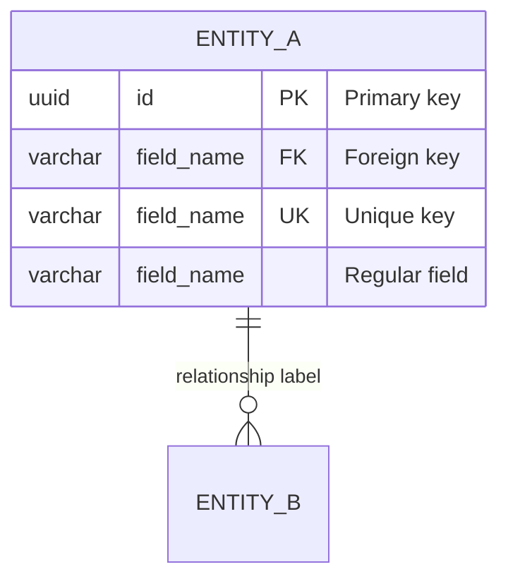
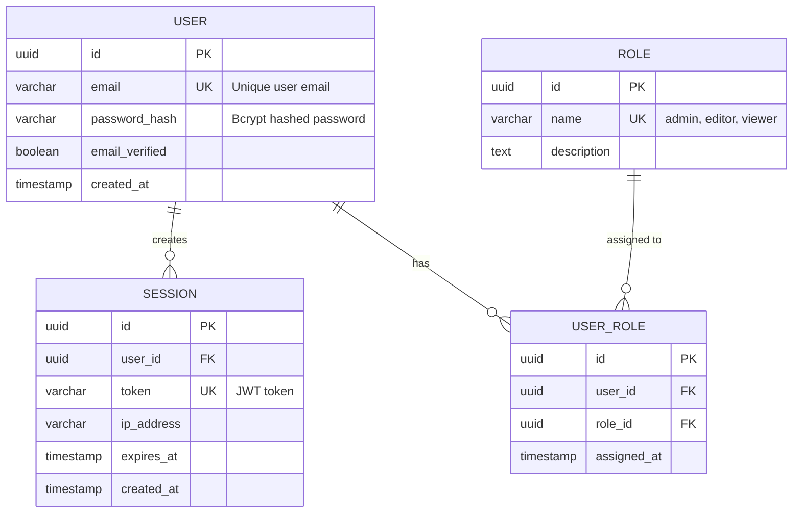
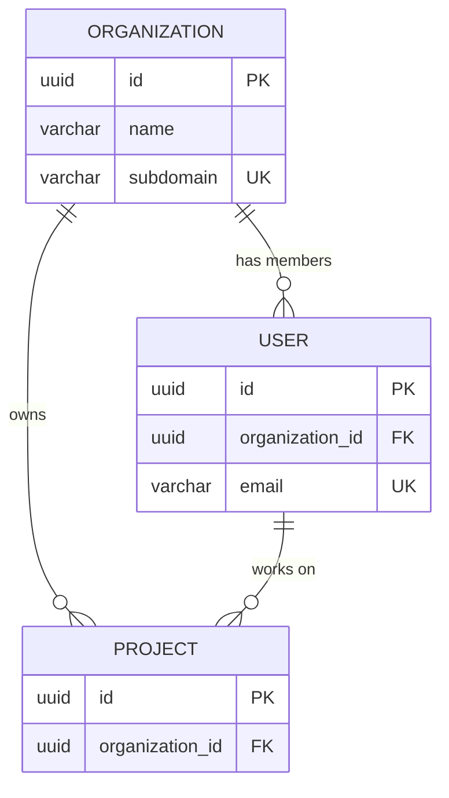
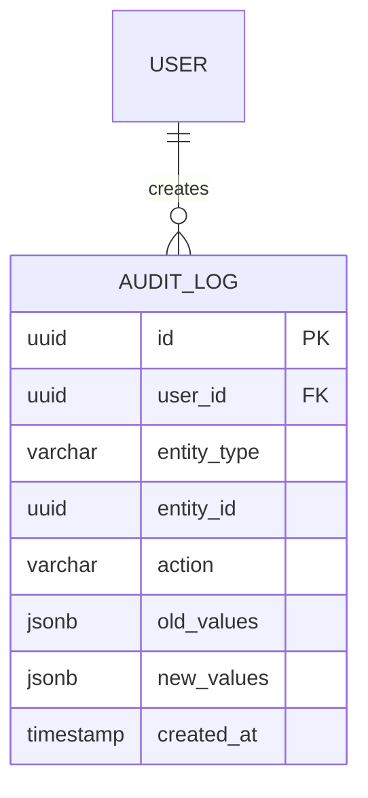

# Code Examples Section Guide

## Overview

The **Code Examples** section has been added to Agent OS spec templates to provide concrete, practical examples that help developers implement specifications correctly and efficiently. This guide explains how to effectively use and populate the Code Examples section in your specifications.

## Purpose

The Code Examples section serves to:

1. **Accelerate Implementation**: Developers can copy and adapt working examples
2. **Ensure Consistency**: Standard patterns are demonstrated across all specs
3. **Reduce Errors**: Common pitfalls and anti-patterns are highlighted
4. **Improve Understanding**: Complex concepts are clarified through code
5. **Document Decisions**: Architectural choices are demonstrated in practice

## Templates with Code Examples

The Code Examples section has been added to the following spec templates:

### 1. Implementation Guide Template
**Location**: `templates/spec-templates/implementation-guide-template.md`

**Example Types**:
- Core feature implementation
- API integration patterns
- Component usage
- Testing patterns
- Configuration examples
- Good vs. bad examples
- Integration examples

**Best Use**: Use when creating feature implementation specifications that require detailed coding guidance.

### 2. Integration Requirements Template
**Location**: `templates/spec-templates/integration-requirements-template.md`

**Example Types**:
- API client integration with retry logic
- Database integration with transactions
- Event-driven integration patterns
- WebSocket real-time communication
- Cache integration patterns
- Integration testing examples

**Best Use**: Use when documenting how systems integrate with external services or internal components.

### 3. Architecture Decisions Template
**Location**: `templates/spec-templates/architecture-decisions-template.md`

**Example Types**:
- Architecture pattern implementation (Clean, Hexagonal, MVC)
- State management architecture
- API layer design with versioning
- Database architecture with migrations
- Microservices communication patterns
- Architectural comparison (good vs. bad)

**Best Use**: Use when documenting major architectural decisions that impact system design.

## How to Fill Out Code Examples

### Step 1: Identify Key Implementation Areas

Before filling out examples, identify the 3-5 most critical implementation areas for your feature:

```
Example for a User Authentication feature:
1. Password hashing and validation
2. JWT token generation and verification
3. Session management
4. Rate limiting for login attempts
5. Multi-factor authentication
```

### Step 2: Create Concrete Examples

For each area, create a complete, runnable example. Don't use pseudo-code unless absolutely necessary.

**Good Example** ✅:
```typescript
// Example: Password hashing with bcrypt
import bcrypt from 'bcrypt';

const SALT_ROUNDS = 12;

export const hash_password = async (
  plain_password: string
): Promise<string> => {
  if (!plain_password || plain_password.length < 8) {
    throw new Error('Password must be at least 8 characters');
  }

  return bcrypt.hash(plain_password, SALT_ROUNDS);
};

export const verify_password = async (
  plain_password: string,
  hashed_password: string
): Promise<boolean> => {
  return bcrypt.compare(plain_password, hashed_password);
};
```

**Bad Example** ❌:
```typescript
// Example: Password hashing
function hashPassword(password) {
  // Hash the password using some algorithm
  return hashedPassword;
}
```

### Step 3: Add Context and Annotations

Each example should include:

1. **Purpose**: What does this example demonstrate?
2. **File Location**: Where should this code live?
3. **Key Points**: Bulleted list of important concepts
4. **Common Pitfalls**: What mistakes to avoid (optional but recommended)

```markdown
### Example 1: Password Hashing

**Purpose**: Demonstrate secure password storage using bcrypt

**File**: `src/auth/utils/password-utils.ts`

```typescript
// [Your code example here]
```

**Key Points**:
- Use bcrypt with minimum 12 salt rounds for security
- Validate password requirements before hashing
- Use async functions to avoid blocking event loop
- Always use timing-safe comparison for password verification

**Common Pitfalls to Avoid**:
- ❌ Using MD5 or SHA-1 for password hashing (not secure)
- ❌ Storing passwords in plain text or base64 encoded
- ❌ Using synchronous bcrypt functions in production
- ✅ Instead: Use bcrypt with async/await and sufficient salt rounds
```

### Step 4: Include Good vs. Bad Comparisons

When there are common anti-patterns, show both bad and good examples:

```markdown
### Good vs. Bad Examples

#### Good Example ✅
```typescript
// GOOD: Proper error handling with logging
const fetch_user_data = async (user_id: string): Promise<User> => {
  try {
    const user = await user_repository.find_by_id(user_id);

    if (!user) {
      throw new Error(`User not found: ${user_id}`);
    }

    return user;
  } catch (error) {
    logger.error('Failed to fetch user:', { user_id, error });
    throw error;
  }
};
```

#### Bad Example ❌
```typescript
// BAD: Silent failures and poor error handling
const fetchUser = async (id) => {
  try {
    return await db.query('SELECT * FROM users WHERE id = ' + id);
  } catch (e) {
    return null;
  }
};
```

**Why the first example is better**:
- Proper TypeScript typing for safety
- Descriptive function names using snake_case (Agent OS standard)
- Explicit error handling with logging
- No SQL injection vulnerability
- Clear error messages for debugging
```

### Step 5: Add Integration Examples

Show how different components work together:

```markdown
### Integration Example

**Purpose**: Demonstrate how authentication components integrate

```typescript
// Example: Complete authentication flow

import { hash_password, verify_password } from './utils/password-utils';
import { generate_jwt_token, verify_jwt_token } from './utils/token-utils';
import { UserRepository } from './repositories/user-repository';
import { SessionService } from './services/session-service';

export class AuthenticationService {
  constructor(
    private user_repository: UserRepository,
    private session_service: SessionService
  ) {}

  async register(email: string, password: string): Promise<RegisterResult> {
    // 1. Validate input
    if (!this.is_valid_email(email)) {
      return { success: false, error: 'Invalid email' };
    }

    // 2. Check if user exists
    const existing_user = await this.user_repository.find_by_email(email);
    if (existing_user) {
      return { success: false, error: 'User already exists' };
    }

    // 3. Hash password
    const hashed_password = await hash_password(password);

    // 4. Create user
    const user = await this.user_repository.create({
      email,
      password: hashed_password,
    });

    // 5. Generate session
    const token = generate_jwt_token({ user_id: user.id });
    await this.session_service.create_session(user.id, token);

    return {
      success: true,
      user_id: user.id,
      token,
    };
  }

  async login(email: string, password: string): Promise<LoginResult> {
    // Implementation...
  }
}
```

**Key Integration Points**:
- Password utilities handle hashing/verification
- Token utilities manage JWT operations
- Repository handles data persistence
- Session service manages user sessions
- Service layer orchestrates the flow
```

## Best Practices

### DO:

✅ **Use Real Code**: Provide complete, working examples that can be copied
✅ **Follow Agent OS Standards**: Use snake_case, proper TypeScript typing, etc.
✅ **Include Error Handling**: Show proper try/catch and error logging
✅ **Add Comments**: Explain complex logic inline
✅ **Show File Paths**: Indicate where code should live
✅ **Highlight Pitfalls**: Warn about common mistakes
✅ **Demonstrate Integration**: Show how components work together
✅ **Use Type Safety**: Include TypeScript interfaces and types
✅ **Keep Examples Focused**: Each example should demonstrate one concept clearly

### DON'T:

❌ **Use Pseudo-Code**: Avoid vague, non-runnable examples
❌ **Skip Error Handling**: Don't show examples without proper error handling
❌ **Ignore Standards**: Follow Agent OS code style guidelines
❌ **Make Examples Too Long**: Keep each example under 50 lines when possible
❌ **Include Multiple Concepts**: One example = one concept
❌ **Use Magic Values**: Always explain or use constants
❌ **Skip Type Annotations**: Always include TypeScript types
❌ **Forget Context**: Always explain what the example demonstrates

## Template-Specific Guidelines

### Implementation Guide Template

Focus on:
- **Core feature logic**: The main functionality being implemented
- **API integration**: How to call external services
- **Component patterns**: React/UI component usage
- **Testing patterns**: How to test the feature
- **Configuration**: Setup and configuration examples

### Integration Requirements Template

Focus on:
- **External service clients**: API client implementations
- **Database operations**: CRUD with transactions
- **Event systems**: Event publishing and subscribing
- **Real-time communication**: WebSocket setup
- **Caching strategies**: Cache integration patterns

### Architecture Decisions Template

Focus on:
- **Architecture patterns**: Clean Architecture, Hexagonal, etc.
- **Layer separation**: Domain, application, infrastructure layers
- **State management**: Redux, Context, etc.
- **API design**: RESTful API structure
- **Database patterns**: Repositories, query builders, migrations

## Examples of Good Code Examples Sections

### Example 1: From a User Authentication Spec

```markdown
## Code Examples

### Example 1: Secure Password Hashing

**Purpose**: Demonstrate bcrypt password hashing implementation

**File**: `src/auth/password-hasher.ts`

```typescript
import bcrypt from 'bcrypt';

const SALT_ROUNDS = 12;

export const hash_password = async (
  plain_password: string
): Promise<string> => {
  if (plain_password.length < 8) {
    throw new Error('Password must be at least 8 characters');
  }

  return bcrypt.hash(plain_password, SALT_ROUNDS);
};
```

**Key Points**:
- Minimum 12 salt rounds for security
- Async operation to avoid blocking
- Input validation before hashing

[Additional examples...]
```

### Example 2: From a Payment Processing Spec

```markdown
## Code Examples

### Example 1: Stripe Payment Integration

**Purpose**: Process payments securely with Stripe API

**File**: `src/payments/stripe-client.ts`

```typescript
import Stripe from 'stripe';

class StripePaymentService {
  private stripe: Stripe;

  constructor(api_key: string) {
    this.stripe = new Stripe(api_key, {
      apiVersion: '2023-10-16',
    });
  }

  async create_payment_intent(
    amount: number,
    currency: string = 'usd'
  ): Promise<PaymentIntent> {
    try {
      const payment_intent = await this.stripe.paymentIntents.create({
        amount,
        currency,
        automatic_payment_methods: {
          enabled: true,
        },
      });

      return {
        client_secret: payment_intent.client_secret,
        payment_intent_id: payment_intent.id,
      };
    } catch (error) {
      logger.error('Failed to create payment intent:', error);
      throw new Error('Payment processing failed');
    }
  }
}
```

**Key Points**:
- Type-safe Stripe client configuration
- Proper error handling and logging
- Automatic payment methods for better UX
- Secure client secret handling

[Additional examples...]
```

## Database Schema Diagrams

When documenting features that involve database changes, always include Entity-Relationship Diagrams (ERDs) using Mermaid syntax to visualize data models and relationships.

### When to Include ERD Diagrams

Include ERD diagrams in your specifications when:

1. **Creating new database tables** - Document the schema structure visually
2. **Modifying existing relationships** - Show how changes affect the data model
3. **Adding foreign key constraints** - Clarify relationship cardinality
4. **Documenting integration points** - Show how external systems map to database
5. **Explaining complex data models** - Make multi-table relationships clear
6. **Defining audit/logging schemas** - Visualize tracking and history tables

### Required Elements

When you include an ERD diagram, you MUST also provide:

1. **ERD diagram** using Mermaid syntax
2. **Table specifications** with columns, types, constraints
3. **Relationship documentation** with cascade rules
4. **Migration code** for schema changes
5. **ORM mappings** in the project's language (Rails/TypeScript/Python)

### Mermaid ERD Syntax Quick Reference



**Cardinality Symbols**:
- `||--||` : One-to-one exactly
- `||--o|` : One-to-zero-or-one
- `||--o{` : One-to-many
- `}o--o{` : Many-to-many
- `}|--|{` : One-or-more to one-or-more

**Attribute Keys**:
- `PK` : Primary Key
- `FK` : Foreign Key
- `UK` : Unique Key
- (no key) : Regular field

### Complete ERD Example

#### User Authentication System ERD



**Table Specifications**:

**Users Table**:
| Column | Type | Constraints | Description |
|--------|------|-------------|-------------|
| id | UUID | PK, NOT NULL | User identifier |
| email | VARCHAR(255) | UNIQUE, NOT NULL | User email |
| password_hash | VARCHAR(255) | NOT NULL | Bcrypt hashed password |
| email_verified | BOOLEAN | NOT NULL, DEFAULT false | Email verification status |
| created_at | TIMESTAMP | NOT NULL | Account creation time |

**Sessions Table**:
| Column | Type | Constraints | Description |
|--------|------|-------------|-------------|
| id | UUID | PK, NOT NULL | Session identifier |
| user_id | UUID | FK, NOT NULL | Reference to user |
| token | VARCHAR(500) | UNIQUE, NOT NULL | JWT session token |
| ip_address | VARCHAR(45) | - | Client IP address |
| expires_at | TIMESTAMP | NOT NULL | Session expiration |
| created_at | TIMESTAMP | NOT NULL | Session creation time |

**Relationships**:

- **users → sessions**: One-to-many (CASCADE delete)
  - Foreign key: `sessions.user_id` references `users.id`
  - When user is deleted, all sessions are invalidated

- **users → user_roles**: One-to-many (CASCADE delete)
  - Foreign key: `user_roles.user_id` references `users.id`

- **roles → user_roles**: One-to-many (CASCADE delete)
  - Foreign key: `user_roles.role_id` references `roles.id`

**Migration Example**:

```sql
-- Create users table
CREATE TABLE users (
  id UUID PRIMARY KEY DEFAULT gen_random_uuid(),
  email VARCHAR(255) UNIQUE NOT NULL,
  password_hash VARCHAR(255) NOT NULL,
  email_verified BOOLEAN NOT NULL DEFAULT false,
  created_at TIMESTAMP NOT NULL DEFAULT CURRENT_TIMESTAMP
);

CREATE INDEX idx_users_email ON users(email);

-- Create sessions table
CREATE TABLE sessions (
  id UUID PRIMARY KEY DEFAULT gen_random_uuid(),
  user_id UUID NOT NULL REFERENCES users(id) ON DELETE CASCADE,
  token VARCHAR(500) UNIQUE NOT NULL,
  ip_address VARCHAR(45),
  expires_at TIMESTAMP NOT NULL,
  created_at TIMESTAMP NOT NULL DEFAULT CURRENT_TIMESTAMP
);

CREATE INDEX idx_sessions_user_id ON sessions(user_id);
CREATE INDEX idx_sessions_token ON sessions(token);
CREATE INDEX idx_sessions_expires_at ON sessions(expires_at);
```

**ORM Mapping Examples**:

**Rails ActiveRecord**:
```ruby
# app/models/user.rb
class User < ApplicationRecord
  has_many :sessions, dependent: :destroy
  has_many :user_roles, dependent: :destroy
  has_many :roles, through: :user_roles

  validates :email, presence: true, uniqueness: true
  validates :password, length: { minimum: 8 }

  has_secure_password
end

# app/models/session.rb
class Session < ApplicationRecord
  belongs_to :user

  validates :token, presence: true, uniqueness: true
  validates :expires_at, presence: true

  scope :active, -> { where('expires_at > ?', Time.current) }
end
```

**TypeScript/TypeORM**:
```typescript
// src/models/user.entity.ts
import { Entity, PrimaryGeneratedColumn, Column, OneToMany } from 'typeorm';

@Entity('users')
export class User {
  @PrimaryGeneratedColumn('uuid')
  id: string;

  @Column({ type: 'varchar', length: 255, unique: true })
  email: string;

  @Column({ type: 'varchar', length: 255 })
  password_hash: string;

  @Column({ type: 'boolean', default: false })
  email_verified: boolean;

  @OneToMany(() => Session, session => session.user, { cascade: true })
  sessions: Session[];

  @CreateDateColumn()
  created_at: Date;
}

// src/models/session.entity.ts
import { Entity, PrimaryGeneratedColumn, Column, ManyToOne } from 'typeorm';

@Entity('sessions')
export class Session {
  @PrimaryGeneratedColumn('uuid')
  id: string;

  @Column({ type: 'uuid' })
  user_id: string;

  @ManyToOne(() => User, user => user.sessions, { onDelete: 'CASCADE' })
  user: User;

  @Column({ type: 'varchar', length: 500, unique: true })
  token: string;

  @Column({ type: 'varchar', length: 45, nullable: true })
  ip_address: string;

  @Column({ type: 'timestamp' })
  expires_at: Date;

  @CreateDateColumn()
  created_at: Date;
}
```

**Python/SQLAlchemy**:
```python
# models/user.py
from sqlalchemy import Column, String, Boolean, DateTime
from sqlalchemy.dialects.postgresql import UUID
from sqlalchemy.orm import relationship
from datetime import datetime
import uuid

class User(Base):
    __tablename__ = 'users'

    id = Column(UUID(as_uuid=True), primary_key=True, default=uuid.uuid4)
    email = Column(String(255), unique=True, nullable=False, index=True)
    password_hash = Column(String(255), nullable=False)
    email_verified = Column(Boolean, nullable=False, default=False)
    created_at = Column(DateTime, nullable=False, default=datetime.utcnow)

    # Relationships
    sessions = relationship('Session', back_populates='user', cascade='all, delete-orphan')

# models/session.py
class Session(Base):
    __tablename__ = 'sessions'

    id = Column(UUID(as_uuid=True), primary_key=True, default=uuid.uuid4)
    user_id = Column(UUID(as_uuid=True), ForeignKey('users.id', ondelete='CASCADE'), nullable=False)
    token = Column(String(500), unique=True, nullable=False)
    ip_address = Column(String(45))
    expires_at = Column(DateTime, nullable=False)
    created_at = Column(DateTime, nullable=False, default=datetime.utcnow)

    # Relationships
    user = relationship('User', back_populates='sessions')
```

### Best Practices for ERD Documentation

**DO**:

✅ **Always include ERD for database changes** - Visual representation is essential
✅ **Document all relationships** - Include cardinality and cascade rules
✅ **Specify all constraints** - Show UNIQUE, NOT NULL, CHECK constraints
✅ **Include indexes** - Document performance-critical indexes
✅ **Provide migration scripts** - Complete SQL for reproducible setup
✅ **Show ORM mappings** - Demonstrate how schema maps to code
✅ **Use descriptive field names** - Clear, self-documenting column names
✅ **Add inline descriptions** - Explain complex fields in ERD
✅ **Document cascade behaviors** - Critical for data integrity
✅ **Include audit fields** - created_at, updated_at for all tables

**DON'T**:

❌ **Skip the ERD diagram** - Always visualize database structure
❌ **Forget cascade rules** - Must specify ON DELETE/UPDATE behavior
❌ **Omit indexes** - Performance suffers without proper indexing
❌ **Use ambiguous names** - Avoid 'data', 'info', 'details'
❌ **Skip constraints** - Database-level validation is essential
❌ **Ignore existing patterns** - Follow established schema conventions
❌ **Forget rollback scripts** - Always provide migration rollback
❌ **Mix naming conventions** - Stick to snake_case for databases

### Common ERD Patterns

**Multi-Tenancy Pattern**:


**Audit Trail Pattern**:


### Resources

- **Comprehensive ERD Guide**: `templates/spec-templates/ERD_GENERATION_GUIDE.md`
- **Mermaid Live Editor**: https://mermaid.live/ (for testing diagrams)
- **Mermaid ERD Documentation**: https://mermaid.js.org/syntax/entityRelationshipDiagram.html

## Maintaining Code Examples

### Regular Updates

Code examples should be updated when:

1. **Technology versions change**: Update imports, APIs when dependencies update
2. **Standards evolve**: Reflect new Agent OS coding standards
3. **Better patterns emerge**: Replace examples with improved approaches
4. **Bugs are found**: Fix any issues discovered in examples
5. **Feedback is received**: Incorporate developer suggestions

### Version Control

- Mark example code with comments indicating last update
- Reference specific library versions when critical
- Include migration notes if examples change significantly

```typescript
// Example: JWT token generation
// Last updated: 2024-10-26
// Uses: jsonwebtoken@9.0.0

import jwt from 'jsonwebtoken';

export const generate_token = (payload: TokenPayload): string => {
  return jwt.sign(payload, process.env.JWT_SECRET!, {
    expiresIn: '24h',
    algorithm: 'HS256',
  });
};
```

## Resources

### Agent OS Standards
- **Code Style Guide**: `~/.agent-os/standards/code-style.md`
- **Best Practices**: `~/.agent-os/standards/best-practices.md`
- **Tech Stack Defaults**: `~/.agent-os/standards/global/tech-stack.md`

### Template Locations
- **Spec Templates**: `~/.agent-os/templates/spec-templates/`
- **Template Validator**: `~/.agent-os/templates/template-validator.js`

### Additional Examples
- Browse existing specs in `specs/` directory for real-world examples
- Check `examples/` directory for reference implementations
- Review `tests/` directory for testing patterns

---

**Version**: 1.0.0
**Last Updated**: 2024-10-26
**Maintained By**: Agent OS Team
