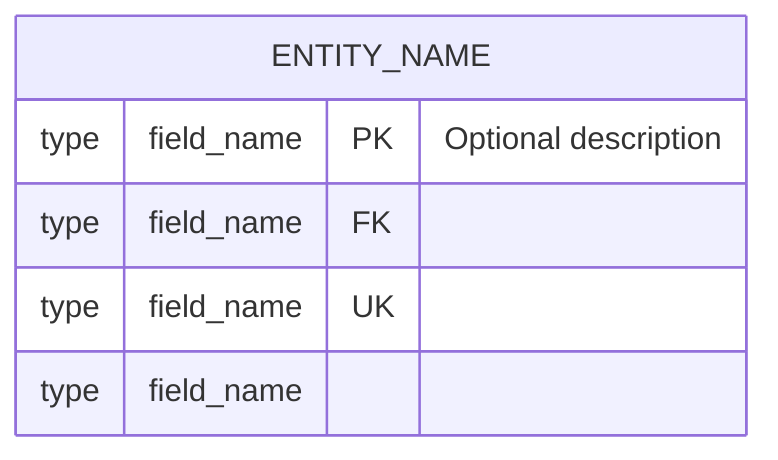
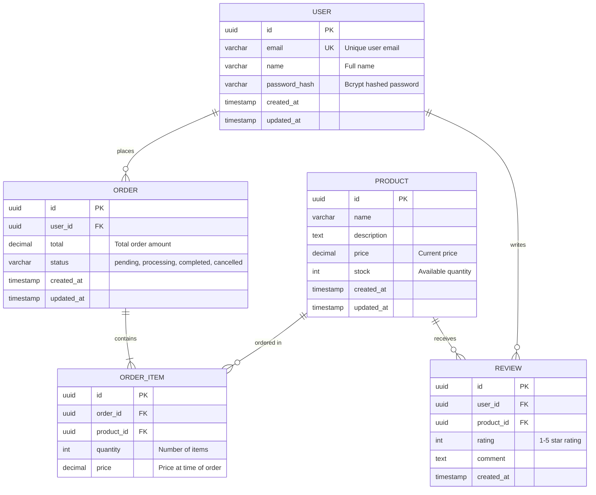
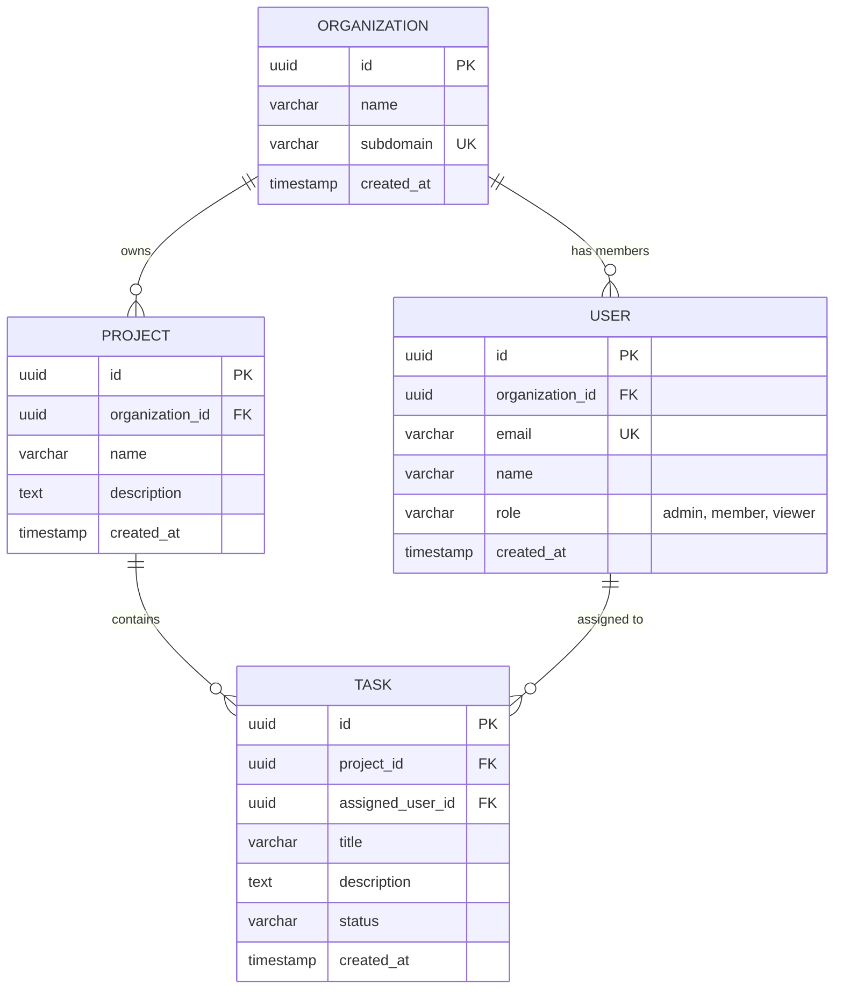
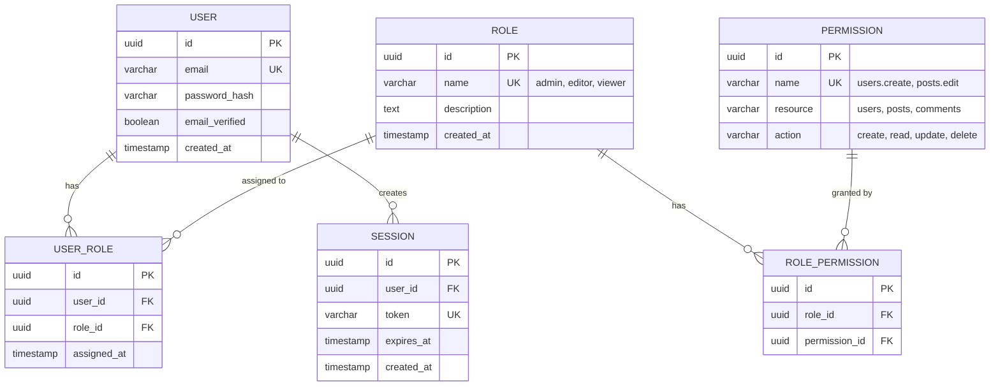
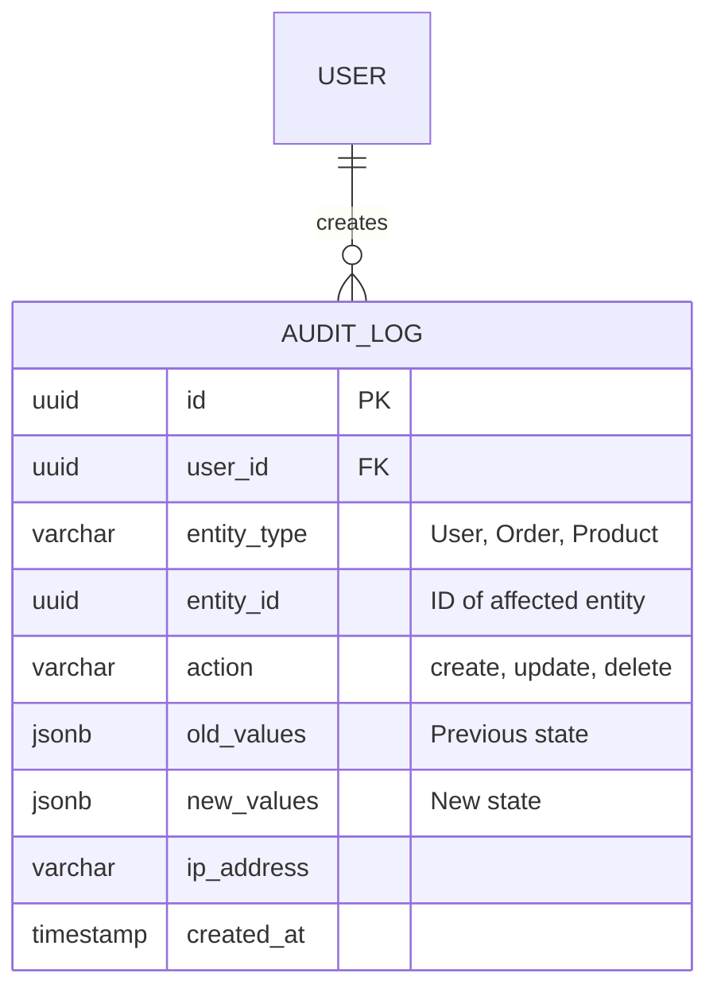

# ERD Generation Guide

## Overview

The **Database Schema & ERD (Entity-Relationship Diagram)** section helps developers visualize and document database schemas using Mermaid diagram syntax. This guide explains how to create effective ERD diagrams and comprehensive database schema documentation for Agent OS specifications.

## Purpose

The Database Schema & ERD section serves to:

1. **Visualize Database Structure**: ERD diagrams provide a clear visual representation of entities and relationships
2. **Document Table Schemas**: Detailed table specifications ensure consistent database design
3. **Clarify Relationships**: Foreign key relationships and cascade behaviors are explicitly documented
4. **Guide Migrations**: Migration scripts ensure reproducible database setup
5. **Map to ORM Models**: ORM code examples demonstrate how schema maps to application code

## Mermaid ERD Syntax Reference

### Basic ERD Structure



### Relationship Cardinality Symbols

| Symbol | Meaning | Example |
|--------|---------|---------|
| `||--||` | One-to-one exactly | `USER ||--|| PROFILE` |
| `||--o\|` | One-to-zero-or-one | `USER ||--o\| SETTINGS` |
| `||--o{` | One-to-many | `USER ||--o{ ORDER` |
| `}o--o{` | Many-to-many | `STUDENT }o--o{ COURSE` |
| `}|--|{` | One-or-more to one-or-more | `AUTHOR }|--|{ BOOK` |

### Attribute Key Types

| Key | Description |
|-----|-------------|
| `PK` | Primary Key |
| `FK` | Foreign Key |
| `UK` | Unique Key |
| (none) | Regular field |

### Common Data Types

- **String Types**: `varchar`, `text`, `char`, `string`
- **Numeric Types**: `int`, `bigint`, `decimal`, `float`, `numeric`
- **Date/Time Types**: `datetime`, `timestamp`, `date`, `time`
- **Boolean**: `boolean`, `bool`
- **UUID**: `uuid`
- **JSON**: `json`, `jsonb`

## Complete ERD Example

### E-Commerce System



## Detailed Table Specifications

### Users Table

**Table Name**: `users`

**Purpose**: Store user account information and authentication credentials

**Primary Key**: `id` (UUID)

**Indexes**:
- Unique index on `email` for fast lookup and uniqueness enforcement
- Index on `created_at` for sorting by registration date
- Index on `updated_at` for tracking recent activity

**Constraints**:
- `email` must be unique and not null
- `name` not null
- `password_hash` not null (minimum 60 chars for bcrypt)

| Column | Type | Constraints | Default | Description |
|--------|------|-------------|---------|-------------|
| id | UUID | PK, NOT NULL | gen_random_uuid() | User identifier |
| email | VARCHAR(255) | UNIQUE, NOT NULL | - | User email address |
| name | VARCHAR(255) | NOT NULL | - | User full name |
| password_hash | VARCHAR(255) | NOT NULL | - | Bcrypt hashed password |
| created_at | TIMESTAMP | NOT NULL | CURRENT_TIMESTAMP | Record creation time |
| updated_at | TIMESTAMP | NOT NULL | CURRENT_TIMESTAMP | Last update time |

### Orders Table

**Table Name**: `orders`

**Purpose**: Store order header information

**Primary Key**: `id` (UUID)

**Indexes**:
- Foreign key index on `user_id`
- Index on `status` for filtering by order state
- Index on `created_at` for sorting by order date

**Constraints**:
- `user_id` references `users(id)`
- `status` must be one of: 'pending', 'processing', 'completed', 'cancelled'
- `total` must be >= 0

| Column | Type | Constraints | Default | Description |
|--------|------|-------------|---------|-------------|
| id | UUID | PK, NOT NULL | gen_random_uuid() | Order identifier |
| user_id | UUID | FK, NOT NULL | - | Reference to user |
| total | DECIMAL(10,2) | NOT NULL, CHECK >= 0 | 0.00 | Total order amount |
| status | VARCHAR(50) | NOT NULL | 'pending' | Order status |
| created_at | TIMESTAMP | NOT NULL | CURRENT_TIMESTAMP | Order creation time |
| updated_at | TIMESTAMP | NOT NULL | CURRENT_TIMESTAMP | Last update time |

### Order Items Table

**Table Name**: `order_items`

**Purpose**: Store individual items within orders

**Primary Key**: `id` (UUID)

**Indexes**:
- Foreign key index on `order_id`
- Foreign key index on `product_id`
- Composite index on `(order_id, product_id)` for unique line items

**Constraints**:
- `order_id` references `orders(id)`
- `product_id` references `products(id)`
- `quantity` must be > 0
- `price` must be >= 0

| Column | Type | Constraints | Default | Description |
|--------|------|-------------|---------|-------------|
| id | UUID | PK, NOT NULL | gen_random_uuid() | Order item identifier |
| order_id | UUID | FK, NOT NULL | - | Reference to order |
| product_id | UUID | FK, NOT NULL | - | Reference to product |
| quantity | INTEGER | NOT NULL, CHECK > 0 | 1 | Number of items |
| price | DECIMAL(10,2) | NOT NULL, CHECK >= 0 | - | Price at purchase time |

### Products Table

**Table Name**: `products`

**Purpose**: Store product catalog information

**Primary Key**: `id` (UUID)

**Indexes**:
- Index on `name` for search
- Index on `price` for sorting and filtering
- Index on `stock` for inventory management
- Full-text index on `(name, description)` for search

**Constraints**:
- `name` not null
- `price` must be >= 0
- `stock` must be >= 0

| Column | Type | Constraints | Default | Description |
|--------|------|-------------|---------|-------------|
| id | UUID | PK, NOT NULL | gen_random_uuid() | Product identifier |
| name | VARCHAR(255) | NOT NULL | - | Product name |
| description | TEXT | - | - | Product description |
| price | DECIMAL(10,2) | NOT NULL, CHECK >= 0 | - | Current price |
| stock | INTEGER | NOT NULL, CHECK >= 0 | 0 | Available quantity |
| created_at | TIMESTAMP | NOT NULL | CURRENT_TIMESTAMP | Record creation time |
| updated_at | TIMESTAMP | NOT NULL | CURRENT_TIMESTAMP | Last update time |

### Reviews Table

**Table Name**: `reviews`

**Purpose**: Store product reviews from users

**Primary Key**: `id` (UUID)

**Indexes**:
- Foreign key index on `user_id`
- Foreign key index on `product_id`
- Unique composite index on `(user_id, product_id)` (one review per user per product)
- Index on `rating` for filtering

**Constraints**:
- `user_id` references `users(id)`
- `product_id` references `products(id)`
- `rating` must be between 1 and 5
- Unique constraint on `(user_id, product_id)`

| Column | Type | Constraints | Default | Description |
|--------|------|-------------|---------|-------------|
| id | UUID | PK, NOT NULL | gen_random_uuid() | Review identifier |
| user_id | UUID | FK, NOT NULL | - | Reference to user |
| product_id | UUID | FK, NOT NULL | - | Reference to product |
| rating | INTEGER | NOT NULL, CHECK 1-5 | - | Star rating |
| comment | TEXT | - | - | Review text |
| created_at | TIMESTAMP | NOT NULL | CURRENT_TIMESTAMP | Review creation time |

## Relationship Documentation

### Foreign Key Relationships and Cascade Behaviors

#### users → orders (One-to-many)
- **Foreign Key**: `orders.user_id` references `users.id`
- **On Delete**: CASCADE (deleting user deletes all their orders)
- **On Update**: CASCADE (if user id changes, update order references)
- **Rationale**: Orders are meaningless without the associated user

#### orders → order_items (One-to-many)
- **Foreign Key**: `order_items.order_id` references `orders.id`
- **On Delete**: CASCADE (deleting order deletes all line items)
- **On Update**: CASCADE
- **Rationale**: Order items cannot exist without parent order

#### products → order_items (One-to-many)
- **Foreign Key**: `order_items.product_id` references `products.id`
- **On Delete**: RESTRICT (cannot delete product if in orders)
- **On Update**: CASCADE
- **Rationale**: Preserve historical order data even if product is discontinued

#### users → reviews (One-to-many)
- **Foreign Key**: `reviews.user_id` references `users.id`
- **On Delete**: CASCADE (deleting user deletes their reviews)
- **On Update**: CASCADE
- **Rationale**: Reviews are user-generated content tied to user identity

#### products → reviews (One-to-many)
- **Foreign Key**: `reviews.product_id` references `products.id`
- **On Delete**: CASCADE (deleting product deletes its reviews)
- **On Update**: CASCADE
- **Rationale**: Reviews are specific to products

## Migration Strategy

### PostgreSQL Migration Example

```sql
-- Migration: Create e-commerce schema
-- Version: 001
-- Date: 2024-10-26

-- Enable UUID extension
CREATE EXTENSION IF NOT EXISTS "uuid-ossp";

-- Create users table
CREATE TABLE users (
  id UUID PRIMARY KEY DEFAULT gen_random_uuid(),
  email VARCHAR(255) UNIQUE NOT NULL,
  name VARCHAR(255) NOT NULL,
  password_hash VARCHAR(255) NOT NULL,
  created_at TIMESTAMP NOT NULL DEFAULT CURRENT_TIMESTAMP,
  updated_at TIMESTAMP NOT NULL DEFAULT CURRENT_TIMESTAMP
);

CREATE INDEX idx_users_email ON users(email);
CREATE INDEX idx_users_created_at ON users(created_at);
CREATE INDEX idx_users_updated_at ON users(updated_at);

-- Create products table
CREATE TABLE products (
  id UUID PRIMARY KEY DEFAULT gen_random_uuid(),
  name VARCHAR(255) NOT NULL,
  description TEXT,
  price DECIMAL(10,2) NOT NULL CHECK (price >= 0),
  stock INTEGER NOT NULL DEFAULT 0 CHECK (stock >= 0),
  created_at TIMESTAMP NOT NULL DEFAULT CURRENT_TIMESTAMP,
  updated_at TIMESTAMP NOT NULL DEFAULT CURRENT_TIMESTAMP
);

CREATE INDEX idx_products_name ON products(name);
CREATE INDEX idx_products_price ON products(price);
CREATE INDEX idx_products_stock ON products(stock);

-- Create full-text search index
CREATE INDEX idx_products_search ON products
  USING GIN (to_tsvector('english', name || ' ' || COALESCE(description, '')));

-- Create orders table
CREATE TABLE orders (
  id UUID PRIMARY KEY DEFAULT gen_random_uuid(),
  user_id UUID NOT NULL REFERENCES users(id) ON DELETE CASCADE,
  total DECIMAL(10,2) NOT NULL DEFAULT 0.00 CHECK (total >= 0),
  status VARCHAR(50) NOT NULL DEFAULT 'pending'
    CHECK (status IN ('pending', 'processing', 'completed', 'cancelled')),
  created_at TIMESTAMP NOT NULL DEFAULT CURRENT_TIMESTAMP,
  updated_at TIMESTAMP NOT NULL DEFAULT CURRENT_TIMESTAMP
);

CREATE INDEX idx_orders_user_id ON orders(user_id);
CREATE INDEX idx_orders_status ON orders(status);
CREATE INDEX idx_orders_created_at ON orders(created_at);

-- Create order_items table
CREATE TABLE order_items (
  id UUID PRIMARY KEY DEFAULT gen_random_uuid(),
  order_id UUID NOT NULL REFERENCES orders(id) ON DELETE CASCADE,
  product_id UUID NOT NULL REFERENCES products(id) ON DELETE RESTRICT,
  quantity INTEGER NOT NULL DEFAULT 1 CHECK (quantity > 0),
  price DECIMAL(10,2) NOT NULL CHECK (price >= 0)
);

CREATE INDEX idx_order_items_order_id ON order_items(order_id);
CREATE INDEX idx_order_items_product_id ON order_items(product_id);
CREATE UNIQUE INDEX idx_order_items_order_product ON order_items(order_id, product_id);

-- Create reviews table
CREATE TABLE reviews (
  id UUID PRIMARY KEY DEFAULT gen_random_uuid(),
  user_id UUID NOT NULL REFERENCES users(id) ON DELETE CASCADE,
  product_id UUID NOT NULL REFERENCES products(id) ON DELETE CASCADE,
  rating INTEGER NOT NULL CHECK (rating >= 1 AND rating <= 5),
  comment TEXT,
  created_at TIMESTAMP NOT NULL DEFAULT CURRENT_TIMESTAMP,
  UNIQUE(user_id, product_id)
);

CREATE INDEX idx_reviews_user_id ON reviews(user_id);
CREATE INDEX idx_reviews_product_id ON reviews(product_id);
CREATE INDEX idx_reviews_rating ON reviews(rating);

-- Create updated_at trigger function
CREATE OR REPLACE FUNCTION update_updated_at_column()
RETURNS TRIGGER AS $$
BEGIN
  NEW.updated_at = CURRENT_TIMESTAMP;
  RETURN NEW;
END;
$$ LANGUAGE plpgsql;

-- Apply updated_at triggers
CREATE TRIGGER update_users_updated_at BEFORE UPDATE ON users
  FOR EACH ROW EXECUTE FUNCTION update_updated_at_column();

CREATE TRIGGER update_products_updated_at BEFORE UPDATE ON products
  FOR EACH ROW EXECUTE FUNCTION update_updated_at_column();

CREATE TRIGGER update_orders_updated_at BEFORE UPDATE ON orders
  FOR EACH ROW EXECUTE FUNCTION update_updated_at_column();
```

### Rollback Migration

```sql
-- Rollback: Drop e-commerce schema
-- Version: 001
-- Date: 2024-10-26

DROP TRIGGER IF EXISTS update_orders_updated_at ON orders;
DROP TRIGGER IF EXISTS update_products_updated_at ON products;
DROP TRIGGER IF EXISTS update_users_updated_at ON users;
DROP FUNCTION IF EXISTS update_updated_at_column();

DROP TABLE IF EXISTS reviews CASCADE;
DROP TABLE IF EXISTS order_items CASCADE;
DROP TABLE IF EXISTS orders CASCADE;
DROP TABLE IF EXISTS products CASCADE;
DROP TABLE IF EXISTS users CASCADE;
```

## ORM Model Mapping

### Rails ActiveRecord Example

```ruby
# app/models/user.rb
class User < ApplicationRecord
  has_many :orders, dependent: :destroy
  has_many :reviews, dependent: :destroy

  validates :email, presence: true, uniqueness: true, format: { with: URI::MailTo::EMAIL_REGEXP }
  validates :name, presence: true
  validates :password, length: { minimum: 8 }, if: :password_digest_changed?

  has_secure_password
end

# app/models/product.rb
class Product < ApplicationRecord
  has_many :order_items, dependent: :restrict_with_error
  has_many :orders, through: :order_items
  has_many :reviews, dependent: :destroy

  validates :name, presence: true
  validates :price, presence: true, numericality: { greater_than_or_equal_to: 0 }
  validates :stock, presence: true, numericality: { greater_than_or_equal_to: 0, only_integer: true }
end

# app/models/order.rb
class Order < ApplicationRecord
  belongs_to :user
  has_many :order_items, dependent: :destroy
  has_many :products, through: :order_items

  enum status: {
    pending: 'pending',
    processing: 'processing',
    completed: 'completed',
    cancelled: 'cancelled'
  }

  validates :total, presence: true, numericality: { greater_than_or_equal_to: 0 }
  validates :status, presence: true, inclusion: { in: statuses.keys }

  before_save :calculate_total

  private

  def calculate_total
    self.total = order_items.sum { |item| item.price * item.quantity }
  end
end

# app/models/order_item.rb
class OrderItem < ApplicationRecord
  belongs_to :order
  belongs_to :product

  validates :quantity, presence: true, numericality: { greater_than: 0, only_integer: true }
  validates :price, presence: true, numericality: { greater_than_or_equal_to: 0 }
  validates :product_id, uniqueness: { scope: :order_id }

  before_validation :set_price_from_product

  private

  def set_price_from_product
    self.price ||= product.price if product
  end
end

# app/models/review.rb
class Review < ApplicationRecord
  belongs_to :user
  belongs_to :product

  validates :rating, presence: true, numericality: {
    only_integer: true,
    greater_than_or_equal_to: 1,
    less_than_or_equal_to: 5
  }
  validates :user_id, uniqueness: { scope: :product_id, message: 'can only review a product once' }
end
```

### TypeScript/TypeORM Example

```typescript
// src/models/user.entity.ts
import { Entity, PrimaryGeneratedColumn, Column, OneToMany, CreateDateColumn, UpdateDateColumn } from 'typeorm';
import { Order } from './order.entity';
import { Review } from './review.entity';

@Entity('users')
export class User {
  @PrimaryGeneratedColumn('uuid')
  id: string;

  @Column({ type: 'varchar', length: 255, unique: true })
  email: string;

  @Column({ type: 'varchar', length: 255 })
  name: string;

  @Column({ type: 'varchar', length: 255 })
  password_hash: string;

  @OneToMany(() => Order, order => order.user, { cascade: true })
  orders: Order[];

  @OneToMany(() => Review, review => review.user, { cascade: true })
  reviews: Review[];

  @CreateDateColumn()
  created_at: Date;

  @UpdateDateColumn()
  updated_at: Date;
}

// src/models/product.entity.ts
import { Entity, PrimaryGeneratedColumn, Column, OneToMany, CreateDateColumn, UpdateDateColumn } from 'typeorm';
import { OrderItem } from './order-item.entity';
import { Review } from './review.entity';

@Entity('products')
export class Product {
  @PrimaryGeneratedColumn('uuid')
  id: string;

  @Column({ type: 'varchar', length: 255 })
  name: string;

  @Column({ type: 'text', nullable: true })
  description: string;

  @Column({ type: 'decimal', precision: 10, scale: 2 })
  price: number;

  @Column({ type: 'int', default: 0 })
  stock: number;

  @OneToMany(() => OrderItem, orderItem => orderItem.product)
  order_items: OrderItem[];

  @OneToMany(() => Review, review => review.product, { cascade: true })
  reviews: Review[];

  @CreateDateColumn()
  created_at: Date;

  @UpdateDateColumn()
  updated_at: Date;
}

// src/models/order.entity.ts
import { Entity, PrimaryGeneratedColumn, Column, ManyToOne, OneToMany, CreateDateColumn, UpdateDateColumn, JoinColumn } from 'typeorm';
import { User } from './user.entity';
import { OrderItem } from './order-item.entity';

export enum OrderStatus {
  PENDING = 'pending',
  PROCESSING = 'processing',
  COMPLETED = 'completed',
  CANCELLED = 'cancelled',
}

@Entity('orders')
export class Order {
  @PrimaryGeneratedColumn('uuid')
  id: string;

  @Column({ type: 'uuid' })
  user_id: string;

  @ManyToOne(() => User, user => user.orders, { onDelete: 'CASCADE' })
  @JoinColumn({ name: 'user_id' })
  user: User;

  @Column({ type: 'decimal', precision: 10, scale: 2, default: 0 })
  total: number;

  @Column({ type: 'varchar', length: 50, default: OrderStatus.PENDING })
  status: OrderStatus;

  @OneToMany(() => OrderItem, orderItem => orderItem.order, { cascade: true })
  order_items: OrderItem[];

  @CreateDateColumn()
  created_at: Date;

  @UpdateDateColumn()
  updated_at: Date;
}

// src/models/order-item.entity.ts
import { Entity, PrimaryGeneratedColumn, Column, ManyToOne, JoinColumn, Unique } from 'typeorm';
import { Order } from './order.entity';
import { Product } from './product.entity';

@Entity('order_items')
@Unique(['order_id', 'product_id'])
export class OrderItem {
  @PrimaryGeneratedColumn('uuid')
  id: string;

  @Column({ type: 'uuid' })
  order_id: string;

  @ManyToOne(() => Order, order => order.order_items, { onDelete: 'CASCADE' })
  @JoinColumn({ name: 'order_id' })
  order: Order;

  @Column({ type: 'uuid' })
  product_id: string;

  @ManyToOne(() => Product, product => product.order_items, { onDelete: 'RESTRICT' })
  @JoinColumn({ name: 'product_id' })
  product: Product;

  @Column({ type: 'int', default: 1 })
  quantity: number;

  @Column({ type: 'decimal', precision: 10, scale: 2 })
  price: number;
}

// src/models/review.entity.ts
import { Entity, PrimaryGeneratedColumn, Column, ManyToOne, JoinColumn, Unique, CreateDateColumn } from 'typeorm';
import { User } from './user.entity';
import { Product } from './product.entity';

@Entity('reviews')
@Unique(['user_id', 'product_id'])
export class Review {
  @PrimaryGeneratedColumn('uuid')
  id: string;

  @Column({ type: 'uuid' })
  user_id: string;

  @ManyToOne(() => User, user => user.reviews, { onDelete: 'CASCADE' })
  @JoinColumn({ name: 'user_id' })
  user: User;

  @Column({ type: 'uuid' })
  product_id: string;

  @ManyToOne(() => Product, product => product.reviews, { onDelete: 'CASCADE' })
  @JoinColumn({ name: 'product_id' })
  product: Product;

  @Column({ type: 'int' })
  rating: number;

  @Column({ type: 'text', nullable: true })
  comment: string;

  @CreateDateColumn()
  created_at: Date;
}
```

### Python/SQLAlchemy Example

```python
# models/user.py
from sqlalchemy import Column, String, DateTime
from sqlalchemy.dialects.postgresql import UUID
from sqlalchemy.orm import relationship
from datetime import datetime
import uuid

from database import Base

class User(Base):
    __tablename__ = 'users'

    id = Column(UUID(as_uuid=True), primary_key=True, default=uuid.uuid4)
    email = Column(String(255), unique=True, nullable=False, index=True)
    name = Column(String(255), nullable=False)
    password_hash = Column(String(255), nullable=False)
    created_at = Column(DateTime, nullable=False, default=datetime.utcnow)
    updated_at = Column(DateTime, nullable=False, default=datetime.utcnow, onupdate=datetime.utcnow)

    # Relationships
    orders = relationship('Order', back_populates='user', cascade='all, delete-orphan')
    reviews = relationship('Review', back_populates='user', cascade='all, delete-orphan')

# models/product.py
from sqlalchemy import Column, String, Text, Integer, Numeric, DateTime, CheckConstraint
from sqlalchemy.dialects.postgresql import UUID
from sqlalchemy.orm import relationship
from datetime import datetime
import uuid

from database import Base

class Product(Base):
    __tablename__ = 'products'

    id = Column(UUID(as_uuid=True), primary_key=True, default=uuid.uuid4)
    name = Column(String(255), nullable=False, index=True)
    description = Column(Text)
    price = Column(Numeric(10, 2), nullable=False, index=True)
    stock = Column(Integer, nullable=False, default=0, index=True)
    created_at = Column(DateTime, nullable=False, default=datetime.utcnow)
    updated_at = Column(DateTime, nullable=False, default=datetime.utcnow, onupdate=datetime.utcnow)

    # Relationships
    order_items = relationship('OrderItem', back_populates='product')
    reviews = relationship('Review', back_populates='product', cascade='all, delete-orphan')

    # Constraints
    __table_args__ = (
        CheckConstraint('price >= 0', name='check_price_non_negative'),
        CheckConstraint('stock >= 0', name='check_stock_non_negative'),
    )

# models/order.py
from sqlalchemy import Column, String, Numeric, DateTime, ForeignKey, CheckConstraint, Enum
from sqlalchemy.dialects.postgresql import UUID
from sqlalchemy.orm import relationship
from datetime import datetime
import uuid
import enum

from database import Base

class OrderStatus(enum.Enum):
    PENDING = 'pending'
    PROCESSING = 'processing'
    COMPLETED = 'completed'
    CANCELLED = 'cancelled'

class Order(Base):
    __tablename__ = 'orders'

    id = Column(UUID(as_uuid=True), primary_key=True, default=uuid.uuid4)
    user_id = Column(UUID(as_uuid=True), ForeignKey('users.id', ondelete='CASCADE'), nullable=False, index=True)
    total = Column(Numeric(10, 2), nullable=False, default=0.00)
    status = Column(Enum(OrderStatus), nullable=False, default=OrderStatus.PENDING, index=True)
    created_at = Column(DateTime, nullable=False, default=datetime.utcnow, index=True)
    updated_at = Column(DateTime, nullable=False, default=datetime.utcnow, onupdate=datetime.utcnow)

    # Relationships
    user = relationship('User', back_populates='orders')
    order_items = relationship('OrderItem', back_populates='order', cascade='all, delete-orphan')

    # Constraints
    __table_args__ = (
        CheckConstraint('total >= 0', name='check_total_non_negative'),
    )

# models/order_item.py
from sqlalchemy import Column, Integer, Numeric, ForeignKey, UniqueConstraint, CheckConstraint
from sqlalchemy.dialects.postgresql import UUID
from sqlalchemy.orm import relationship
import uuid

from database import Base

class OrderItem(Base):
    __tablename__ = 'order_items'

    id = Column(UUID(as_uuid=True), primary_key=True, default=uuid.uuid4)
    order_id = Column(UUID(as_uuid=True), ForeignKey('orders.id', ondelete='CASCADE'), nullable=False, index=True)
    product_id = Column(UUID(as_uuid=True), ForeignKey('products.id', ondelete='RESTRICT'), nullable=False, index=True)
    quantity = Column(Integer, nullable=False, default=1)
    price = Column(Numeric(10, 2), nullable=False)

    # Relationships
    order = relationship('Order', back_populates='order_items')
    product = relationship('Product', back_populates='order_items')

    # Constraints
    __table_args__ = (
        UniqueConstraint('order_id', 'product_id', name='uq_order_product'),
        CheckConstraint('quantity > 0', name='check_quantity_positive'),
        CheckConstraint('price >= 0', name='check_price_non_negative'),
    )

# models/review.py
from sqlalchemy import Column, Integer, Text, DateTime, ForeignKey, UniqueConstraint, CheckConstraint
from sqlalchemy.dialects.postgresql import UUID
from sqlalchemy.orm import relationship
from datetime import datetime
import uuid

from database import Base

class Review(Base):
    __tablename__ = 'reviews'

    id = Column(UUID(as_uuid=True), primary_key=True, default=uuid.uuid4)
    user_id = Column(UUID(as_uuid=True), ForeignKey('users.id', ondelete='CASCADE'), nullable=False, index=True)
    product_id = Column(UUID(as_uuid=True), ForeignKey('products.id', ondelete='CASCADE'), nullable=False, index=True)
    rating = Column(Integer, nullable=False, index=True)
    comment = Column(Text)
    created_at = Column(DateTime, nullable=False, default=datetime.utcnow)

    # Relationships
    user = relationship('User', back_populates='reviews')
    product = relationship('Product', back_populates='reviews')

    # Constraints
    __table_args__ = (
        UniqueConstraint('user_id', 'product_id', name='uq_user_product_review'),
        CheckConstraint('rating >= 1 AND rating <= 5', name='check_rating_range'),
    )
```

## Common ERD Patterns

### Multi-Tenancy Pattern



### Authentication & Authorization Pattern



### Audit Trail Pattern



## Tools and Resources

### Mermaid Visualization Tools

1. **Mermaid Live Editor**: https://mermaid.live/
   - Interactive editor with real-time preview
   - Export to PNG, SVG, or Markdown
   - Share diagrams via URL

2. **dbdiagram.io**: https://dbdiagram.io/
   - Database-specific diagramming tool
   - Supports DBML syntax
   - Can export to SQL migrations

3. **Visual Studio Code Extensions**:
   - "Markdown Preview Mermaid Support"
   - "Mermaid Markdown Syntax Highlighting"

### Database Schema Tools

1. **PostgreSQL**: `pg_dump --schema-only` to extract schema
2. **Rails**: `rake db:schema:dump` for schema.rb
3. **TypeORM**: `typeorm schema:log` to see migrations
4. **SQLAlchemy**: `alembic revision --autogenerate`

### ERD Generation from Existing Database

```bash
# PostgreSQL - Generate ERD using SchemaSpy
java -jar schemaspy.jar -t pgsql -db mydb -host localhost -u user -p pass -o output

# Rails - Generate ERD using rails-erd gem
bundle exec erd --filename=erd --filetype=png

# TypeORM - Use typeorm-uml to generate UML diagrams
npx typeorm-uml ormconfig.json --download

# Python/SQLAlchemy - Use eralchemy
eralchemy -i postgresql:///mydb -o erd.png
```

## Best Practices

### DO:

✅ **Use Consistent Naming**: Follow database naming conventions (snake_case)
✅ **Document Relationships**: Always specify cascade behaviors
✅ **Include Constraints**: Show CHECK, UNIQUE, NOT NULL constraints
✅ **Add Descriptions**: Use inline comments in ERD for complex fields
✅ **Show Indexes**: Document important indexes in table specifications
✅ **Provide Migration Code**: Include SQL for reproducible setup
✅ **Map to ORM**: Show how schema translates to application code
✅ **Use UUIDs for PKs**: Prefer UUIDs over auto-increment integers for distributed systems
✅ **Add Timestamps**: Include created_at and updated_at for auditing
✅ **Document Enums**: Clearly specify allowed values for status/type fields

### DON'T:

❌ **Skip Cascade Rules**: Always specify ON DELETE and ON UPDATE behavior
❌ **Forget Indexes**: Include indexes for foreign keys and frequently queried fields
❌ **Use Ambiguous Names**: Avoid generic names like 'data', 'info', 'details'
❌ **Ignore Constraints**: Document all business rules as database constraints
❌ **Skip Validation**: Always validate in both database AND application layer
❌ **Use Magic Numbers**: Document allowed value ranges and meanings
❌ **Forget Rollback**: Always provide rollback migration scripts
❌ **Mix Concerns**: Keep one table per entity, avoid denormalization without reason

## Version History

- **Version 1.0.0** (2024-10-26): Initial ERD generation guide with Mermaid syntax, comprehensive examples, and ORM mappings for Rails, TypeScript/TypeORM, and Python/SQLAlchemy

---

**Maintained By**: Agent OS Team
**Last Updated**: 2024-10-26
