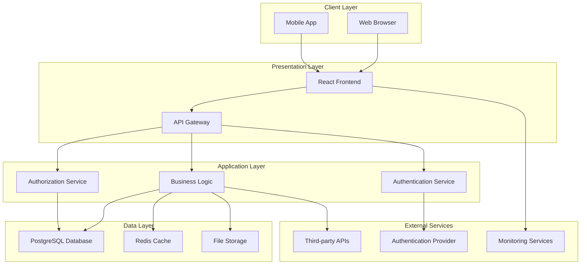

# Architecture Decisions: [FEATURE_NAME]

## Context
[FEATURE_DESCRIPTION]

## AI Development Notes

### Context for AI Agents
Information to help AI agents understand this architectural decision:
- **Complexity Level**: [Low/Medium/High/Very High]
- **Domain Knowledge Required**: [List specific domains - e.g., Distributed Systems, Database Architecture, Microservices, Cloud Infrastructure, Security Architecture]
- **Similar Patterns**: [Reference similar architectural decisions - e.g., "Similar to ADR-005 regarding API versioning strategy", "Follows hexagonal architecture pattern used in core services"]
- **Common Pitfalls**: [Known issues to avoid - e.g., "Avoid premature optimization of database schema", "Don't overcomplicate with microservices too early"]

### Implementation Guidance
- **Recommended Approach**: [Suggested implementation strategy - e.g., "Implement migrations incrementally with rollback support", "Start with monolith, extract services as needed"]
- **Code Patterns to Follow**: [Reference to standards/patterns - e.g., "Follow Clean Architecture principles from standards/architecture-principles.md", "Use Repository pattern for data access"]
- **Testing Strategy**: [Test-first, integration tests, etc. - e.g., "Architecture fitness functions to validate constraints", "Integration tests for cross-service communication"]

### Constraints
- **Must Not**: [Hard constraints - e.g., "Must not introduce circular dependencies between services", "Must not bypass the API gateway"]
- **Should Avoid**: [Soft constraints - e.g., "Avoid tight coupling between layers", "Minimize technology lock-in"]
- **Performance Requirements**: [Speed, memory, etc. - e.g., "System must scale to 10K requests/sec", "Database queries must complete in <50ms p95"]

### Agent Collaboration
- **Best Agent for Task**: [implementation-specialist, frontend-specialist, etc. - e.g., "architecture-specialist for system design, implementation-specialist for coding patterns"]
- **Estimated Token Usage**: [Low/Medium/High - e.g., "High - requires deep understanding of system architecture and trade-offs"]
- **Parallel Execution**: [Can this be parallelized? - e.g., "Partially - infrastructure setup and application code can proceed in parallel"]

## Overview
Technical decisions and constraints documentation for [FEATURE_NAME], following Architecture Decision Records (ADR) format and Agent OS architectural standards.

## Executive Summary

### Key Architectural Decisions
1. **[DECISION_1]**: [BRIEF_DESCRIPTION_1]
2. **[DECISION_2]**: [BRIEF_DESCRIPTION_2]
3. **[DECISION_3]**: [BRIEF_DESCRIPTION_3]

### Technology Stack Decisions
- **Frontend**: [FRONTEND_CHOICE] - [FRONTEND_RATIONALE]
- **Backend**: [BACKEND_CHOICE] - [BACKEND_RATIONALE]
- **Database**: [DATABASE_CHOICE] - [DATABASE_RATIONALE]
- **Deployment**: [DEPLOYMENT_CHOICE] - [DEPLOYMENT_RATIONALE]

## Architecture Decision Records

### ADR-001: [DECISION_TITLE_1]

#### Status
**[STATUS]** - [Proposed | Accepted | Deprecated | Superseded]

#### Date
[DECISION_DATE]

#### Context
[DETAILED_CONTEXT_DESCRIPTION]

The problem we need to solve:
- [PROBLEM_STATEMENT_1]
- [PROBLEM_STATEMENT_2]
- [PROBLEM_STATEMENT_3]

#### Decision
We will [DECISION_STATEMENT].

#### Rationale
```
Primary factors influencing this decision:

1. [FACTOR_1]: [EXPLANATION_1]
2. [FACTOR_2]: [EXPLANATION_2]
3. [FACTOR_3]: [EXPLANATION_3]

Decision matrix:
| Option | [CRITERIA_1] | [CRITERIA_2] | [CRITERIA_3] | Total Score |
|--------|--------------|--------------|--------------|-------------|
| [OPTION_A] | [SCORE_A1] | [SCORE_A2] | [SCORE_A3] | [TOTAL_A] |
| [OPTION_B] | [SCORE_B1] | [SCORE_B2] | [SCORE_B3] | [TOTAL_B] |
| [OPTION_C] | [SCORE_C1] | [SCORE_C2] | [SCORE_C3] | [TOTAL_C] |
```

#### Consequences

**Positive:**
- [POSITIVE_CONSEQUENCE_1]
- [POSITIVE_CONSEQUENCE_2]
- [POSITIVE_CONSEQUENCE_3]

**Negative:**
- [NEGATIVE_CONSEQUENCE_1]
- [NEGATIVE_CONSEQUENCE_2]
- [NEGATIVE_CONSEQUENCE_3]

**Neutral:**
- [NEUTRAL_CONSEQUENCE_1]
- [NEUTRAL_CONSEQUENCE_2]

#### Implementation
```typescript
// Implementation approach
const implementationPlan = {
  phase1: {
    duration: '[DURATION_1]',
    deliverables: '[DELIVERABLES_1]',
    resources: '[RESOURCES_1]'
  },
  phase2: {
    duration: '[DURATION_2]',
    deliverables: '[DELIVERABLES_2]',
    resources: '[RESOURCES_2]'
  }
};
```

#### Alternatives Considered
1. **[ALTERNATIVE_1]**
   - **Pros**: [ALT_1_PROS]
   - **Cons**: [ALT_1_CONS]
   - **Rejected because**: [ALT_1_REJECTION_REASON]

2. **[ALTERNATIVE_2]**
   - **Pros**: [ALT_2_PROS]
   - **Cons**: [ALT_2_CONS]
   - **Rejected because**: [ALT_2_REJECTION_REASON]

#### Related Decisions
- [RELATED_ADR_1]: [RELATIONSHIP_DESCRIPTION_1]
- [RELATED_ADR_2]: [RELATIONSHIP_DESCRIPTION_2]

---

### ADR-002: [DECISION_TITLE_2]

#### Status
**[STATUS]** - [Proposed | Accepted | Deprecated | Superseded]

#### Date
[DECISION_DATE]

#### Context
[CONTEXT_DESCRIPTION_2]

#### Decision
[DECISION_STATEMENT_2]

#### Rationale
[RATIONALE_2]

#### Consequences
**Positive:**
- [POSITIVE_2]

**Negative:**
- [NEGATIVE_2]

#### Implementation
[IMPLEMENTATION_APPROACH_2]

---

### ADR-003: [DECISION_TITLE_3]

#### Status
**[STATUS]** - [Proposed | Accepted | Deprecated | Superseded]

#### Date
[DECISION_DATE]

#### Context
[CONTEXT_DESCRIPTION_3]

#### Decision
[DECISION_STATEMENT_3]

#### Rationale
[RATIONALE_3]

#### Consequences
[CONSEQUENCES_3]

#### Implementation
[IMPLEMENTATION_APPROACH_3]

## Technical Architecture

### System Architecture Overview


### Component Architecture
```typescript
// Component architecture definition
const componentArchitecture = {
  presentation: {
    framework: '[FRONTEND_FRAMEWORK]',
    stateManagement: '[STATE_MANAGEMENT]',
    routing: '[ROUTING_SOLUTION]',
    styling: '[STYLING_APPROACH]',
    components: {
      layout: '[LAYOUT_COMPONENTS]',
      business: '[BUSINESS_COMPONENTS]',
      shared: '[SHARED_COMPONENTS]'
    }
  },
  application: {
    framework: '[BACKEND_FRAMEWORK]',
    architecture: '[ARCHITECTURE_PATTERN]',
    services: '[SERVICE_LAYER]',
    middleware: '[MIDDLEWARE_STACK]',
    apis: {
      rest: '[REST_IMPLEMENTATION]',
      graphql: '[GRAPHQL_IMPLEMENTATION]',
      websocket: '[WEBSOCKET_IMPLEMENTATION]'
    }
  },
  data: {
    database: '[DATABASE_CHOICE]',
    orm: '[ORM_CHOICE]',
    caching: '[CACHING_STRATEGY]',
    storage: '[FILE_STORAGE]',
    migrations: '[MIGRATION_STRATEGY]'
  }
};
```

### Data Architecture
```sql
-- Core data model
CREATE SCHEMA [SCHEMA_NAME];

-- Primary entities
CREATE TABLE [SCHEMA_NAME].[ENTITY_1] (
    id [ID_TYPE] PRIMARY KEY,
    [FIELD_1] [TYPE_1] [CONSTRAINTS_1],
    [FIELD_2] [TYPE_2] [CONSTRAINTS_2],
    created_at TIMESTAMP DEFAULT NOW(),
    updated_at TIMESTAMP DEFAULT NOW()
);

CREATE TABLE [SCHEMA_NAME].[ENTITY_2] (
    id [ID_TYPE] PRIMARY KEY,
    [ENTITY_1]_id [ID_TYPE] REFERENCES [SCHEMA_NAME].[ENTITY_1](id),
    [FIELD_A] [TYPE_A] [CONSTRAINTS_A],
    [FIELD_B] [TYPE_B] [CONSTRAINTS_B],
    created_at TIMESTAMP DEFAULT NOW(),
    updated_at TIMESTAMP DEFAULT NOW()
);

-- Indexes for performance
CREATE INDEX idx_[INDEX_1] ON [SCHEMA_NAME].[ENTITY_1] ([INDEXED_FIELD_1]);
CREATE INDEX idx_[INDEX_2] ON [SCHEMA_NAME].[ENTITY_2] ([INDEXED_FIELD_2]);
```

## Technology Decisions

### Frontend Technology Stack

#### React Framework Decision
**Decision**: Use React [REACT_VERSION] with TypeScript
**Rationale**:
- Industry standard with large ecosystem
- Strong TypeScript integration
- Excellent performance with modern optimizations
- Agent OS standard technology choice
- Team expertise and familiarity

**Configuration**:
```typescript
// React application configuration
const reactConfig = {
  framework: 'React [REACT_VERSION]',
  language: 'TypeScript [TS_VERSION]',
  buildTool: 'Vite [VITE_VERSION]',
  packageManager: 'pnpm [PNPM_VERSION]',
  stateManagement: '[STATE_LIBRARY]',
  styling: 'TailwindCSS [TAILWIND_VERSION]',
  componentLibrary: 'shadcn/ui',
  iconLibrary: 'Lucide React'
};
```

#### State Management Decision
**Decision**: Use [STATE_MANAGEMENT_CHOICE] for application state
**Rationale**:
- [STATE_RATIONALE_1]
- [STATE_RATIONALE_2]
- [STATE_RATIONALE_3]

### Backend Technology Stack

#### API Framework Decision
**Decision**: Use [BACKEND_FRAMEWORK] for API development
**Rationale**:
- [BACKEND_RATIONALE_1]
- [BACKEND_RATIONALE_2]
- [BACKEND_RATIONALE_3]

**Configuration**:
```typescript
// Backend application configuration
const backendConfig = {
  framework: '[BACKEND_FRAMEWORK]',
  runtime: 'Node.js [NODE_VERSION]',
  language: 'TypeScript [TS_VERSION]',
  orm: '[ORM_CHOICE]',
  validation: '[VALIDATION_LIBRARY]',
  authentication: '[AUTH_STRATEGY]',
  authorization: '[AUTHZ_STRATEGY]',
  logging: '[LOGGING_LIBRARY]',
  monitoring: '[MONITORING_SOLUTION]'
};
```

### Database Technology Stack

#### Database Engine Decision
**Decision**: Use PostgreSQL [PG_VERSION] as primary database
**Rationale**:
- ACID compliance for data integrity
- Advanced JSON support for flexible schemas
- Excellent performance and scalability
- Strong ecosystem and tooling
- Agent OS standard database choice

**Configuration**:
```sql
-- Database configuration
-- Connection settings
max_connections = [MAX_CONNECTIONS]
shared_buffers = [SHARED_BUFFERS]
effective_cache_size = [CACHE_SIZE]

-- Performance settings
random_page_cost = [PAGE_COST]
effective_io_concurrency = [IO_CONCURRENCY]
work_mem = [WORK_MEM]
maintenance_work_mem = [MAINTENANCE_WORK_MEM]

-- Logging settings
log_statement = '[LOG_STATEMENT]'
log_duration = [LOG_DURATION]
log_min_duration_statement = [MIN_DURATION]
```

#### Caching Strategy Decision
**Decision**: Implement Redis-based caching
**Rationale**:
- High-performance in-memory storage
- Rich data structures for complex caching
- Persistence options for durability
- Excellent Node.js integration

```typescript
// Caching configuration
const cachingConfig = {
  provider: 'Redis [REDIS_VERSION]',
  strategy: '[CACHING_STRATEGY]',
  ttl: {
    short: '[SHORT_TTL]',
    medium: '[MEDIUM_TTL]',
    long: '[LONG_TTL]'
  },
  eviction: '[EVICTION_POLICY]',
  clustering: '[CLUSTERING_STRATEGY]'
};
```

### Database Schema & ERD

> **Note**: For comprehensive ERD guidance, see `templates/spec-templates/ERD_GENERATION_GUIDE.md`

Document the database architecture with Entity-Relationship Diagrams to visualize data models and relationships.

#### Entity-Relationship Diagram

```mermaid
erDiagram
    [ENTITY_1] ||--o{ [ENTITY_2] : [RELATIONSHIP_LABEL]
    [ENTITY_1] {
        uuid id PK
        varchar [field_1] UK "Unique identifier"
        varchar [field_2]
        timestamp created_at
        timestamp updated_at
    }
    [ENTITY_2] ||--|{ [ENTITY_3] : [RELATIONSHIP_LABEL]
    [ENTITY_2] {
        uuid id PK
        uuid [entity_1]_id FK
        varchar status "pending, processing, completed"
        decimal [amount_field]
        timestamp created_at
    }
    [ENTITY_3] {
        uuid id PK
        uuid [entity_2]_id FK
        uuid [entity_4]_id FK
        int quantity
        decimal unit_price
    }
    [ENTITY_4] ||--o{ [ENTITY_3] : "referenced by"
    [ENTITY_4] {
        uuid id PK
        varchar name
        text description
        decimal price
        int inventory_count
    }
```

**Architecture Decision**: Use UUID primary keys for all entities
**Rationale**:
- Distributed system compatibility (no ID collision risk)
- Better security (non-sequential IDs)
- Easier data migration between environments
- Supports microservices architecture

#### Relationship Architecture

**One-to-Many Relationships**:
- `[entity_1]` → `[entity_2]`: Cascade delete (dependent data)
- `[entity_2]` → `[entity_3]`: Cascade delete (child records)
- `[entity_4]` → `[entity_3]`: Restrict delete (preserve references)

**Indexing Strategy**:
- All foreign keys automatically indexed
- Unique indexes on business keys ([BUSINESS_KEY_EXAMPLE])
- Composite indexes on frequently queried field combinations
- Full-text search indexes on text fields ([TEXT_FIELD_EXAMPLES])

#### Schema Evolution Strategy

**Migration Approach**: [MIGRATION_STRATEGY]
**Versioning**: [VERSIONING_APPROACH]
**Backward Compatibility**: [COMPATIBILITY_STRATEGY]

```sql
-- Example migration structure
-- migrations/[VERSION]_[DESCRIPTION].sql

-- Up migration
CREATE TABLE [table_name] (
  id UUID PRIMARY KEY DEFAULT gen_random_uuid(),
  [field_definitions]
);

-- Rollback migration
-- migrations/[VERSION]_[DESCRIPTION]_rollback.sql
DROP TABLE IF EXISTS [table_name] CASCADE;
```

#### ORM Architecture Decision

**Decision**: Use [ORM_CHOICE] for database abstraction
**Rationale**:
- Type-safe database queries
- Automatic migration generation
- Strong community support
- [ORM_SPECIFIC_BENEFIT_1]
- [ORM_SPECIFIC_BENEFIT_2]

**Example Model Architecture**:

```typescript
// Architecture: Models follow repository pattern
// Location: src/models/[domain]/

import { Entity, PrimaryGeneratedColumn, Column, ManyToOne } from 'typeorm';

@Entity('[table_name]')
export class [EntityName] {
  @PrimaryGeneratedColumn('uuid')
  id: string;

  @Column({ type: 'varchar', length: 255, unique: true })
  [unique_field]: string;

  @ManyToOne(() => [ParentEntity], { onDelete: 'CASCADE' })
  [parent_relation]: [ParentEntity];

  @CreateDateColumn()
  created_at: Date;

  @UpdateDateColumn()
  updated_at: Date;
}
```

## Performance Architecture

### Performance Requirements
```typescript
// Performance benchmarks and targets
const performanceTargets = {
  frontend: {
    firstContentfulPaint: 1500, // ms
    largestContentfulPaint: 2500, // ms
    timeToInteractive: 3000, // ms
    cumulativeLayoutShift: 0.1,
    firstInputDelay: 100 // ms
  },
  backend: {
    apiResponseTime: {
      p50: 100, // ms
      p95: 250, // ms
      p99: 500 // ms
    },
    throughput: 1000, // requests/second
    errorRate: 0.1 // %
  },
  database: {
    queryTime: {
      simple: 10, // ms
      complex: 100, // ms
      analytical: 1000 // ms
    },
    connections: {
      max: 100,
      poolSize: 20
    }
  }
};
```

### Optimization Strategies
1. **Frontend Optimization**
   - Code splitting and lazy loading
   - Image optimization and compression
   - Service worker for caching
   - Bundle size optimization

2. **Backend Optimization**
   - Database query optimization
   - API response caching
   - Connection pooling
   - Asynchronous processing

3. **Infrastructure Optimization**
   - CDN implementation
   - Load balancing
   - Auto-scaling configuration
   - Monitoring and alerting

## Security Architecture

### Security Framework
```typescript
// Security architecture configuration
const securityArchitecture = {
  authentication: {
    provider: '[AUTH_PROVIDER]',
    methods: ['[AUTH_METHOD_1]', '[AUTH_METHOD_2]'],
    tokenType: '[TOKEN_TYPE]',
    sessionManagement: '[SESSION_STRATEGY]'
  },
  authorization: {
    model: 'RBAC',
    enforcement: '[AUTHZ_ENFORCEMENT]',
    policies: '[POLICY_ENGINE]'
  },
  dataProtection: {
    encryption: {
      inTransit: 'TLS 1.3',
      atRest: '[ENCRYPTION_ALGORITHM]',
      keys: '[KEY_MANAGEMENT]'
    },
    privacy: {
      dataClassification: '[DATA_CLASSIFICATION]',
      retention: '[RETENTION_POLICY]',
      anonymization: '[ANONYMIZATION_STRATEGY]'
    }
  },
  infrastructure: {
    networkSecurity: '[NETWORK_SECURITY]',
    containerSecurity: '[CONTAINER_SECURITY]',
    secretsManagement: '[SECRETS_MANAGEMENT]'
  }
};
```

### Security Controls
1. **Input Validation**
   - All user inputs validated and sanitized
   - SQL injection prevention
   - XSS protection
   - CSRF token implementation

2. **Access Control**
   - Role-based permissions
   - API endpoint protection
   - Resource-level authorization
   - Audit logging

3. **Data Protection**
   - Encryption in transit and at rest
   - PII data handling
   - Secure backup procedures
   - Data leak prevention

## Scalability Architecture

### Horizontal Scaling Strategy
```yaml
# Scaling configuration
scalability:
  frontend:
    cdn: '[CDN_PROVIDER]'
    static_hosting: '[HOSTING_PROVIDER]'
    edge_caching: '[EDGE_STRATEGY]'

  backend:
    load_balancer: '[LB_TYPE]'
    auto_scaling: '[SCALING_STRATEGY]'
    container_orchestration: '[ORCHESTRATION_PLATFORM]'
    service_mesh: '[SERVICE_MESH]'

  database:
    read_replicas: '[REPLICA_COUNT]'
    connection_pooling: '[POOLING_STRATEGY]'
    sharding: '[SHARDING_STRATEGY]'
    caching: '[CACHE_STRATEGY]'
```

### Capacity Planning
- **Expected Load**: [EXPECTED_LOAD] concurrent users
- **Growth Projection**: [GROWTH_RATE]% annually
- **Resource Requirements**: [RESOURCE_ESTIMATES]
- **Scaling Triggers**: [SCALING_TRIGGERS]

## Deployment Architecture

### Infrastructure as Code
```yaml
# Infrastructure configuration
infrastructure:
  provider: '[CLOUD_PROVIDER]'
  regions: '[DEPLOYMENT_REGIONS]'
  environments:
    development:
      instances: '[DEV_INSTANCES]'
      resources: '[DEV_RESOURCES]'
    staging:
      instances: '[STAGING_INSTANCES]'
      resources: '[STAGING_RESOURCES]'
    production:
      instances: '[PROD_INSTANCES]'
      resources: '[PROD_RESOURCES]'

  deployment_strategy: '[DEPLOYMENT_STRATEGY]'
  rollback_strategy: '[ROLLBACK_STRATEGY]'
  health_checks: '[HEALTH_CHECK_CONFIG]'
  monitoring: '[MONITORING_CONFIG]'
```

### CI/CD Pipeline Architecture
```yaml
# CI/CD pipeline configuration
pipeline:
  source_control: '[SCM_SYSTEM]'
  build_system: '[BUILD_SYSTEM]'
  testing:
    unit: '[UNIT_TEST_CONFIG]'
    integration: '[INTEGRATION_TEST_CONFIG]'
    e2e: '[E2E_TEST_CONFIG]'
  security:
    sast: '[SAST_TOOL]'
    dast: '[DAST_TOOL]'
    dependency_scan: '[DEPENDENCY_TOOL]'
  deployment:
    strategy: '[DEPLOYMENT_STRATEGY]'
    approval_gates: '[APPROVAL_PROCESS]'
    rollback: '[ROLLBACK_AUTOMATION]'
```

## Monitoring & Observability

### Observability Stack
```typescript
// Monitoring architecture
const observabilityStack = {
  logging: {
    aggregation: '[LOG_AGGREGATION_TOOL]',
    analysis: '[LOG_ANALYSIS_TOOL]',
    retention: '[LOG_RETENTION_PERIOD]'
  },
  metrics: {
    collection: '[METRICS_COLLECTION_TOOL]',
    storage: '[METRICS_STORAGE]',
    visualization: '[DASHBOARD_TOOL]'
  },
  tracing: {
    distributed: '[TRACING_TOOL]',
    sampling: '[SAMPLING_STRATEGY]',
    correlation: '[CORRELATION_STRATEGY]'
  },
  alerting: {
    manager: '[ALERT_MANAGER]',
    channels: '[NOTIFICATION_CHANNELS]',
    escalation: '[ESCALATION_POLICY]'
  }
};
```

### Key Metrics
- **Application Metrics**: Response time, throughput, error rate
- **Infrastructure Metrics**: CPU, memory, disk, network utilization
- **Business Metrics**: User engagement, conversion rates, feature usage
- **Security Metrics**: Authentication failures, access violations, threat detection

## Reusability Analysis

Identify opportunities to extract reusable components following compounding engineering principles. See `@.agent-os/standards/best-practices.md` for philosophy.

### Existing Patterns to Reuse
What existing code/patterns can be leveraged?

- **Pattern/Component**: [Name]
  - **Location**: `file:line`
  - **How to reuse**: [Brief description]
  - **Modifications needed**: [None/Minor/Adapt]

Example:
- **Pattern/Component**: User authentication middleware
  - **Location**: `src/middleware/auth.ts:15`
  - **How to reuse**: Import and apply to protected routes
  - **Modifications needed**: None - works as-is

### New Reusable Components
What components should be extracted for future reuse?

- **Component**: [Name and purpose]
  - **Abstraction level**: [Utility/Service/Module/Library]
  - **Future use cases**: [List potential reuses]
  - **Documentation needed**: [What to document]

Example:
- **Component**: Email validation and sanitization
  - **Abstraction level**: Utility function
  - **Future use cases**: All forms with email input, user registration, profile updates
  - **Documentation needed**: API docs, examples, edge cases

### Knowledge to Capture
What learnings should be documented for next time?

- **Pattern/Anti-pattern**: [Name]
  - **Description**: [What was learned]
  - **Documentation location**: [Where to add it]
  - **Example code**: [If applicable]

Example:
- **Pattern**: Rate limiting with Redis
  - **Description**: Sliding window algorithm prevents burst abuse
  - **Documentation location**: `@.agent-os/patterns/rate-limiting.md`
  - **Example code**: See implementation in `src/middleware/rate-limit.ts:25-60`

### Compound Value Assessment
How does this feature increase system compounding value?

- **Immediate value**: [Direct benefit of this feature]
- **Future value**: [How it makes future features easier]
- **Compound factor**: [Estimate: Low/Medium/High/Very High]

Example:
- **Immediate value**: User can reset forgotten passwords
- **Future value**: Email sending infrastructure can be reused for notifications, 2FA, marketing
- **Compound factor**: High - email system is foundation for 5+ future features

### Refactoring Opportunities
What existing code should be refactored to improve reusability?

- **Location**: `file:line`
  - **Current issue**: [What makes it hard to reuse]
  - **Proposed refactor**: [How to improve it]
  - **Impact**: [Benefits of refactoring]
  - **Priority**: [High/Medium/Low]

Example:
- **Location**: `src/services/user_service.rb:45-120`
  - **Current issue**: Monolithic method mixes validation, DB access, email sending
  - **Proposed refactor**: Extract validation → `validate_user_input`, email → `send_welcome_email`
  - **Impact**: Each piece reusable independently, easier to test
  - **Priority**: High - blocks 3 upcoming features

## Code Examples

This section demonstrates how to implement key architectural decisions with concrete code examples.

### Example 1: Implementing the Chosen Architecture Pattern

**Purpose**: Demonstrate the primary architectural pattern implementation

**Architecture Pattern**: [CHOSEN_PATTERN] (e.g., MVC, Clean Architecture, Hexagonal, etc.)

```typescript
// Example: [ARCHITECTURE_PATTERN] implementation structure

// Domain Layer - Core business logic (no dependencies)
// domain/entities/[Entity].ts
export class [Entity] {
  constructor(
    private readonly id: string,
    private data: [EntityData]
  ) {}

  // Business logic methods
  public validate(): ValidationResult {
    // Domain validation rules
    return {
      is_valid: [VALIDATION_LOGIC],
      errors: [VALIDATION_ERRORS]
    };
  }

  public update_data(new_data: Partial<[EntityData]>): void {
    // Business rules for updates
    this.data = { ...this.data, ...new_data };
  }
}

// Application Layer - Use cases and orchestration
// application/use-cases/[UseCase].ts
import { [Entity] } from '../../domain/entities/[Entity]';
import { [Repository] } from '../../domain/repositories/[Repository]';

export class [UseCase] {
  constructor(
    private readonly repository: [Repository]
  ) {}

  async execute(input: [InputDTO]): Promise<[OutputDTO]> {
    // 1. Retrieve entity
    const entity = await this.repository.find_by_id(input.id);

    if (!entity) {
      throw new Error('Entity not found');
    }

    // 2. Apply business logic
    entity.update_data(input.data);

    const validation = entity.validate();
    if (!validation.is_valid) {
      throw new Error(`Validation failed: ${validation.errors.join(', ')}`);
    }

    // 3. Persist changes
    await this.repository.save(entity);

    // 4. Return result
    return {
      success: true,
      entity_id: entity.id
    };
  }
}

// Infrastructure Layer - External interfaces
// infrastructure/repositories/[RepositoryImplementation].ts
import { Pool } from 'pg';
import { [Entity] } from '../../domain/entities/[Entity]';
import { [Repository] } from '../../domain/repositories/[Repository]';

export class [PostgresRepository] implements [Repository] {
  constructor(private readonly pool: Pool) {}

  async find_by_id(id: string): Promise<[Entity] | null> {
    const result = await this.pool.query(
      'SELECT * FROM [table_name] WHERE id = $1',
      [id]
    );

    if (result.rows.length === 0) {
      return null;
    }

    return this.map_to_entity(result.rows[0]);
  }

  async save(entity: [Entity]): Promise<void> {
    await this.pool.query(
      'UPDATE [table_name] SET data = $1 WHERE id = $2',
      [entity.data, entity.id]
    );
  }

  private map_to_entity(row: any): [Entity] {
    return new [Entity](row.id, row.data);
  }
}
```

**Key Architectural Principles**:
- **Dependency Inversion**: Domain doesn't depend on infrastructure
- **Separation of Concerns**: Each layer has distinct responsibilities
- **Testability**: Business logic can be tested without database
- **Flexibility**: Easy to swap implementations (e.g., different database)

### Example 2: State Management Architecture

**Purpose**: Show the chosen state management pattern implementation

**Pattern**: [STATE_MANAGEMENT_CHOICE]

```typescript
// Example: [STATE_MANAGEMENT] implementation

// State definition
interface [ApplicationState] {
  [feature]: {
    data: [FeatureData][];
    loading: boolean;
    error: string | null;
  };
}

// Actions
type [FeatureActions] =
  | { type: 'FETCH_DATA_START' }
  | { type: 'FETCH_DATA_SUCCESS'; payload: [FeatureData][] }
  | { type: 'FETCH_DATA_FAILURE'; payload: string }
  | { type: 'UPDATE_ITEM'; payload: { id: string; data: Partial<[FeatureData]> } };

// Reducer
const [feature_reducer] = (
  state: [ApplicationState]['[feature]'],
  action: [FeatureActions]
): [ApplicationState]['[feature]'] => {
  switch (action.type) {
    case 'FETCH_DATA_START':
      return {
        ...state,
        loading: true,
        error: null,
      };

    case 'FETCH_DATA_SUCCESS':
      return {
        ...state,
        loading: false,
        data: action.payload,
      };

    case 'FETCH_DATA_FAILURE':
      return {
        ...state,
        loading: false,
        error: action.payload,
      };

    case 'UPDATE_ITEM':
      return {
        ...state,
        data: state.data.map(item =>
          item.id === action.payload.id
            ? { ...item, ...action.payload.data }
            : item
        ),
      };

    default:
      return state;
  }
};

// Action creators
const [feature_actions] = {
  fetch_data: () => async (dispatch: Dispatch<[FeatureActions]>) => {
    dispatch({ type: 'FETCH_DATA_START' });

    try {
      const data = await [api_client].fetch_data();
      dispatch({ type: 'FETCH_DATA_SUCCESS', payload: data });
    } catch (error) {
      dispatch({
        type: 'FETCH_DATA_FAILURE',
        payload: error instanceof Error ? error.message : 'Unknown error',
      });
    }
  },

  update_item: (id: string, data: Partial<[FeatureData]>) => ({
    type: 'UPDATE_ITEM' as const,
    payload: { id, data },
  }),
};

// Selectors
const [feature_selectors] = {
  get_data: (state: [ApplicationState]) => state.[feature].data,
  get_loading: (state: [ApplicationState]) => state.[feature].loading,
  get_error: (state: [ApplicationState]) => state.[feature].error,
  get_item_by_id: (state: [ApplicationState], id: string) =>
    state.[feature].data.find(item => item.id === id),
};
```

**Key Design Decisions**:
- **Immutability**: State updates create new objects
- **Single Source of Truth**: Centralized state management
- **Predictable Updates**: Actions clearly define state changes
- **Separation**: Business logic separated from UI components

### Example 3: API Layer Architecture

**Purpose**: Demonstrate API layer design with versioning and middleware

```typescript
// Example: RESTful API architecture with Express

import express, { Request, Response, NextFunction } from 'express';
import { [UseCase] } from '../application/use-cases/[UseCase]';

// API versioning structure
const create_api_router = (version: string) => {
  const router = express.Router();

  // Middleware stack
  router.use(authentication_middleware);
  router.use(rate_limiting_middleware);
  router.use(validation_middleware);

  // Route handlers
  router.get(
    '/[resource]/:id',
    async (req: Request, res: Response, next: NextFunction) => {
      try {
        const use_case = container.resolve<[UseCase]>('[UseCase]');

        const result = await use_case.execute({
          id: req.params.id,
        });

        res.json({
          success: true,
          data: result,
          version,
        });
      } catch (error) {
        next(error);
      }
    }
  );

  router.post(
    '/[resource]',
    async (req: Request, res: Response, next: NextFunction) => {
      try {
        // Validate request body
        const validation = validate_request_body(req.body);
        if (!validation.is_valid) {
          return res.status(400).json({
            success: false,
            errors: validation.errors,
          });
        }

        const use_case = container.resolve<[UseCase]>('[UseCase]');
        const result = await use_case.execute(req.body);

        res.status(201).json({
          success: true,
          data: result,
          version,
        });
      } catch (error) {
        next(error);
      }
    }
  );

  return router;
};

// API versioning setup
const app = express();

app.use('/api/v1', create_api_router('v1'));
app.use('/api/v2', create_api_router('v2'));

// Global error handler
app.use((error: Error, req: Request, res: Response, next: NextFunction) => {
  logger.error('API error:', {
    error: error.message,
    stack: error.stack,
    path: req.path,
  });

  res.status(500).json({
    success: false,
    error: 'Internal server error',
  });
});
```

**Key Architectural Decisions**:
- **API Versioning**: Support multiple API versions simultaneously
- **Middleware Pattern**: Composable request processing pipeline
- **Dependency Injection**: Loosely coupled components
- **Error Handling**: Centralized error processing

### Example 4: Database Architecture Pattern

**Purpose**: Show database access layer with migration strategy

```typescript
// Example: Database architecture with migrations

// Migration system
// migrations/001_create_[table_name].ts
export const up = async (client: PoolClient): Promise<void> => {
  await client.query(`
    CREATE TABLE [table_name] (
      id UUID PRIMARY KEY DEFAULT gen_random_uuid(),
      [field_1] [TYPE_1] NOT NULL,
      [field_2] [TYPE_2],
      created_at TIMESTAMP DEFAULT NOW(),
      updated_at TIMESTAMP DEFAULT NOW()
    );

    CREATE INDEX idx_[table_name]_[field_1]
    ON [table_name] ([field_1]);
  `);
};

export const down = async (client: PoolClient): Promise<void> => {
  await client.query(`DROP TABLE IF EXISTS [table_name]`);
};

// Query builder pattern
class [QueryBuilder] {
  private query: string = '';
  private params: any[] = [];
  private param_index: number = 1;

  select(fields: string[]): this {
    this.query = `SELECT ${fields.join(', ')}`;
    return this;
  }

  from(table: string): this {
    this.query += ` FROM ${table}`;
    return this;
  }

  where(condition: string, value: any): this {
    const connector = this.query.includes('WHERE') ? 'AND' : 'WHERE';
    this.query += ` ${connector} ${condition} $${this.param_index}`;
    this.params.push(value);
    this.param_index++;
    return this;
  }

  order_by(field: string, direction: 'ASC' | 'DESC' = 'ASC'): this {
    this.query += ` ORDER BY ${field} ${direction}`;
    return this;
  }

  limit(count: number): this {
    this.query += ` LIMIT $${this.param_index}`;
    this.params.push(count);
    this.param_index++;
    return this;
  }

  build(): { query: string; params: any[] } {
    return {
      query: this.query,
      params: this.params,
    };
  }
}

// Usage
const builder = new [QueryBuilder]();
const { query, params } = builder
  .select(['id', 'name', 'email'])
  .from('[table_name]')
  .where('active', true)
  .where('created_at > ', new Date('2024-01-01'))
  .order_by('created_at', 'DESC')
  .limit(10)
  .build();

const result = await pool.query(query, params);
```

**Key Design Patterns**:
- **Migration System**: Version-controlled schema changes
- **Query Builder**: Type-safe, composable query construction
- **Connection Pooling**: Efficient database connection management
- **Transactions**: ACID compliance for data integrity

### Example 5: Microservices Communication Pattern

**Purpose**: Demonstrate service-to-service communication architecture

```typescript
// Example: Inter-service communication with circuit breaker

class [ServiceClient] {
  private circuit_breaker: CircuitBreaker;
  private retry_policy: RetryPolicy;

  constructor(
    private service_url: string,
    private config: ServiceClientConfig
  ) {
    this.circuit_breaker = new CircuitBreaker({
      failure_threshold: 5,
      reset_timeout: 60000,
    });

    this.retry_policy = new RetryPolicy({
      max_attempts: 3,
      backoff: 'exponential',
    });
  }

  async call_service<T>(
    endpoint: string,
    options: RequestOptions
  ): Promise<T> {
    return this.circuit_breaker.execute(async () => {
      return this.retry_policy.execute(async () => {
        const response = await fetch(
          `${this.service_url}${endpoint}`,
          {
            ...options,
            headers: {
              ...options.headers,
              'X-Request-ID': generate_request_id(),
              'X-Correlation-ID': get_correlation_id(),
            },
          }
        );

        if (!response.ok) {
          throw new ServiceError(
            `Service call failed: ${response.statusText}`,
            response.status
          );
        }

        return response.json();
      });
    });
  }
}

// Circuit breaker implementation
class CircuitBreaker {
  private state: 'CLOSED' | 'OPEN' | 'HALF_OPEN' = 'CLOSED';
  private failures: number = 0;
  private last_failure_time: number = 0;

  constructor(private config: CircuitBreakerConfig) {}

  async execute<T>(operation: () => Promise<T>): Promise<T> {
    if (this.state === 'OPEN') {
      if (Date.now() - this.last_failure_time > this.config.reset_timeout) {
        this.state = 'HALF_OPEN';
      } else {
        throw new Error('Circuit breaker is OPEN');
      }
    }

    try {
      const result = await operation();

      if (this.state === 'HALF_OPEN') {
        this.state = 'CLOSED';
        this.failures = 0;
      }

      return result;
    } catch (error) {
      this.failures++;
      this.last_failure_time = Date.now();

      if (this.failures >= this.config.failure_threshold) {
        this.state = 'OPEN';
      }

      throw error;
    }
  }
}
```

**Key Architectural Patterns**:
- **Circuit Breaker**: Prevent cascade failures
- **Retry Policy**: Automatic retry with backoff
- **Request Correlation**: Track requests across services
- **Fault Tolerance**: Graceful degradation under failure

### Architectural Decision Comparison

**Good Architecture Example ✅**
```typescript
// GOOD: Layered architecture with clear separation

// Controller Layer - HTTP concerns only
export class [Controller] {
  constructor(private use_case: [UseCase]) {}

  async handle_request(req: Request, res: Response) {
    const result = await this.use_case.execute(req.body);
    res.json(result);
  }
}

// Use Case Layer - Business orchestration
export class [UseCase] {
  constructor(
    private repository: [Repository],
    private email_service: [EmailService]
  ) {}

  async execute(input: [Input]): Promise<[Output]> {
    const entity = await this.repository.create(input);
    await this.email_service.send_notification(entity);
    return { entity_id: entity.id };
  }
}

// Repository Layer - Data access
export class [Repository] {
  async create(data: [Data]): Promise<[Entity]> {
    // Database operations
  }
}
```

**Bad Architecture Example ❌**
```typescript
// BAD: Mixed concerns, tight coupling, no testability

export class [BadController] {
  async handle_request(req: Request, res: Response) {
    // Database access in controller
    const result = await db.query('INSERT INTO ...');

    // Email sending in controller
    await sendgrid.send({
      to: result.email,
      subject: 'Welcome',
    });

    res.json({ id: result.id });
  }
}
```

**Why the first example is better**:
- **Separation of Concerns**: Each layer has one responsibility
- **Testability**: Can test business logic without HTTP or database
- **Maintainability**: Changes to one layer don't affect others
- **Flexibility**: Easy to swap implementations (e.g., different email service)

### Additional Resources

**Architecture Patterns**:
- See `docs/architecture/[PATTERN_NAME].md` for detailed pattern documentation
- See `standards/architecture-principles.md` for architectural guidelines
- See `examples/architectures/` for complete architecture examples

**Decision Records**:
- Each ADR above should have corresponding implementation examples
- See `docs/adr/` directory for all architecture decision records

## Deep Analysis

This architecture specification underwent ultra-thinking protocol analysis to ensure comprehensive quality:

### Analysis Artifacts
- **[Stakeholder Analysis](./analysis-stakeholder.md)**: Multi-stakeholder impact assessment covering Developer, Operations, User, Security, Business, and QA perspectives
- **[Scenario Exploration](./analysis-scenarios.md)**: Risk-prioritized scenarios across edge cases, failures, scale, security, user behavior, integration, and operational concerns
- **[Multi-Angle Review](./analysis-multi-angle.md)**: Comprehensive review from Technical Excellence, Business Value, Risk Management, Team Collaboration, UX, and Long-term Vision angles

### Key Architecture Insights from Deep Analysis

#### Architecture Strategist Findings
**Technical Excellence Rating**: [RATING/5] ⭐
- **Architectural Soundness**: [SUMMARY]
- **Scalability Assessment**: [SUMMARY]
- **Technical Debt Implications**: [SUMMARY]

#### Critical Architecture Scenarios (P1)
- [P1_ARCH_SCENARIO_1]: [DESCRIPTION] - [MITIGATION]
- [P1_ARCH_SCENARIO_2]: [DESCRIPTION] - [MITIGATION]
- [P1_ARCH_SCENARIO_3]: [DESCRIPTION] - [MITIGATION]

#### Long-term Vision Assessment
**Maintainability Rating**: [RATING/5] ⭐
- **2-Year Evolution Path**: [SUMMARY]
- **Technology Resilience**: [SUMMARY]
- **Team Capability Match**: [SUMMARY]

#### Architecture Readiness
- [ ] Architectural patterns are proven and well-understood
- [ ] Scalability requirements are achievable
- [ ] Technical debt is acceptable
- [ ] Team has skills to implement and maintain
- [ ] Long-term evolution path is clear

## Risk Assessment

### Technical Risks
| Risk | Impact | Probability | Mitigation |
|------|--------|-------------|------------|
| [TECH_RISK_1] | [IMPACT_1] | [PROB_1] | [MITIGATION_1] |
| [TECH_RISK_2] | [IMPACT_2] | [PROB_2] | [MITIGATION_2] |
| [TECH_RISK_3] | [IMPACT_3] | [PROB_3] | [MITIGATION_3] |

### Architectural Risks
| Risk | Impact | Probability | Mitigation |
|------|--------|-------------|------------|
| [ARCH_RISK_1] | [ARCH_IMPACT_1] | [ARCH_PROB_1] | [ARCH_MITIGATION_1] |
| [ARCH_RISK_2] | [ARCH_IMPACT_2] | [ARCH_PROB_2] | [ARCH_MITIGATION_2] |
| [ARCH_RISK_3] | [ARCH_IMPACT_3] | [ARCH_PROB_3] | [ARCH_MITIGATION_3] |

### Contingency Plans
1. **Performance Degradation**: [PERFORMANCE_CONTINGENCY]
2. **Security Incident**: [SECURITY_CONTINGENCY]
3. **System Failure**: [FAILURE_CONTINGENCY]
4. **Data Loss**: [DATA_LOSS_CONTINGENCY]

## Evolution & Maintenance

### Architecture Evolution Strategy
```typescript
// Architecture evolution plan
const evolutionStrategy = {
  shortTerm: {
    timeline: '[SHORT_TERM_TIMELINE]',
    objectives: '[SHORT_TERM_OBJECTIVES]',
    deliverables: '[SHORT_TERM_DELIVERABLES]'
  },
  mediumTerm: {
    timeline: '[MEDIUM_TERM_TIMELINE]',
    objectives: '[MEDIUM_TERM_OBJECTIVES]',
    deliverables: '[MEDIUM_TERM_DELIVERABLES]'
  },
  longTerm: {
    timeline: '[LONG_TERM_TIMELINE]',
    objectives: '[LONG_TERM_OBJECTIVES]',
    deliverables: '[LONG_TERM_DELIVERABLES]'
  }
};
```

### Technical Debt Management
- **Debt Classification**: [DEBT_CLASSIFICATION_SYSTEM]
- **Debt Tracking**: [DEBT_TRACKING_TOOL]
- **Remediation Strategy**: [DEBT_REMEDIATION_PLAN]
- **Prevention Measures**: [DEBT_PREVENTION_STRATEGY]

### Documentation Maintenance
- **Architecture Documentation**: Updated quarterly
- **Decision Records**: Updated with each major decision
- **Runbooks**: Updated with operational changes
- **API Documentation**: Auto-generated and maintained

---

**Template Version**: 2.0.0
**Last Updated**: [CURRENT_DATE]
**Next Architecture Review**: [REVIEW_DATE]
**Decision Authority**: [DECISION_AUTHORITY]