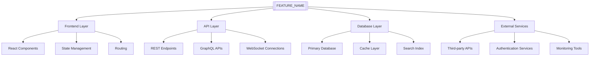

# Integration Requirements: [FEATURE_NAME]

## Context
[FEATURE_DESCRIPTION]

## AI Development Notes

### Context for AI Agents
Information to help AI agents understand this integration:
- **Complexity Level**: [Low/Medium/High/Very High]
- **Domain Knowledge Required**: [List specific domains - e.g., API Design, Service Integration, Event-Driven Architecture, Message Queues, Webhook Systems]
- **Similar Patterns**: [Reference similar integrations - e.g., "Follow payment gateway integration pattern", "Similar to existing notification service integration"]
- **Common Pitfalls**: [Known issues to avoid - e.g., "Avoid synchronous calls to slow external APIs", "Handle network failures gracefully with circuit breakers"]

### Implementation Guidance
- **Recommended Approach**: [Suggested implementation strategy - e.g., "Implement retry logic with exponential backoff", "Use async processing for external API calls"]
- **Code Patterns to Follow**: [Reference to standards/patterns - e.g., "Follow adapter pattern for external services from standards/integration-patterns.md", "Use dependency injection for service clients"]
- **Testing Strategy**: [Test-first, integration tests, etc. - e.g., "Mock external services for unit tests", "Use contract testing for API integrations", "Test timeout and retry scenarios"]

### Constraints
- **Must Not**: [Hard constraints - e.g., "Must not block main thread on external API calls", "Must not store third-party API keys in code"]
- **Should Avoid**: [Soft constraints - e.g., "Avoid tight coupling to external service implementations", "Minimize data transfer between services"]
- **Performance Requirements**: [Speed, memory, etc. - e.g., "External API calls timeout at 5s", "Cache external data for 15 minutes", "Support 100 concurrent integrations"]

### Agent Collaboration
- **Best Agent for Task**: [implementation-specialist, frontend-specialist, etc. - e.g., "integration-specialist for API contracts", "implementation-specialist for service clients"]
- **Estimated Token Usage**: [Low/Medium/High - e.g., "Medium - standard integration patterns with some complexity in error handling"]
- **Parallel Execution**: [Can this be parallelized? - e.g., "Yes - different external service integrations can be developed in parallel"]

## Overview
System integration and compatibility requirements for [FEATURE_NAME], ensuring seamless operation within the existing ecosystem and future scalability.

## Integration Architecture

### System Landscape


### Integration Points

#### Frontend Integration
1. **Component Integration**
   - **Location**: [COMPONENT_INTEGRATION_PATH]
   - **Dependencies**: [FRONTEND_DEPENDENCIES]
   - **Integration Method**: [INTEGRATION_APPROACH]
   - **State Management**: [STATE_INTEGRATION]

2. **Routing Integration**
   - **Route Structure**: [ROUTE_DEFINITIONS]
   - **Navigation Flow**: [NAV_INTEGRATION]
   - **Guard Conditions**: [ROUTE_GUARDS]
   - **Lazy Loading**: [LAZY_LOAD_STRATEGY]

3. **State Management Integration**
   - **Store Structure**: [STORE_INTEGRATION]
   - **Action Definitions**: [ACTION_INTEGRATION]
   - **Reducer Integration**: [REDUCER_INTEGRATION]
   - **Middleware Usage**: [MIDDLEWARE_INTEGRATION]

#### Backend Integration
1. **API Endpoints**
   ```typescript
   // API integration points
   const apiIntegration = {
     endpoints: {
       [ENDPOINT_1]: {
         method: '[HTTP_METHOD]',
         path: '[ENDPOINT_PATH]',
         integration: '[INTEGRATION_TYPE]',
         dependencies: '[ENDPOINT_DEPENDENCIES]'
       },
       [ENDPOINT_2]: {
         method: '[HTTP_METHOD]',
         path: '[ENDPOINT_PATH]',
         integration: '[INTEGRATION_TYPE]',
         dependencies: '[ENDPOINT_DEPENDENCIES]'
       }
     }
   };
   ```

2. **Database Integration**
   - **Schema Changes**: [SCHEMA_MODIFICATIONS]
   - **Migration Strategy**: [MIGRATION_APPROACH]
   - **Index Requirements**: [INDEX_STRATEGY]
   - **Relationship Management**: [RELATIONSHIP_HANDLING]

3. **Service Layer Integration**
   - **Business Logic Integration**: [SERVICE_INTEGRATION]
   - **Transaction Management**: [TRANSACTION_STRATEGY]
   - **Event Handling**: [EVENT_INTEGRATION]
   - **Cache Integration**: [CACHE_STRATEGY]

## External Service Integration

### Third-Party APIs

#### [EXTERNAL_SERVICE_1]
- **Purpose**: [SERVICE_PURPOSE_1]
- **Integration Type**: [INTEGRATION_TYPE_1]
- **Authentication**: [AUTH_METHOD_1]
- **Rate Limits**: [RATE_LIMIT_1]
- **Fallback Strategy**: [FALLBACK_1]

```typescript
// Service integration configuration
const [SERVICE_1]Config = {
  baseUrl: '[SERVICE_BASE_URL]',
  apiKey: process.env.[API_KEY_ENV_VAR],
  timeout: [TIMEOUT_VALUE],
  retryAttempts: [RETRY_COUNT],
  rateLimits: {
    requestsPerMinute: [RATE_LIMIT],
    burstLimit: [BURST_LIMIT]
  }
};
```

#### [EXTERNAL_SERVICE_2]
- **Purpose**: [SERVICE_PURPOSE_2]
- **Integration Type**: [INTEGRATION_TYPE_2]
- **Authentication**: [AUTH_METHOD_2]
- **Rate Limits**: [RATE_LIMIT_2]
- **Fallback Strategy**: [FALLBACK_2]

#### [EXTERNAL_SERVICE_3]
- **Purpose**: [SERVICE_PURPOSE_3]
- **Integration Type**: [INTEGRATION_TYPE_3]
- **Authentication**: [AUTH_METHOD_3]
- **Rate Limits**: [RATE_LIMIT_3]
- **Fallback Strategy**: [FALLBACK_3]

### Authentication & Authorization Integration

#### Identity Provider Integration
```typescript
// Authentication integration
const authIntegration = {
  provider: '[AUTH_PROVIDER]',
  configuration: {
    clientId: '[CLIENT_ID]',
    domain: '[AUTH_DOMAIN]',
    audience: '[API_AUDIENCE]',
    scopes: '[REQUIRED_SCOPES]'
  },
  tokenManagement: {
    storage: '[TOKEN_STORAGE]',
    refreshStrategy: '[REFRESH_STRATEGY]',
    expiration: '[TOKEN_EXPIRATION]'
  }
};
```

#### Role-Based Access Control
- **Permission Model**: [PERMISSION_STRUCTURE]
- **Role Definitions**: [ROLE_DEFINITIONS]
- **Resource Access**: [RESOURCE_ACCESS_RULES]
- **Integration Points**: [RBAC_INTEGRATION_POINTS]

## Data Integration

### Data Flow Architecture
```typescript
// Data flow configuration
const dataFlow = {
  sources: {
    [DATA_SOURCE_1]: {
      type: '[SOURCE_TYPE]',
      format: '[DATA_FORMAT]',
      frequency: '[UPDATE_FREQUENCY]',
      transformation: '[TRANSFORM_RULES]'
    },
    [DATA_SOURCE_2]: {
      type: '[SOURCE_TYPE]',
      format: '[DATA_FORMAT]',
      frequency: '[UPDATE_FREQUENCY]',
      transformation: '[TRANSFORM_RULES]'
    }
  },
  destinations: {
    [DATA_DESTINATION_1]: {
      type: '[DEST_TYPE]',
      format: '[OUTPUT_FORMAT]',
      schedule: '[SYNC_SCHEDULE]'
    }
  }
};
```

### Database Integration Strategy

#### Schema Integration & ERD

> **Note**: For comprehensive ERD guidance, see `templates/spec-templates/ERD_GENERATION_GUIDE.md`

Document database schema integration points with Entity-Relationship Diagrams:

**Entity-Relationship Diagram**:

```mermaid
erDiagram
    EXTERNAL_SYSTEM ||--o{ INTEGRATION_TABLE : syncs
    EXTERNAL_SYSTEM {
        uuid external_id PK "External system identifier"
        varchar system_name UK
        varchar api_endpoint
        varchar auth_type
        timestamp last_sync
    }
    INTEGRATION_TABLE ||--|{ SYNC_LOG : "has sync history"
    INTEGRATION_TABLE {
        uuid id PK
        uuid external_system_id FK
        varchar external_reference UK "Reference ID from external system"
        varchar [field_1] "Mapped data field"
        varchar sync_status "pending, synced, failed"
        timestamp synced_at
        timestamp created_at
    }
    SYNC_LOG {
        uuid id PK
        uuid integration_table_id FK
        varchar operation "create, update, delete"
        varchar status "success, failure"
        text error_message
        jsonb request_payload
        jsonb response_payload
        timestamp created_at
    }
    LOCAL_TABLE ||--o{ INTEGRATION_TABLE : "maps to"
    LOCAL_TABLE {
        uuid id PK
        uuid integration_id FK
        varchar [local_field_1]
        varchar [local_field_2]
        timestamp created_at
    }
```

**Integration Tables**:

| Table | Purpose | Integration Type |
|-------|---------|------------------|
| `external_system` | Track external system connections | Configuration |
| `integration_table` | Store synchronized data from external systems | Data Bridge |
| `sync_log` | Audit trail for all sync operations | Audit/Logging |
| `local_table` | Application-specific data mapped to external data | Application Data |

**Schema Integration SQL**:

```sql
-- Database schema integration
-- External system registry
CREATE TABLE external_system (
  external_id UUID PRIMARY KEY DEFAULT gen_random_uuid(),
  system_name VARCHAR(255) UNIQUE NOT NULL,
  api_endpoint VARCHAR(500) NOT NULL,
  auth_type VARCHAR(50) NOT NULL,
  last_sync TIMESTAMP,
  created_at TIMESTAMP NOT NULL DEFAULT CURRENT_TIMESTAMP
);

-- Integration bridge table
CREATE TABLE integration_table (
  id UUID PRIMARY KEY DEFAULT gen_random_uuid(),
  external_system_id UUID NOT NULL REFERENCES external_system(external_id) ON DELETE CASCADE,
  external_reference VARCHAR(255) UNIQUE NOT NULL,
  [field_1] [TYPE_1] [CONSTRAINTS_1],
  [field_2] [TYPE_2] [CONSTRAINTS_2],
  sync_status VARCHAR(50) NOT NULL DEFAULT 'pending',
  synced_at TIMESTAMP,
  created_at TIMESTAMP NOT NULL DEFAULT CURRENT_TIMESTAMP,

  -- Indexes for integration performance
  INDEX idx_integration_external_ref (external_reference),
  INDEX idx_integration_system_id (external_system_id),
  INDEX idx_integration_sync_status (sync_status)
);

-- Sync audit log
CREATE TABLE sync_log (
  id UUID PRIMARY KEY DEFAULT gen_random_uuid(),
  integration_table_id UUID NOT NULL REFERENCES integration_table(id) ON DELETE CASCADE,
  operation VARCHAR(50) NOT NULL,
  status VARCHAR(50) NOT NULL,
  error_message TEXT,
  request_payload JSONB,
  response_payload JSONB,
  created_at TIMESTAMP NOT NULL DEFAULT CURRENT_TIMESTAMP,

  INDEX idx_sync_log_integration_id (integration_table_id),
  INDEX idx_sync_log_status (status),
  INDEX idx_sync_log_created_at (created_at)
);

-- Local application table with integration mapping
CREATE TABLE local_table (
  id UUID PRIMARY KEY DEFAULT gen_random_uuid(),
  integration_id UUID REFERENCES integration_table(id) ON DELETE SET NULL,
  [local_field_1] [TYPE_1],
  [local_field_2] [TYPE_2],
  created_at TIMESTAMP NOT NULL DEFAULT CURRENT_TIMESTAMP,

  INDEX idx_local_integration_id (integration_id)
);
```

**Relationship Details**:

- **external_system → integration_table**: One-to-many (CASCADE delete)
  - When external system is removed, all synchronized data is cleaned up

- **integration_table → sync_log**: One-to-many (CASCADE delete)
  - Audit logs are tied to integration records lifecycle

- **integration_table → local_table**: One-to-many (SET NULL on delete)
  - Local data persists even if external integration is removed
  - `integration_id` becomes NULL to indicate orphaned data

**ORM Integration Mapping**:

```typescript
// TypeORM entity for integration table
import { Entity, PrimaryGeneratedColumn, Column, ManyToOne, OneToMany } from 'typeorm';

@Entity('integration_table')
export class IntegrationRecord {
  @PrimaryGeneratedColumn('uuid')
  id: string;

  @Column({ type: 'uuid' })
  external_system_id: string;

  @ManyToOne(() => ExternalSystem, system => system.integration_records, { onDelete: 'CASCADE' })
  external_system: ExternalSystem;

  @Column({ type: 'varchar', length: 255, unique: true })
  external_reference: string;

  @Column({ type: 'varchar', length: 50, default: 'pending' })
  sync_status: 'pending' | 'synced' | 'failed';

  @Column({ type: 'timestamp', nullable: true })
  synced_at: Date;

  @OneToMany(() => SyncLog, log => log.integration_record, { cascade: true })
  sync_logs: SyncLog[];

  @CreateDateColumn()
  created_at: Date;
}
```

#### Data Migration Strategy
1. **Migration Planning**
   - [ ] Data inventory and mapping
   - [ ] Migration sequence definition
   - [ ] Rollback procedure design
   - [ ] Data validation rules

2. **Migration Execution**
   ```sql
   -- Migration script template
   BEGIN TRANSACTION;

   -- Pre-migration validation
   [PRE_MIGRATION_CHECKS]

   -- Data transformation
   [DATA_TRANSFORMATION_QUERIES]

   -- Post-migration validation
   [POST_MIGRATION_VALIDATION]

   -- Commit or rollback based on validation
   [COMMIT_OR_ROLLBACK_LOGIC]
   ```

3. **Data Validation**
   - [ ] Row count verification
   - [ ] Data integrity checks
   - [ ] Referential integrity validation
   - [ ] Business rule compliance

### Cache Integration

#### Caching Strategy
```typescript
// Cache integration configuration
const cacheIntegration = {
  layers: {
    application: {
      provider: '[CACHE_PROVIDER]',
      ttl: [TTL_SECONDS],
      keys: '[KEY_PATTERN]',
      eviction: '[EVICTION_POLICY]'
    },
    database: {
      provider: '[DB_CACHE_PROVIDER]',
      strategy: '[CACHING_STRATEGY]',
      invalidation: '[INVALIDATION_RULES]'
    }
  },
  patterns: {
    cacheAside: '[CACHE_ASIDE_IMPLEMENTATION]',
    writeThrough: '[WRITE_THROUGH_IMPLEMENTATION]',
    writeBack: '[WRITE_BACK_IMPLEMENTATION]'
  }
};
```

## Event-Driven Integration

### Event Architecture
```typescript
// Event-driven integration
const eventIntegration = {
  eventBus: {
    provider: '[EVENT_BUS_PROVIDER]',
    configuration: '[EVENT_BUS_CONFIG]',
    topics: '[EVENT_TOPICS]'
  },
  publishers: {
    [PUBLISHER_1]: {
      events: '[PUBLISHED_EVENTS]',
      schema: '[EVENT_SCHEMA]',
      routing: '[ROUTING_RULES]'
    }
  },
  subscribers: {
    [SUBSCRIBER_1]: {
      events: '[SUBSCRIBED_EVENTS]',
      handler: '[EVENT_HANDLER]',
      errorHandling: '[ERROR_STRATEGY]'
    }
  }
};
```

### Event Definitions
1. **[EVENT_TYPE_1]**
   - **Schema**: [EVENT_SCHEMA_1]
   - **Producers**: [EVENT_PRODUCERS_1]
   - **Consumers**: [EVENT_CONSUMERS_1]
   - **Processing Rules**: [PROCESSING_RULES_1]

2. **[EVENT_TYPE_2]**
   - **Schema**: [EVENT_SCHEMA_2]
   - **Producers**: [EVENT_PRODUCERS_2]
   - **Consumers**: [EVENT_CONSUMERS_2]
   - **Processing Rules**: [PROCESSING_RULES_2]

3. **[EVENT_TYPE_3]**
   - **Schema**: [EVENT_SCHEMA_3]
   - **Producers**: [EVENT_PRODUCERS_3]
   - **Consumers**: [EVENT_CONSUMERS_3]
   - **Processing Rules**: [PROCESSING_RULES_3]

## API Integration Specifications

### REST API Integration
```typescript
// REST API integration client
class [API_CLIENT_NAME] {
  private baseUrl: string = '[API_BASE_URL]';
  private headers: HeadersInit = {
    'Content-Type': 'application/json',
    'Authorization': `Bearer ${[TOKEN_SOURCE]}`
  };

  async [METHOD_NAME]([PARAMETERS]): Promise<[RETURN_TYPE]> {
    const response = await fetch(`${this.baseUrl}/[ENDPOINT]`, {
      method: '[HTTP_METHOD]',
      headers: this.headers,
      body: JSON.stringify([REQUEST_BODY])
    });

    if (!response.ok) {
      throw new Error(`[API_ERROR_PREFIX]: ${response.statusText}`);
    }

    return response.json();
  }
}
```

### GraphQL Integration
```typescript
// GraphQL integration
const [GRAPHQL_CLIENT] = {
  queries: {
    [QUERY_NAME]: gql`
      query [QUERY_NAME]([QUERY_PARAMETERS]) {
        [QUERY_FIELDS]
      }
    `,
  },
  mutations: {
    [MUTATION_NAME]: gql`
      mutation [MUTATION_NAME]([MUTATION_PARAMETERS]) {
        [MUTATION_FIELDS]
      }
    `,
  },
  subscriptions: {
    [SUBSCRIPTION_NAME]: gql`
      subscription [SUBSCRIPTION_NAME]([SUBSCRIPTION_PARAMETERS]) {
        [SUBSCRIPTION_FIELDS]
      }
    `,
  }
};
```

### WebSocket Integration
```typescript
// WebSocket integration
class [WEBSOCKET_CLIENT] {
  private ws: WebSocket;
  private reconnectAttempts: number = 0;
  private maxReconnectAttempts: number = [MAX_RECONNECT];

  connect(): void {
    this.ws = new WebSocket('[WEBSOCKET_URL]');

    this.ws.onopen = () => {
      console.log('[WEBSOCKET_CONNECTED]');
      this.reconnectAttempts = 0;
    };

    this.ws.onmessage = (event) => {
      this.handleMessage(JSON.parse(event.data));
    };

    this.ws.onclose = () => {
      this.handleReconnection();
    };

    this.ws.onerror = (error) => {
      console.error('[WEBSOCKET_ERROR]:', error);
    };
  }

  private handleMessage(message: [MESSAGE_TYPE]): void {
    // Message handling logic
  }

  private handleReconnection(): void {
    if (this.reconnectAttempts < this.maxReconnectAttempts) {
      setTimeout(() => {
        this.reconnectAttempts++;
        this.connect();
      }, [RECONNECT_DELAY] * this.reconnectAttempts);
    }
  }
}
```

## Compatibility Requirements

### Browser Compatibility
- **Minimum Supported Versions**:
  - Chrome: [CHROME_VERSION]+
  - Firefox: [FIREFOX_VERSION]+
  - Safari: [SAFARI_VERSION]+
  - Edge: [EDGE_VERSION]+

- **Polyfills Required**:
  - [ ] [POLYFILL_1]: For [FEATURE_1] support
  - [ ] [POLYFILL_2]: For [FEATURE_2] support
  - [ ] [POLYFILL_3]: For [FEATURE_3] support

### Platform Compatibility
- **Operating Systems**:
  - [ ] Windows [WINDOWS_VERSIONS]
  - [ ] macOS [MACOS_VERSIONS]
  - [ ] Linux [LINUX_DISTRIBUTIONS]

- **Mobile Platforms**:
  - [ ] iOS [IOS_VERSIONS]
  - [ ] Android [ANDROID_VERSIONS]

### Technology Stack Compatibility
```typescript
// Technology compatibility matrix
const compatibilityMatrix = {
  framework: {
    react: '[REACT_VERSION_RANGE]',
    nextjs: '[NEXTJS_VERSION_RANGE]',
    typescript: '[TS_VERSION_RANGE]'
  },
  database: {
    postgresql: '[PG_VERSION_RANGE]',
    redis: '[REDIS_VERSION_RANGE]'
  },
  runtime: {
    nodejs: '[NODE_VERSION_RANGE]',
    npm: '[NPM_VERSION_RANGE]'
  }
};
```

## Security Integration

### Security Requirements
1. **Authentication Security**
   - [ ] JWT token validation
   - [ ] Session management
   - [ ] Multi-factor authentication support
   - [ ] Single sign-on integration

2. **Authorization Security**
   - [ ] Role-based access control
   - [ ] Resource-level permissions
   - [ ] API endpoint protection
   - [ ] Data access restrictions

3. **Data Security**
   - [ ] Encryption in transit (TLS 1.3)
   - [ ] Encryption at rest
   - [ ] PII data protection
   - [ ] Audit logging

### Security Integration Points
```typescript
// Security middleware integration
const securityMiddleware = {
  authentication: {
    provider: '[AUTH_PROVIDER]',
    validation: '[TOKEN_VALIDATION]',
    refresh: '[TOKEN_REFRESH]'
  },
  authorization: {
    rbac: '[RBAC_IMPLEMENTATION]',
    permissions: '[PERMISSION_CHECK]',
    resources: '[RESOURCE_PROTECTION]'
  },
  encryption: {
    transit: '[TLS_CONFIG]',
    rest: '[ENCRYPTION_CONFIG]',
    keys: '[KEY_MANAGEMENT]'
  }
};
```

## Performance Integration

### Performance Requirements
- **Response Time Targets**:
  - API endpoints: < [API_RESPONSE_TIME]ms
  - Database queries: < [DB_QUERY_TIME]ms
  - Page load time: < [PAGE_LOAD_TIME]ms
  - Time to interactive: < [TTI_TIME]ms

- **Throughput Targets**:
  - Concurrent users: [CONCURRENT_USERS]
  - Requests per second: [RPS_TARGET]
  - Database connections: [DB_CONNECTIONS]

### Performance Optimization Integration
```typescript
// Performance optimization configuration
const performanceConfig = {
  caching: {
    browser: '[BROWSER_CACHE_CONFIG]',
    cdn: '[CDN_CONFIG]',
    application: '[APP_CACHE_CONFIG]'
  },
  optimization: {
    bundling: '[BUNDLE_OPTIMIZATION]',
    compression: '[COMPRESSION_CONFIG]',
    minification: '[MINIFICATION_CONFIG]'
  },
  monitoring: {
    metrics: '[PERFORMANCE_METRICS]',
    alerts: '[PERFORMANCE_ALERTS]',
    dashboards: '[MONITORING_DASHBOARDS]'
  }
};
```

## Monitoring & Observability Integration

### Monitoring Stack Integration
```typescript
// Monitoring integration
const monitoringIntegration = {
  logging: {
    provider: '[LOGGING_PROVIDER]',
    levels: '[LOG_LEVELS]',
    aggregation: '[LOG_AGGREGATION]'
  },
  metrics: {
    provider: '[METRICS_PROVIDER]',
    collection: '[METRICS_COLLECTION]',
    visualization: '[METRICS_DASHBOARD]'
  },
  tracing: {
    provider: '[TRACING_PROVIDER]',
    sampling: '[TRACE_SAMPLING]',
    correlation: '[TRACE_CORRELATION]'
  },
  alerting: {
    provider: '[ALERTING_PROVIDER]',
    rules: '[ALERT_RULES]',
    channels: '[NOTIFICATION_CHANNELS]'
  }
};
```

### Health Check Integration
```typescript
// Health check endpoints
const healthChecks = {
  liveness: {
    endpoint: '/health/live',
    checks: '[LIVENESS_CHECKS]'
  },
  readiness: {
    endpoint: '/health/ready',
    checks: '[READINESS_CHECKS]'
  },
  dependencies: {
    database: '[DB_HEALTH_CHECK]',
    cache: '[CACHE_HEALTH_CHECK]',
    externalServices: '[EXTERNAL_SERVICE_CHECKS]'
  }
};
```

## Deployment Integration

### CI/CD Pipeline Integration
```yaml
# Deployment integration pipeline
deployment_integration:
  stages:
    - build:
        - Compile TypeScript
        - Bundle assets
        - Run tests
        - Generate artifacts

    - integration_tests:
        - Database migrations
        - Service integration tests
        - API contract tests
        - Performance benchmarks

    - deployment:
        - Blue-green deployment
        - Health check validation
        - Rollback procedures
        - Monitoring activation

  environments:
    development:
      database: '[DEV_DB_CONFIG]'
      services: '[DEV_SERVICES_CONFIG]'
      monitoring: '[DEV_MONITORING_CONFIG]'

    staging:
      database: '[STAGING_DB_CONFIG]'
      services: '[STAGING_SERVICES_CONFIG]'
      monitoring: '[STAGING_MONITORING_CONFIG]'

    production:
      database: '[PROD_DB_CONFIG]'
      services: '[PROD_SERVICES_CONFIG]'
      monitoring: '[PROD_MONITORING_CONFIG]'
```

### Environment Configuration
```typescript
// Environment-specific integration
const environmentConfig = {
  development: {
    apiUrl: '[DEV_API_URL]',
    database: '[DEV_DB_URL]',
    cache: '[DEV_CACHE_URL]',
    monitoring: '[DEV_MONITORING_CONFIG]'
  },
  staging: {
    apiUrl: '[STAGING_API_URL]',
    database: '[STAGING_DB_URL]',
    cache: '[STAGING_CACHE_URL]',
    monitoring: '[STAGING_MONITORING_CONFIG]'
  },
  production: {
    apiUrl: '[PROD_API_URL]',
    database: '[PROD_DB_URL]',
    cache: '[PROD_CACHE_URL]',
    monitoring: '[PROD_MONITORING_CONFIG]'
  }
};
```

## Reusability Analysis

Identify opportunities to extract reusable components following compounding engineering principles. See `@.agent-os/standards/best-practices.md` for philosophy.

### Existing Patterns to Reuse
What existing code/patterns can be leveraged?

- **Pattern/Component**: [Name]
  - **Location**: `file:line`
  - **How to reuse**: [Brief description]
  - **Modifications needed**: [None/Minor/Adapt]

Example:
- **Pattern/Component**: User authentication middleware
  - **Location**: `src/middleware/auth.ts:15`
  - **How to reuse**: Import and apply to protected routes
  - **Modifications needed**: None - works as-is

### New Reusable Components
What components should be extracted for future reuse?

- **Component**: [Name and purpose]
  - **Abstraction level**: [Utility/Service/Module/Library]
  - **Future use cases**: [List potential reuses]
  - **Documentation needed**: [What to document]

Example:
- **Component**: Email validation and sanitization
  - **Abstraction level**: Utility function
  - **Future use cases**: All forms with email input, user registration, profile updates
  - **Documentation needed**: API docs, examples, edge cases

### Knowledge to Capture
What learnings should be documented for next time?

- **Pattern/Anti-pattern**: [Name]
  - **Description**: [What was learned]
  - **Documentation location**: [Where to add it]
  - **Example code**: [If applicable]

Example:
- **Pattern**: Rate limiting with Redis
  - **Description**: Sliding window algorithm prevents burst abuse
  - **Documentation location**: `@.agent-os/patterns/rate-limiting.md`
  - **Example code**: See implementation in `src/middleware/rate-limit.ts:25-60`

### Compound Value Assessment
How does this feature increase system compounding value?

- **Immediate value**: [Direct benefit of this feature]
- **Future value**: [How it makes future features easier]
- **Compound factor**: [Estimate: Low/Medium/High/Very High]

Example:
- **Immediate value**: User can reset forgotten passwords
- **Future value**: Email sending infrastructure can be reused for notifications, 2FA, marketing
- **Compound factor**: High - email system is foundation for 5+ future features

### Refactoring Opportunities
What existing code should be refactored to improve reusability?

- **Location**: `file:line`
  - **Current issue**: [What makes it hard to reuse]
  - **Proposed refactor**: [How to improve it]
  - **Impact**: [Benefits of refactoring]
  - **Priority**: [High/Medium/Low]

Example:
- **Location**: `src/services/user_service.rb:45-120`
  - **Current issue**: Monolithic method mixes validation, DB access, email sending
  - **Proposed refactor**: Extract validation → `validate_user_input`, email → `send_welcome_email`
  - **Impact**: Each piece reusable independently, easier to test
  - **Priority**: High - blocks 3 upcoming features

## Code Examples

This section provides practical code examples for integrating [FEATURE_NAME] with existing systems and external services.

### Example 1: API Client Integration

**Purpose**: Demonstrate robust API client implementation with error handling

**File**: `[API_CLIENT_FILE_PATH]`

```typescript
// Example: Full-featured API client for [EXTERNAL_SERVICE]

import axios, { AxiosInstance, AxiosRequestConfig } from 'axios';

interface ApiClientConfig {
  baseUrl: string;
  apiKey: string;
  timeout?: number;
  retryAttempts?: number;
}

interface ApiResponse<T> {
  success: boolean;
  data?: T;
  error?: string;
}

class [ExternalServiceClient] {
  private client: AxiosInstance;
  private retryAttempts: number;

  constructor(config: ApiClientConfig) {
    this.retryAttempts = config.retryAttempts || 3;

    this.client = axios.create({
      baseURL: config.baseUrl,
      timeout: config.timeout || 10000,
      headers: {
        'Authorization': `Bearer ${config.apiKey}`,
        'Content-Type': 'application/json',
      },
    });

    // Request interceptor for logging
    this.client.interceptors.request.use(
      (config) => {
        logger.debug('API Request:', {
          method: config.method,
          url: config.url,
        });
        return config;
      },
      (error) => Promise.reject(error)
    );

    // Response interceptor for error handling
    this.client.interceptors.response.use(
      (response) => response,
      async (error) => {
        const config = error.config;

        // Implement retry logic
        if (!config.__retryCount) {
          config.__retryCount = 0;
        }

        if (config.__retryCount < this.retryAttempts) {
          config.__retryCount += 1;
          const delay = Math.pow(2, config.__retryCount) * 1000;

          await new Promise(resolve => setTimeout(resolve, delay));
          return this.client(config);
        }

        return Promise.reject(error);
      }
    );
  }

  async [method_name]<T>(
    endpoint: string,
    params?: object
  ): Promise<ApiResponse<T>> {
    try {
      const response = await this.client.get<T>(endpoint, { params });

      return {
        success: true,
        data: response.data,
      };
    } catch (error) {
      logger.error('API call failed:', {
        endpoint,
        error: error instanceof Error ? error.message : 'Unknown error',
      });

      return {
        success: false,
        error: error instanceof Error ? error.message : 'Unknown error',
      };
    }
  }
}

export { [ExternalServiceClient] };
```

**Key Points**:
- Retry logic with exponential backoff
- Request/response interceptors for logging
- Type-safe API responses
- Comprehensive error handling

### Example 2: Database Integration with Transaction Support

**Purpose**: Show proper database integration with transactions and error handling

**File**: `[DATABASE_INTEGRATION_FILE_PATH]`

```typescript
// Example: Database integration with transaction support

import { Pool, PoolClient } from 'pg';
import { [ENTITY_NAME] } from '../types/[ENTITY_NAME]';

class [DatabaseService] {
  private pool: Pool;

  constructor(connectionString: string) {
    this.pool = new Pool({
      connectionString,
      max: 20,
      idleTimeoutMillis: 30000,
      connectionTimeoutMillis: 2000,
    });

    // Error handler for the pool
    this.pool.on('error', (err) => {
      logger.error('Unexpected database pool error:', err);
    });
  }

  async execute_with_transaction<T>(
    operations: (client: PoolClient) => Promise<T>
  ): Promise<T> {
    const client = await this.pool.connect();

    try {
      await client.query('BEGIN');

      const result = await operations(client);

      await client.query('COMMIT');
      return result;
    } catch (error) {
      await client.query('ROLLBACK');
      logger.error('Transaction failed:', error);
      throw error;
    } finally {
      client.release();
    }
  }

  async create_[entity](
    data: Partial<[ENTITY_NAME]>
  ): Promise<[ENTITY_NAME]> {
    return this.execute_with_transaction(async (client) => {
      const query = `
        INSERT INTO [table_name] ([columns])
        VALUES ($1, $2, $3)
        RETURNING *
      `;

      const values = [data.[field1], data.[field2], data.[field3]];
      const result = await client.query(query, values);

      return result.rows[0] as [ENTITY_NAME];
    });
  }

  async get_[entity]_by_id(id: string): Promise<[ENTITY_NAME] | null> {
    const query = 'SELECT * FROM [table_name] WHERE id = $1';
    const result = await this.pool.query(query, [id]);

    return result.rows[0] || null;
  }

  async close(): Promise<void> {
    await this.pool.end();
  }
}

export { [DatabaseService] };
```

**Key Points**:
- Connection pooling for performance
- Transaction support with automatic rollback
- Proper error handling and cleanup
- Type-safe query results

### Example 3: Event-Driven Integration

**Purpose**: Demonstrate event bus integration for loosely coupled components

**File**: `[EVENT_BUS_FILE_PATH]`

```typescript
// Example: Event bus for inter-component communication

type EventCallback<T = any> = (data: T) => void | Promise<void>;

interface EventSubscription {
  unsubscribe: () => void;
}

class [EventBus] {
  private subscribers: Map<string, Set<EventCallback>>;

  constructor() {
    this.subscribers = new Map();
  }

  subscribe<T>(
    event: string,
    callback: EventCallback<T>
  ): EventSubscription {
    if (!this.subscribers.has(event)) {
      this.subscribers.set(event, new Set());
    }

    this.subscribers.get(event)!.add(callback);

    return {
      unsubscribe: () => {
        const callbacks = this.subscribers.get(event);
        if (callbacks) {
          callbacks.delete(callback);
          if (callbacks.size === 0) {
            this.subscribers.delete(event);
          }
        }
      },
    };
  }

  async publish<T>(event: string, data: T): Promise<void> {
    const callbacks = this.subscribers.get(event);

    if (!callbacks || callbacks.size === 0) {
      logger.debug(`No subscribers for event: ${event}`);
      return;
    }

    logger.debug(`Publishing event: ${event}`, { subscriberCount: callbacks.size });

    const promises = Array.from(callbacks).map(async (callback) => {
      try {
        await callback(data);
      } catch (error) {
        logger.error(`Event handler failed for ${event}:`, error);
      }
    });

    await Promise.all(promises);
  }

  clear(event?: string): void {
    if (event) {
      this.subscribers.delete(event);
    } else {
      this.subscribers.clear();
    }
  }
}

// Usage example
const event_bus = new [EventBus]();

// Subscribe to events
const subscription = event_bus.subscribe<[EventDataType]>(
  '[EVENT_NAME]',
  async (data) => {
    // Handle event
    logger.info('Event received:', data);
  }
);

// Publish events
await event_bus.publish('[EVENT_NAME]', { [event_data] });

// Cleanup
subscription.unsubscribe();

export { [EventBus], event_bus };
```

**Key Points**:
- Type-safe event handling
- Automatic cleanup with unsubscribe
- Error isolation (one handler failure doesn't affect others)
- Async/await support

### Example 4: WebSocket Integration

**Purpose**: Show real-time communication setup with reconnection logic

**File**: `[WEBSOCKET_CLIENT_FILE_PATH]`

```typescript
// Example: WebSocket client with automatic reconnection

type MessageHandler = (message: any) => void;
type ConnectionStateHandler = (connected: boolean) => void;

class [WebSocketClient] {
  private ws: WebSocket | null = null;
  private url: string;
  private reconnectAttempts: number = 0;
  private maxReconnectAttempts: number = 5;
  private reconnectDelay: number = 1000;
  private messageHandlers: Set<MessageHandler> = new Set();
  private connectionHandlers: Set<ConnectionStateHandler> = new Set();

  constructor(url: string) {
    this.url = url;
  }

  connect(): void {
    try {
      this.ws = new WebSocket(this.url);

      this.ws.onopen = () => {
        logger.info('WebSocket connected');
        this.reconnectAttempts = 0;
        this.notify_connection_handlers(true);
      };

      this.ws.onmessage = (event) => {
        try {
          const message = JSON.parse(event.data);
          this.notify_message_handlers(message);
        } catch (error) {
          logger.error('Failed to parse WebSocket message:', error);
        }
      };

      this.ws.onclose = () => {
        logger.info('WebSocket disconnected');
        this.notify_connection_handlers(false);
        this.attempt_reconnection();
      };

      this.ws.onerror = (error) => {
        logger.error('WebSocket error:', error);
      };
    } catch (error) {
      logger.error('Failed to create WebSocket connection:', error);
      this.attempt_reconnection();
    }
  }

  private attempt_reconnection(): void {
    if (this.reconnectAttempts >= this.maxReconnectAttempts) {
      logger.error('Max reconnection attempts reached');
      return;
    }

    const delay = this.reconnectDelay * Math.pow(2, this.reconnectAttempts);
    this.reconnectAttempts++;

    logger.info(`Attempting to reconnect in ${delay}ms (attempt ${this.reconnectAttempts})`);

    setTimeout(() => {
      this.connect();
    }, delay);
  }

  send(data: any): void {
    if (this.ws?.readyState === WebSocket.OPEN) {
      this.ws.send(JSON.stringify(data));
    } else {
      logger.warn('Cannot send message: WebSocket not connected');
    }
  }

  on_message(handler: MessageHandler): () => void {
    this.messageHandlers.add(handler);
    return () => this.messageHandlers.delete(handler);
  }

  on_connection_change(handler: ConnectionStateHandler): () => void {
    this.connectionHandlers.add(handler);
    return () => this.connectionHandlers.delete(handler);
  }

  private notify_message_handlers(message: any): void {
    this.messageHandlers.forEach(handler => {
      try {
        handler(message);
      } catch (error) {
        logger.error('Message handler error:', error);
      }
    });
  }

  private notify_connection_handlers(connected: boolean): void {
    this.connectionHandlers.forEach(handler => {
      try {
        handler(connected);
      } catch (error) {
        logger.error('Connection handler error:', error);
      }
    });
  }

  disconnect(): void {
    if (this.ws) {
      this.ws.close();
      this.ws = null;
    }
  }
}

export { [WebSocketClient] };
```

**Key Points**:
- Automatic reconnection with exponential backoff
- Connection state monitoring
- Error isolation in message handlers
- Clean subscription management

### Example 5: Cache Integration Pattern

**Purpose**: Demonstrate caching layer implementation

**File**: `[CACHE_SERVICE_FILE_PATH]`

```typescript
// Example: Redis cache integration with fallback

import Redis from 'ioredis';

interface CacheOptions {
  ttl?: number;
  prefix?: string;
}

class [CacheService] {
  private redis: Redis;
  private prefix: string;
  private defaultTtl: number;

  constructor(redisUrl: string, options: CacheOptions = {}) {
    this.redis = new Redis(redisUrl, {
      retryStrategy: (times) => {
        const delay = Math.min(times * 50, 2000);
        return delay;
      },
      maxRetriesPerRequest: 3,
    });

    this.prefix = options.prefix || 'cache:';
    this.defaultTtl = options.ttl || 3600; // 1 hour default

    this.redis.on('error', (error) => {
      logger.error('Redis connection error:', error);
    });
  }

  private get_key(key: string): string {
    return `${this.prefix}${key}`;
  }

  async get<T>(key: string): Promise<T | null> {
    try {
      const value = await this.redis.get(this.get_key(key));

      if (!value) {
        return null;
      }

      return JSON.parse(value) as T;
    } catch (error) {
      logger.error('Cache get error:', error);
      return null;
    }
  }

  async set<T>(
    key: string,
    value: T,
    ttl: number = this.defaultTtl
  ): Promise<boolean> {
    try {
      const serialized = JSON.stringify(value);
      await this.redis.setex(this.get_key(key), ttl, serialized);
      return true;
    } catch (error) {
      logger.error('Cache set error:', error);
      return false;
    }
  }

  async get_or_set<T>(
    key: string,
    factory: () => Promise<T>,
    ttl?: number
  ): Promise<T> {
    // Try to get from cache first
    const cached = await this.get<T>(key);

    if (cached !== null) {
      return cached;
    }

    // If not in cache, fetch from factory
    const value = await factory();

    // Store in cache for next time
    await this.set(key, value, ttl);

    return value;
  }

  async delete(key: string): Promise<boolean> {
    try {
      await this.redis.del(this.get_key(key));
      return true;
    } catch (error) {
      logger.error('Cache delete error:', error);
      return false;
    }
  }

  async clear_pattern(pattern: string): Promise<number> {
    try {
      const keys = await this.redis.keys(`${this.prefix}${pattern}`);

      if (keys.length === 0) {
        return 0;
      }

      await this.redis.del(...keys);
      return keys.length;
    } catch (error) {
      logger.error('Cache clear pattern error:', error);
      return 0;
    }
  }

  async disconnect(): Promise<void> {
    await this.redis.quit();
  }
}

export { [CacheService] };
```

**Key Points**:
- Get-or-set pattern for simplified usage
- Automatic retry with exponential backoff
- Error handling with graceful degradation
- Pattern-based cache invalidation

### Integration Testing Example

**Purpose**: Demonstrate integration testing for external services

**File**: `[INTEGRATION_TEST_FILE_PATH]`

```typescript
// Example: Integration test for external service

import { [ExternalServiceClient] } from '../[client_file]';
import { setupServer } from 'msw/node';
import { rest } from 'msw';

describe('[FEATURE_NAME] Integration', () => {
  const mockServer = setupServer(
    rest.get('[API_ENDPOINT]', (req, res, ctx) => {
      return res(ctx.json({ success: true, data: [MOCK_DATA] }));
    })
  );

  beforeAll(() => mockServer.listen());
  afterEach(() => mockServer.resetHandlers());
  afterAll(() => mockServer.close());

  it('should successfully integrate with external service', async () => {
    const client = new [ExternalServiceClient]({
      baseUrl: '[TEST_BASE_URL]',
      apiKey: '[TEST_API_KEY]',
    });

    const response = await client.[method_name]('[ENDPOINT]');

    expect(response.success).toBe(true);
    expect(response.data).toEqual([EXPECTED_DATA]);
  });

  it('should handle external service errors gracefully', async () => {
    mockServer.use(
      rest.get('[API_ENDPOINT]', (req, res, ctx) => {
        return res(ctx.status(500), ctx.json({ error: 'Server error' }));
      })
    );

    const client = new [ExternalServiceClient]({
      baseUrl: '[TEST_BASE_URL]',
      apiKey: '[TEST_API_KEY]',
    });

    const response = await client.[method_name]('[ENDPOINT]');

    expect(response.success).toBe(false);
    expect(response.error).toBeDefined();
  });
});
```

**Key Points**:
- Mock external services for reliable testing
- Test both success and failure scenarios
- Verify error handling behavior
- Use realistic test data

### Additional Resources

**Integration Patterns Documentation**:
- [PATTERN_1]: See `docs/[PATTERN_1_FILE]` for detailed explanation
- [PATTERN_2]: See `docs/[PATTERN_2_FILE]` for usage guidelines
- [PATTERN_3]: See `docs/[PATTERN_3_FILE]` for best practices

**Related Integration Examples**:
- See `examples/[EXAMPLE_DIR]` for complete integration examples
- See `tests/integration/` for more integration test patterns

## Deep Analysis

This integration specification underwent ultra-thinking protocol analysis to ensure comprehensive quality:

### Analysis Artifacts
- **[Stakeholder Analysis](./analysis-stakeholder.md)**: Multi-stakeholder impact assessment covering Developer, Operations, User, Security, Business, and QA perspectives
- **[Scenario Exploration](./analysis-scenarios.md)**: Risk-prioritized scenarios across edge cases, failures, scale, security, user behavior, integration, and operational concerns
- **[Multi-Angle Review](./analysis-multi-angle.md)**: Comprehensive review from Technical Excellence, Business Value, Risk Management, Team Collaboration, UX, and Long-term Vision angles

### Key Integration Insights from Deep Analysis

#### Critical Integration Scenarios (P1)
Based on scenario exploration, the following integration failure modes **must** be handled:
- [P1_INTEGRATION_SCENARIO_1]: [DESCRIPTION] - [HANDLING_APPROACH]
- [P1_INTEGRATION_SCENARIO_2]: [DESCRIPTION] - [HANDLING_APPROACH]
- [P1_INTEGRATION_SCENARIO_3]: [DESCRIPTION] - [HANDLING_APPROACH]

#### Operations Impact Assessment
**Operations Rating**: [RATING/5] ⭐
- **Deployment Complexity**: [SUMMARY]
- **Monitoring Requirements**: [SUMMARY]
- **Operational Overhead**: [SUMMARY]

#### Data Integrity Considerations
**Data Integrity Rating**: [RATING/5] ⭐
- **Cross-System Consistency**: [SUMMARY]
- **Failure Recovery Strategy**: [SUMMARY]
- **Data Validation Approach**: [SUMMARY]

#### Integration Readiness
- [ ] Third-party dependencies are stable and supported
- [ ] API contracts are well-defined and versioned
- [ ] Failure modes are identified and handled
- [ ] Data consistency strategies are in place
- [ ] Monitoring and alerting are planned

## Risk Assessment & Mitigation

### Integration Risks
| Risk Category | Risk Description | Impact | Probability | Mitigation Strategy |
|---------------|------------------|--------|-------------|-------------------|
| [RISK_CATEGORY_1] | [RISK_DESC_1] | [IMPACT_1] | [PROB_1] | [MITIGATION_1] |
| [RISK_CATEGORY_2] | [RISK_DESC_2] | [IMPACT_2] | [PROB_2] | [MITIGATION_2] |
| [RISK_CATEGORY_3] | [RISK_DESC_3] | [IMPACT_3] | [PROB_3] | [MITIGATION_3] |

### Contingency Planning
1. **Service Degradation**
   - **Trigger**: [DEGRADATION_TRIGGER]
   - **Response**: [DEGRADATION_RESPONSE]
   - **Recovery**: [RECOVERY_PROCEDURE]

2. **Data Loss Prevention**
   - **Backup Strategy**: [BACKUP_STRATEGY]
   - **Recovery Procedures**: [RECOVERY_PROCEDURES]
   - **Data Validation**: [VALIDATION_PROCEDURES]

3. **Security Incidents**
   - **Detection**: [INCIDENT_DETECTION]
   - **Response**: [INCIDENT_RESPONSE]
   - **Communication**: [COMMUNICATION_PLAN]

## Testing & Validation

### Integration Testing Strategy
- [ ] Unit integration tests
- [ ] API integration tests
- [ ] Database integration tests
- [ ] End-to-end integration tests
- [ ] Performance integration tests
- [ ] Security integration tests

### Validation Criteria
1. **Functional Validation**
   - [ ] All integration points working correctly
   - [ ] Data flow validation
   - [ ] Error handling verification
   - [ ] Performance requirements met

2. **Non-Functional Validation**
   - [ ] Security controls working
   - [ ] Monitoring and alerting active
   - [ ] Backup and recovery tested
   - [ ] Scalability requirements met

---

**Template Version**: 2.0.0
**Last Updated**: [CURRENT_DATE]
**Integration Review Date**: [REVIEW_DATE]