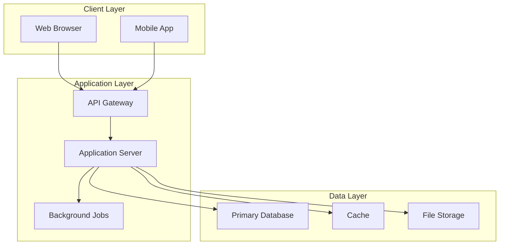
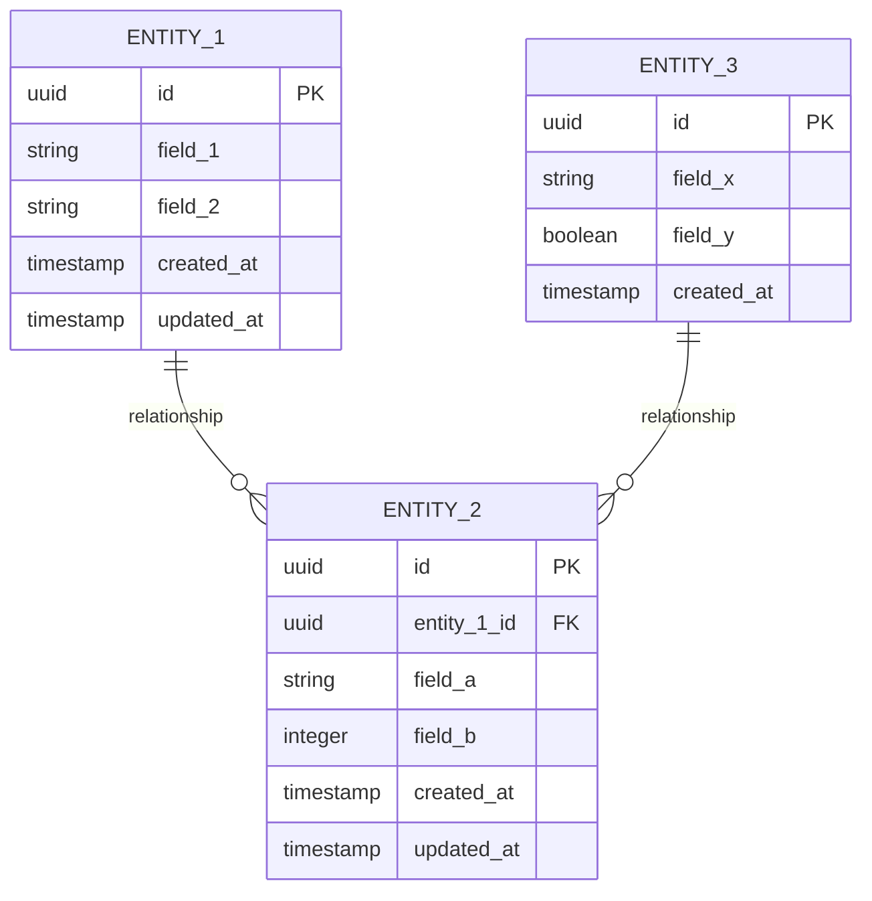

# [FEATURE_NAME] - Standard Specification

## Overview

**Purpose**: [2-3 paragraph description of the feature, its purpose, and its value]

This feature [DESCRIBE_WHAT_IT_DOES] to address [DESCRIBE_THE_PROBLEM_IT_SOLVES]. It will enable users to [DESCRIBE_USER_CAPABILITIES] while maintaining [DESCRIBE_QUALITY_ATTRIBUTES].

**Business Value**: [Explain the business impact, user benefits, or strategic importance]

**Scope**:
- **In Scope**: [List what is included in this feature]
- **Out of Scope**: [List what is explicitly excluded from this feature]

---

## Requirements

### Functional Requirements

#### Core Functionality
- [ ] **FR-1**: [REQUIREMENT_1] - [Detailed description of what this requirement delivers]
- [ ] **FR-2**: [REQUIREMENT_2] - [Detailed description of what this requirement delivers]
- [ ] **FR-3**: [REQUIREMENT_3] - [Detailed description of what this requirement delivers]
- [ ] **FR-4**: [REQUIREMENT_4] - [Detailed description of what this requirement delivers]

#### User Interface
- [ ] **FR-5**: [UI_REQUIREMENT_1] - [Description of user interface behavior]
- [ ] **FR-6**: [UI_REQUIREMENT_2] - [Description of user interface behavior]

#### Data Management
- [ ] **FR-7**: [DATA_REQUIREMENT_1] - [Description of data handling requirements]
- [ ] **FR-8**: [DATA_REQUIREMENT_2] - [Description of data handling requirements]

### Non-Functional Requirements

#### Performance
- [ ] **NFR-1**: Response time < [TIME_TARGET] for [OPERATION]
- [ ] **NFR-2**: Support [CONCURRENT_USERS] concurrent users
- [ ] **NFR-3**: Page load time < [TIME_TARGET]

#### Security
- [ ] **NFR-4**: [AUTHENTICATION_REQUIREMENT]
- [ ] **NFR-5**: [AUTHORIZATION_REQUIREMENT]
- [ ] **NFR-6**: [DATA_PROTECTION_REQUIREMENT]

#### Scalability & Reliability
- [ ] **NFR-7**: [SCALABILITY_REQUIREMENT]
- [ ] **NFR-8**: [AVAILABILITY_REQUIREMENT]
- [ ] **NFR-9**: [ERROR_HANDLING_REQUIREMENT]

#### Accessibility & Usability
- [ ] **NFR-10**: [ACCESSIBILITY_STANDARD] compliance
- [ ] **NFR-11**: [USABILITY_REQUIREMENT]

---

## Technical Approach

### Technology Stack

**Frontend**:
- Framework: [FRONTEND_FRAMEWORK]
- UI Library: [UI_LIBRARY]
- State Management: [STATE_MANAGEMENT]

**Backend**:
- Language/Runtime: [BACKEND_LANGUAGE]
- Framework: [BACKEND_FRAMEWORK]
- API Design: [API_STYLE]

**Database**:
- Primary Database: [DATABASE_TYPE]
- Caching Layer: [CACHING_SOLUTION]
- Storage: [STORAGE_SOLUTION]

**Infrastructure**:
- Hosting: [HOSTING_PLATFORM]
- Deployment: [DEPLOYMENT_METHOD]
- Monitoring: [MONITORING_TOOLS]

### Architecture Overview



### Key Technical Decisions

1. **[DECISION_1]**: [Technology/Pattern chosen]
   - **Rationale**: [Why this choice was made]
   - **Trade-offs**: [What was gained/sacrificed]

2. **[DECISION_2]**: [Technology/Pattern chosen]
   - **Rationale**: [Why this choice was made]
   - **Trade-offs**: [What was gained/sacrificed]

3. **[DECISION_3]**: [Technology/Pattern chosen]
   - **Rationale**: [Why this choice was made]
   - **Trade-offs**: [What was gained/sacrificed]

### Dependencies

**External Libraries**:
- [LIBRARY_1]: [VERSION] - [Purpose]
- [LIBRARY_2]: [VERSION] - [Purpose]
- [LIBRARY_3]: [VERSION] - [Purpose]

**System Dependencies**:
- [SERVICE_1]: [Integration point description]
- [SERVICE_2]: [Integration point description]

---

## Data Model

### Entity Relationship Diagram



### Database Schema

#### Table: [TABLE_NAME_1]
```sql
CREATE TABLE [table_name_1] (
  id UUID PRIMARY KEY DEFAULT gen_random_uuid(),
  [field_1] VARCHAR(255) NOT NULL,
  [field_2] TEXT,
  [field_3] INTEGER DEFAULT 0,
  created_at TIMESTAMP DEFAULT CURRENT_TIMESTAMP,
  updated_at TIMESTAMP DEFAULT CURRENT_TIMESTAMP,

  INDEX idx_[field_1] ([field_1]),
  CONSTRAINT [constraint_name] [constraint_definition]
);
```

#### Table: [TABLE_NAME_2]
```sql
CREATE TABLE [table_name_2] (
  id UUID PRIMARY KEY DEFAULT gen_random_uuid(),
  [table_name_1]_id UUID NOT NULL REFERENCES [table_name_1](id) ON DELETE CASCADE,
  [field_a] VARCHAR(100),
  [field_b] JSONB,
  created_at TIMESTAMP DEFAULT CURRENT_TIMESTAMP,

  INDEX idx_[table_name_1]_id ([table_name_1]_id)
);
```

### Data Validation Rules
- [ENTITY_1].[field_1]: [Validation rule - e.g., "Required, 3-255 characters, alphanumeric"]
- [ENTITY_2].[field_a]: [Validation rule - e.g., "Optional, email format"]
- [ENTITY_3].[field_x]: [Validation rule - e.g., "Required, enum: ['value1', 'value2', 'value3']"]

---

## API Contracts

### REST Endpoints

| Method | Endpoint | Purpose | Key Request/Response |
|--------|----------|---------|---------------------|
| POST | `/api/v1/[resources]` | Create new [resource] | Request: `{field_1, field_2}` → 201 with created resource |
| GET | `/api/v1/[resources]` | List all [resources] | Query params: `page, limit, sort` → 200 with paginated data |
| GET | `/api/v1/[resources]/:id` | Get single [resource] | Path param: `id` → 200 with resource data |
| PATCH | `/api/v1/[resources]/:id` | Update [resource] | Request: `{field_1, field_2}` → 200 with updated resource |
| DELETE | `/api/v1/[resources]/:id` | Delete [resource] | Path param: `id` → 204 No Content |

### Request/Response Examples

**Create Resource** - `POST /api/v1/[resources]`
```json
Request: {"[field_1]": "value", "[field_2]": "value"}
Response (201): {"id": "uuid", "[field_1]": "value", "created_at": "timestamp"}
```

**Common Error Responses**:
- `400`: Invalid request body
- `401`: Unauthorized
- `404`: Resource not found
- `422`: Validation error

---

## Code Examples

### Example 1: Core Business Logic

```typescript
// [FILE_PATH]/[service_name].ts
export class [ServiceName] {
  async [method_name](params: [ParamsType]): Promise<[ReturnType]> {
    const validated = this.validate_params(params);
    const result = await this.repository.[operation](validated);
    return this.transform_result(result);
  }

  private validate_params(params: [ParamsType]): [ValidatedParamsType] {
    if (![condition]) throw new ValidationError('[error_message]');
    return params;
  }
}
```

### Example 2: API Route Handler

```typescript
// [FILE_PATH]/[route_name].ts
export const [handler_name] = async (req: Request, res: Response) => {
  try {
    const result = await service.[method_name](req.body);
    res.status([STATUS_CODE]).json({ success: true, data: result });
  } catch (error) {
    next(error);
  }
};
```

### Example 3: Frontend Component

```typescript
// [FILE_PATH]/[ComponentName].tsx
export const [ComponentName]: React.FC<Props> = ({ [prop_1] }) => {
  const [data, set_data] = useState<[DataType][]>([]);
  const [loading, set_loading] = useState(false);

  useEffect(() => {
    const fetch_data = async () => {
      set_loading(true);
      const result = await [api_client].[method_name]([prop_1]);
      set_data(result);
      set_loading(false);
    };
    fetch_data();
  }, [[prop_1]]);

  if (loading) return <LoadingSpinner />;
  return <div>{data.map(item => <Item key={item.id} item={item} />)}</div>;
};
```

---

## Testing Strategy

### Test Coverage Requirements

| Test Type | Coverage | Focus Areas |
|-----------|----------|-------------|
| Unit Tests | 80% minimum | Business logic, validation, utilities, state management |
| Integration Tests | Critical paths | API workflows, database operations, external services, auth |
| E2E Tests | Core journeys | Primary workflows, critical processes, error handling |

### Test Example

```typescript
describe('[ServiceName]', () => {
  it('should [expected_behavior] when [condition]', async () => {
    const result = await service.[method_name]({ [test_data] });
    expect(result).toEqual([expected_result]);
  });

  it('should throw error when [invalid_condition]', async () => {
    await expect(service.[method_name]([invalid_data]))
      .rejects.toThrow('[expected_error]');
  });
});
```

### Critical Test Scenarios
- [ ] **Happy Path**: [PRIMARY_WORKFLOW] completes successfully
- [ ] **Error Handling**: System handles [ERROR_SCENARIO] gracefully
- [ ] **Edge Cases**: [EDGE_CASE_1], [EDGE_CASE_2], [EDGE_CASE_3]
- [ ] **Performance**: Response times meet targets under load
- [ ] **Security**: Authentication, authorization, input validation

---

## Test-Driven Development Approach

### TDD Configuration

**Enforcement Level**: [STRICT|STANDARD|RELAXED]

**Rationale**: [1-2 sentences explaining why this enforcement level is appropriate for this feature based on criticality, security sensitivity, data integrity impact, and business requirements]

**Enforcement Behavior**:
- Test-first requirement: [Block|Warn|Log only] - [Based on enforcement level]
- Implementation blocking: [Enabled|Disabled] - [Whether implementation can proceed without tests]
- Quality gates: [List specific quality gates that apply to this enforcement level]

**Feature Type Considerations**: [e.g., Business logic, Data validation, Security feature, UI component, Integration]

---

### RED Phase: Failing Tests

**Objective**: Write tests that fail because the feature is not yet implemented

**Test Strategy**: Write comprehensive failing tests before any implementation code. All tests should execute but fail with expected error messages that clearly indicate missing functionality.

#### Unit Tests

1. **Test Name**: `test_[feature]_[specific_behavior]`
   - **Purpose**: [What this test verifies]
   - **Expected Failure**: `[ErrorType]: [Expected error message]`
   - **Test Data**: [Description of test input data]
   - **Validation**: [What the test asserts]

2. **Test Name**: `test_[feature]_[edge_case]`
   - **Purpose**: [What this test verifies]
   - **Expected Failure**: `[ErrorType]: [Expected error message]`
   - **Test Data**: [Description of test input data]
   - **Validation**: [What the test asserts]

[Add 3-5 unit test specifications for core functionality]

#### Integration Tests

1. **Test Name**: `test_[component_interaction]`
   - **Purpose**: [What component interaction this verifies]
   - **Expected Failure**: `[ErrorType]: [Expected error message]`
   - **Test Data**: [Description of integration test scenario]
   - **Dependencies**: [What components/services are involved]

[Add 2-4 integration test specifications]

#### API Tests (if applicable)

1. **Test Name**: `test_[endpoint]_[http_method]_[scenario]`
   - **Purpose**: [What API behavior this verifies]
   - **Expected Failure**: `[HTTP Status Code]: [Expected error response]`
   - **Request**: [HTTP method, endpoint, headers, body]
   - **Expected Response**: [Status code, error structure]

[Add API test specifications for all endpoints]

#### Database Tests (if applicable)

1. **Test Name**: `test_[model]_[database_operation]`
   - **Purpose**: [What database behavior this verifies]
   - **Expected Failure**: `[DatabaseError]: [Expected error message]`
   - **Test Data**: [Database state setup and operation]
   - **Validation**: [Query results, constraints, relationships]

[Add database test specifications]

#### Edge Case Tests

1. **Test Name**: `test_[boundary_condition]`
   - **Purpose**: [What edge case this verifies]
   - **Expected Failure**: `[ErrorType]: [Expected error message]`
   - **Test Data**: [Edge case input data]
   - **Validation**: [Expected boundary behavior]

[Add edge case and error handling test specifications]

**Test Execution Order**:
1. Unit tests (parallel execution, fastest feedback)
2. Integration tests (sequential execution, component dependencies)
3. API tests (parallel execution, endpoint isolation)
4. Database tests (sequential execution, data isolation)
5. Edge case tests (parallel execution, boundary validation)

**Expected Test Results (RED Phase)**:
- Total tests: [NUMBER] tests planned
- Expected failures: [NUMBER] (100% - all tests should fail)
- Expected passes: 0 (no implementation exists yet)
- Test execution time: ~[TIME] (for full test suite)

**RED Phase Complete When**:
- [ ] All planned tests written in test files
- [ ] All tests execute without syntax errors
- [ ] All tests fail with expected error messages
- [ ] Test failures clearly indicate missing implementation
- [ ] Test structure follows project conventions
- [ ] Test data and fixtures created
- [ ] Test execution time acceptable

---

### GREEN Phase: Minimal Implementation

**Objective**: Write the simplest code possible to make all tests pass

**Implementation Philosophy**: Build minimal, focused implementation that satisfies tests without over-engineering. Avoid premature optimization, abstraction, or features not required by tests.

#### Minimal Implementation Principles

**Code Simplicity Constraints**:
- Maximum lines per function: [50|75|100] lines (based on config)
- Maximum cyclomatic complexity: [10|15|20] (based on enforcement level)
- Maximum nesting depth: 3 levels
- Single responsibility per function/class
- No premature abstraction until pattern emerges 3+ times

**Implementation Preferences**:
- Use standard library functions over custom implementations
- Prefer composition over inheritance
- Avoid design patterns until complexity justifies them
- Write clear, self-documenting code over clever solutions
- Extract complexity only when tests require it

#### Implementation Steps

1. **Step**: [First implementation increment]
   - **Files**: [List files to create/modify]
   - **Code**: [Brief description of code to write]
   - **Tests Passing**: [List test names that will pass]
   - **Lines of Code**: ~[NUMBER] lines
   - **Checkpoint**: [What functionality is working after this step]
   - **Validation**: Run tests to verify green status

2. **Step**: [Second implementation increment]
   - **Files**: [List files to create/modify]
   - **Code**: [Brief description of code to write]
   - **Tests Passing**: [List test names that will pass]
   - **Lines of Code**: ~[NUMBER] lines
   - **Checkpoint**: [What functionality is working after this step]
   - **Validation**: Run tests to verify green status

[Add implementation steps for each logical increment - typically 3-8 steps]

**Implementation Order**:
1. Data models and validation (foundation)
2. Core business logic functions (behavior)
3. API endpoint handlers (interface)
4. Integration components (connections)
5. Error handling and edge cases (robustness)

**Expected Test Results (After GREEN Phase)**:
- Total tests: [NUMBER] tests
- Expected failures: 0 (all tests pass)
- Expected passes: [NUMBER] (100% of tests)
- Expected coverage: [PERCENTAGE]% (should meet minimum target)
- Test execution time: ~[TIME]

**GREEN Phase Complete When**:
- [ ] All tests pass (100% green)
- [ ] Coverage target met ([NUMBER]%)
- [ ] No over-implementation detected (code only satisfies test requirements)
- [ ] Code follows minimal implementation principles
- [ ] All implementation checkpoints achieved
- [ ] No code smells or obvious quality issues
- [ ] Ready for refactoring phase

---

### REFACTOR Phase: Code Quality Improvements

**Objective**: Improve code quality, performance, and maintainability while keeping all tests green

**Refactoring Philosophy**: Systematically improve code structure, eliminate duplication, optimize performance, and apply patterns where beneficial. Every refactoring must maintain passing tests.

#### Refactoring Opportunities

1. **Opportunity**: [First refactoring opportunity]
   - **Current State**: [Description of current code structure/issue]
   - **Target State**: [Description of improved code structure]
   - **Files Affected**: [List files that will change]
   - **Effort**: [Small: 15-20 min | Medium: 30-45 min | Large: 60+ min]
   - **Priority**: [Must: blocking | Should: important | Could: nice-to-have]
   - **Benefit**: [Concrete improvement this provides]
   - **Risk**: [Low|Medium|High] - [Any risks in making this change]

2. **Opportunity**: [Second refactoring opportunity]
   - **Current State**: [Description of current code structure/issue]
   - **Target State**: [Description of improved code structure]
   - **Files Affected**: [List files that will change]
   - **Effort**: [Small|Medium|Large]
   - **Priority**: [Must|Should|Could]
   - **Benefit**: [Concrete improvement this provides]
   - **Risk**: [Low|Medium|High] - [Any risks in making this change]

[Add 3-6 refactoring opportunities based on GREEN phase implementation]

#### Common Refactoring Categories

**Code Duplication**:
- Extract shared logic to utility functions
- Create shared components for repeated UI patterns
- Consolidate validation logic
- Share common test fixtures

**Complexity Reduction**:
- Simplify nested conditionals using early returns
- Extract complex boolean logic to named functions
- Break large functions into smaller focused functions
- Reduce cyclomatic complexity

**Performance Optimization**:
- Optimize database queries (add indexes, reduce N+1 queries)
- Implement caching for expensive operations
- Batch operations instead of loops
- Lazy load resources

**Pattern Application**:
- Apply appropriate design patterns where beneficial
- Standardize error handling patterns
- Implement consistent data transformation patterns
- Use framework conventions

**Code Clarity**:
- Improve variable/function naming
- Add clarifying comments for complex logic
- Simplify data structures
- Make implicit behavior explicit

#### Refactoring Order

**Phase 1: Must-Have Refactorings** (Blocking quality issues)
1. [List Must priority refactorings]
2. [Rationale: Why these block completion]

**Phase 2: Should-Have Refactorings** (Significant improvements)
1. [List Should priority refactorings]
2. [Rationale: Why these are important]

**Phase 3: Could-Have Refactorings** (Nice-to-have polish)
1. [List Could priority refactorings]
2. [Rationale: Why these are valuable but optional]

#### Refactoring Validation

**After Each Refactoring**:
- [ ] All tests still pass (100% green)
- [ ] Coverage remains ≥ target coverage
- [ ] Performance benchmarks do not regress
- [ ] Code complexity metrics improve or maintain
- [ ] No new linting warnings introduced
- [ ] Git commit created with clear refactoring description

**REFACTOR Phase Complete When**:
- [ ] All Must-have refactorings completed
- [ ] All Should-have refactorings completed (or documented for future if time-constrained)
- [ ] All tests passing (100%)
- [ ] Coverage target maintained or improved
- [ ] Code quality metrics improved (complexity, duplication, etc.)
- [ ] No regressions in functionality or performance
- [ ] Code review-ready state achieved

---

### Coverage Targets

**Enforcement Level**: [STRICT|STANDARD|RELAXED]
**Feature Type**: [e.g., Business Logic, Data Validation, Security, UI Component, Integration]

#### Coverage Requirements

**Base Coverage Targets** (from enforcement level):
- **Minimum coverage**: [NUMBER]% - Blocks task completion if not met
- **Target coverage**: [NUMBER]% - Goal for implementation, best effort
- **Warning threshold**: [NUMBER]% - Triggers warning messages to improve coverage

**Feature Type Adjustments**:
- [e.g., "+5% for business logic features" or "-5% for UI components focusing on logic"]
- **Adjusted Minimum**: [NUMBER]%
- **Adjusted Target**: [NUMBER]%

#### Coverage Categories

**Statement Coverage**: [NUMBER]%
- Definition: Percentage of code statements executed by tests
- Target: [NUMBER]%

**Branch Coverage**: [NUMBER]%
- Definition: Percentage of conditional branches (if/else, switch) tested
- Target: [NUMBER]%

**Function Coverage**: [NUMBER]%
- Definition: Percentage of functions/methods called by tests
- Target: [NUMBER]%

**Line Coverage**: [NUMBER]%
- Definition: Percentage of code lines executed by tests
- Target: [NUMBER]%

#### Coverage Validation

**Testing Framework**: [Jest|Vitest|pytest|RSpec|PHPUnit|Mocha|other]
**Coverage Tool**: [Framework built-in|Istanbul|Coverage.py|SimpleCov|other]

**Report Formats**:
- HTML report: Detailed line-by-line coverage visualization (in `coverage/` directory)
- JSON report: Machine-readable data for CI/CD integration
- Terminal report: Quick summary for developers during development
- LCOV format: For coverage tracking tools and IDE integration

**Validation Timing**:
- After GREEN phase: Verify minimum coverage met before proceeding to REFACTOR
- After REFACTOR phase: Verify coverage maintained or improved
- Before PR/merge: Final coverage validation in CI/CD pipeline

**CI/CD Integration**:
- Coverage check runs on every push
- PR merge blocked if coverage below minimum threshold
- Coverage trends tracked over time
- Notifications for coverage decreases

#### Coverage Exclusions

**Excluded from Coverage Requirements** (if applicable):
- Configuration files (`config/*.js`, `*.config.js`)
- Type definition files (`*.d.ts`)
- Generated code (build output, migrations)
- Third-party integrations (covered by integration tests separately)
- Development-only utilities (test helpers, mocks)

**Exclusion Rationale**: [Explain why certain code is excluded and how it's validated otherwise]

---

### TDD Acceptance Criteria

These criteria are enforced by the task-orchestrator during task execution and must be met for task completion:

#### Phase-Based Criteria

**RED Phase Criteria**:
- [ ] All planned tests written and committed to repository
- [ ] All tests execute without syntax/import errors
- [ ] All tests fail with expected error messages documented in RED phase
- [ ] Test failures clearly indicate missing implementation (not test bugs)
- [ ] Test code follows project testing conventions and style guide

**GREEN Phase Criteria**:
- [ ] All tests pass (100% green test suite)
- [ ] Minimum coverage target met ([NUMBER]%)
- [ ] Implementation follows minimal implementation principles (no over-engineering)
- [ ] Code complexity within acceptable limits (cyclomatic complexity ≤ [NUMBER])
- [ ] No code duplication exceeding threshold (DRY principle)

**REFACTOR Phase Criteria**:
- [ ] All Must-have refactorings completed
- [ ] All Should-have refactorings completed or documented for future work
- [ ] All tests still passing after refactorings (100% green)
- [ ] Coverage maintained or improved after refactorings
- [ ] Code quality metrics improved (complexity, duplication, maintainability)

#### Quality Gate Criteria

**Code Quality**:
- [ ] All linting rules pass (no warnings or errors)
- [ ] Code formatting matches project style guide
- [ ] No hardcoded secrets or credentials
- [ ] Error handling implemented for failure scenarios
- [ ] Logging added for debugging and monitoring

**Test Quality**:
- [ ] Tests are deterministic (no flaky tests)
- [ ] Tests are independent (can run in any order)
- [ ] Test data isolated (no shared mutable state)
- [ ] Test execution time acceptable (< [TIME] for full suite)
- [ ] Tests provide clear failure messages

**Test-First Verification**:
- [ ] Test files created before implementation files (timestamp verification)
- [ ] Git history shows test commits before implementation commits
- [ ] No implementation code committed without corresponding tests

#### Coverage Validation Criteria

**Coverage Thresholds**:
- [ ] Overall coverage ≥ [NUMBER]% (minimum threshold)
- [ ] Statement coverage ≥ [NUMBER]%
- [ ] Branch coverage ≥ [NUMBER]%
- [ ] Function coverage ≥ [NUMBER]%

**Coverage Quality**:
- [ ] Critical paths have 100% coverage
- [ ] Error handling paths covered by tests
- [ ] Edge cases covered by tests
- [ ] No trivial tests inflating coverage metrics

#### Documentation Criteria

**Test Documentation**:
- [ ] Test descriptions clearly explain what is being tested
- [ ] Complex test scenarios documented with comments
- [ ] Test fixtures and data explained
- [ ] Test utilities documented

**Implementation Documentation**:
- [ ] Public APIs documented (JSDoc/docstrings/etc.)
- [ ] Complex algorithms explained with comments
- [ ] Configuration options documented
- [ ] README updated with usage examples

---

## Acceptance Criteria

### Functional Acceptance
- [ ] **AC-1**: [Specific, measurable criterion for core functionality]
- [ ] **AC-2**: [Specific, measurable criterion for data operations]
- [ ] **AC-3**: [Specific, measurable criterion for user interface]
- [ ] **AC-4**: [Specific, measurable criterion for integration points]
- [ ] **AC-5**: [Specific, measurable criterion for error handling]

### Technical Acceptance
- [ ] **AC-6**: All unit tests pass with >80% coverage
- [ ] **AC-7**: All integration tests pass
- [ ] **AC-8**: E2E tests pass for critical user journeys
- [ ] **AC-9**: API response times meet performance targets
- [ ] **AC-10**: Security requirements validated

### Quality Acceptance
- [ ] **AC-11**: Code reviewed and approved by [REVIEWER_ROLE]
- [ ] **AC-12**: Documentation complete and accurate
- [ ] **AC-13**: No critical or high-severity bugs
- [ ] **AC-14**: Accessibility requirements met ([STANDARD])
- [ ] **AC-15**: Cross-browser compatibility verified

### Deployment Acceptance
- [ ] **AC-16**: Successfully deployed to staging environment
- [ ] **AC-17**: Smoke tests pass in staging
- [ ] **AC-18**: Performance validated under load
- [ ] **AC-19**: Database migrations execute successfully
- [ ] **AC-20**: Rollback procedure tested and documented

---

## Failure Modes & Anti-Patterns

> Generated from Inversion Analysis: [analysis-inversion.md](./analysis-inversion.md)
> Reference: `@.agent-os/instructions/utilities/quality-lenses.md#inversion-lens`

### Identified Failure Modes

| Mode | Category | Severity | Mitigation |
|------|----------|----------|------------|
| [FAILURE_MODE_1] | [Adoption/Execution/Evolution/Security] | [Critical/High/Medium/Low] | [Specific constraint or approach] |
| [FAILURE_MODE_2] | [Adoption/Execution/Evolution/Security] | [Critical/High/Medium/Low] | [Specific constraint or approach] |
| [FAILURE_MODE_3] | [Adoption/Execution/Evolution/Security] | [Critical/High/Medium/Low] | [Specific constraint or approach] |
| [FAILURE_MODE_4] | [Adoption/Execution/Evolution/Security] | [Critical/High/Medium/Low] | [Specific constraint or approach] |

#### Adoption Failures
- **[ADOPTION_FAILURE_1]**: [How it happens] - Risk: [HIGH/MED/LOW]
  - **Constraint**: [Specific, actionable constraint derived]
- **[ADOPTION_FAILURE_2]**: [How it happens] - Risk: [HIGH/MED/LOW]
  - **Constraint**: [Specific, actionable constraint derived]

#### Execution Failures
- **[EXECUTION_FAILURE_1]**: [How it happens] - Risk: [HIGH/MED/LOW]
  - **Constraint**: [Specific, actionable constraint derived]
- **[EXECUTION_FAILURE_2]**: [How it happens] - Risk: [HIGH/MED/LOW]
  - **Constraint**: [Specific, actionable constraint derived]

#### Evolution Failures
- **[EVOLUTION_FAILURE_1]**: [How it happens] - Risk: [HIGH/MED/LOW]
  - **Constraint**: [Specific, actionable constraint derived]
- **[EVOLUTION_FAILURE_2]**: [How it happens] - Risk: [HIGH/MED/LOW]
  - **Constraint**: [Specific, actionable constraint derived]

#### Security Failures
- **[SECURITY_FAILURE_1]**: [How it happens] - OWASP: [Category] - Risk: [HIGH/MED/LOW]
  - **Constraint**: [Specific, actionable constraint derived]
- **[SECURITY_FAILURE_2]**: [How it happens] - OWASP: [Category] - Risk: [HIGH/MED/LOW]
  - **Constraint**: [Specific, actionable constraint derived]

### Anti-Patterns to Avoid

Based on this inversion analysis, the implementation **MUST NOT**:

1. **[ANTI_PATTERN_1]** - [Root cause/description]
   - **Causes**: [List failure modes this anti-pattern causes]
   - **Prevent With**: [Specific approach to prevent]

2. **[ANTI_PATTERN_2]** - [Root cause/description]
   - **Causes**: [List failure modes this anti-pattern causes]
   - **Prevent With**: [Specific approach to prevent]

3. **[ANTI_PATTERN_3]** - [Root cause/description]
   - **Causes**: [List failure modes this anti-pattern causes]
   - **Prevent With**: [Specific approach to prevent]

### Derived Constraints

Constraints derived from inversion analysis, integrated into relevant spec sections:

#### Technical Constraints (from Execution/Evolution Failures)
- **MUST** [CONSTRAINT_1] (from: [failure mode analysis])
- **MUST** [CONSTRAINT_2] (from: [failure mode analysis])
- **SHOULD** [CONSTRAINT_3] (from: [failure mode analysis])

#### Security Constraints (from Security Failures)
- **MUST** [SECURITY_CONSTRAINT_1] (from: [failure mode analysis])
- **MUST** [SECURITY_CONSTRAINT_2] (from: [failure mode analysis])

#### UX Constraints (from Adoption Failures)
- **MUST** [UX_CONSTRAINT_1] (from: [failure mode analysis])
- **SHOULD** [UX_CONSTRAINT_2] (from: [failure mode analysis])

### Inversion Analysis Summary

| Metric | Count | Target |
|--------|-------|--------|
| Adoption Failures | [N] | Min 2 |
| Execution Failures | [N] | Min 2 |
| Evolution Failures | [N] | Min 2 |
| Security Failures | [N] | Min 2 |
| **Total Failures** | [N] | Min 8 |
| Constraints Derived | [N] | Min 6 |
| Anti-Patterns Documented | [N] | Min 2 |

---

## Pre-Mortem Risk Analysis

> Reference: `@.agent-os/instructions/utilities/quality-lenses.md#pre-mortem-lens`
> Status: [COMPLETED | SKIPPED - see justification below]

### Failure Scenario

> "It's 6 months from now. This feature has failed completely. Users have abandoned it, stakeholders are frustrated, and we're considering removing it entirely. Looking back, we should have seen this coming."

### Risk Assessment

| Cause | Category | L | I | D | Score | Mitigation |
|-------|----------|---|---|---|-------|------------|
| [RISK_1] | [Technical/Product/Process/External] | [1-5] | [1-5] | [1-5] | [L*I*D/2] | [Mitigation strategy] |
| [RISK_2] | [Technical/Product/Process/External] | [1-5] | [1-5] | [1-5] | [L*I*D/2] | [Mitigation strategy] |
| [RISK_3] | [Technical/Product/Process/External] | [1-5] | [1-5] | [1-5] | [L*I*D/2] | [Mitigation strategy] |
| [RISK_4] | [Technical/Product/Process/External] | [1-5] | [1-5] | [1-5] | [L*I*D/2] | [Mitigation strategy] |

**Scoring Legend**:
- **L (Likelihood)**: 1=Rare (<5%), 2=Unlikely (5-20%), 3=Possible (20-50%), 4=Likely (50-80%), 5=Almost Certain (>80%)
- **I (Impact)**: 1=Minimal, 2=Minor, 3=Moderate, 4=Major, 5=Catastrophic
- **D (Detectability)**: 1=Obvious, 2=Easy, 3=Moderate, 4=Difficult, 5=Hidden
- **Score**: L x I x (D/2) - Threshold for mitigation: >12

### High-Risk Mitigations (Score > 12)

1. **[RISK_TITLE]** (Score: [N])
   - **Action**: [Specific, measurable mitigation action]
   - **Owner**: [Person responsible]
   - **Deadline**: [Date]
   - **Verification**: [How to confirm mitigation worked]

2. **[RISK_TITLE]** (Score: [N])
   - **Action**: [Specific, measurable mitigation action]
   - **Owner**: [Person responsible]
   - **Deadline**: [Date]
   - **Verification**: [How to confirm mitigation worked]

### Early Warning Indicators

Track these signals to detect emerging risks:

- [ ] [INDICATOR_1]: [Threshold or trigger condition]
- [ ] [INDICATOR_2]: [Threshold or trigger condition]
- [ ] [INDICATOR_3]: [Threshold or trigger condition]

### Risk Categories Summary

| Category | Count | Critical (>12) | Mitigations Required |
|----------|-------|----------------|---------------------|
| Technical | [N] | [N] | [N] |
| Product | [N] | [N] | [N] |
| Process | [N] | [N] | [N] |
| External | [N] | [N] | [N] |
| **Total** | **[N]** | **[N]** | **[N]** |

<!-- For P2-P4 features that skip pre-mortem analysis, replace above with: -->
<!--
### Pre-Mortem Analysis

**Status**: SKIPPED
**Priority**: [P2|P3|P4]
**Justification**: [All of: no external dependencies, no data integrity risks, no security implications, low complexity, no time-critical delivery]
-->

---

## Risks & Mitigation

### Technical Risks

| Risk | Likelihood | Impact | Mitigation Strategy |
|------|------------|--------|---------------------|
| [TECHNICAL_RISK_1] | [High/Medium/Low] | [High/Medium/Low] | [Detailed mitigation approach] |
| [TECHNICAL_RISK_2] | [High/Medium/Low] | [High/Medium/Low] | [Detailed mitigation approach] |
| [TECHNICAL_RISK_3] | [High/Medium/Low] | [High/Medium/Low] | [Detailed mitigation approach] |

### Business Risks

| Risk | Likelihood | Impact | Mitigation Strategy |
|------|------------|--------|---------------------|
| [BUSINESS_RISK_1] | [High/Medium/Low] | [High/Medium/Low] | [Detailed mitigation approach] |
| [BUSINESS_RISK_2] | [High/Medium/Low] | [High/Medium/Low] | [Detailed mitigation approach] |

### Operational Risks

| Risk | Likelihood | Impact | Mitigation Strategy |
|------|------------|--------|---------------------|
| [OPERATIONAL_RISK_1] | [High/Medium/Low] | [High/Medium/Low] | [Detailed mitigation approach] |
| [OPERATIONAL_RISK_2] | [High/Medium/Low] | [High/Medium/Low] | [Detailed mitigation approach] |

---

## Implementation Plan

### File Structure
```
[PROJECT_ROOT]/src/[feature_name]/
├── components/         # UI components with __tests__/
├── services/          # Business logic with __tests__/
├── api/              # routes.ts, handlers.ts
├── types/            # TypeScript interfaces
└── utils/            # Helper functions
```

### Development Phases

| Phase | Duration | Key Deliverables |
|-------|----------|-----------------|
| Foundation | [DURATION] | Database schema, data models, API structure |
| Implementation | [DURATION] | Business logic, API endpoints, UI components |
| Testing | [DURATION] | Test coverage, performance optimization |
| Deployment | [DURATION] | Integration tests, documentation, staging deploy |

### Success Metrics
- [METRIC_1]: [Target value]
- [METRIC_2]: [Target value]
- [METRIC_3]: [Target value]

---

**Template Version**: 2.1.0
**Specification Level**: Standard (Medium Detail)
**Created**: [CREATION_DATE]
**Last Updated**: [UPDATE_DATE]
**Owner**: [OWNER_NAME]
**Reviewers**: [REVIEWER_NAMES]
