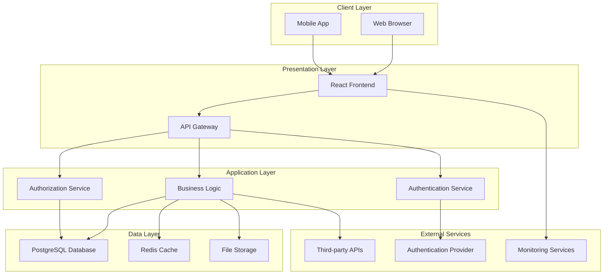

# Architecture Decisions: E-commerce Product Catalog

## Context
Advanced product catalog with search, filtering, and recommendation engine

## Overview
Technical decisions and constraints documentation for E-commerce Product Catalog, following Architecture Decision Records (ADR) format and Agent OS architectural standards.

## Executive Summary

### Key Architectural Decisions
1. **[DECISION_1]**: [BRIEF_DESCRIPTION_1]
2. **[DECISION_2]**: [BRIEF_DESCRIPTION_2]
3. **[DECISION_3]**: [BRIEF_DESCRIPTION_3]

### Technology Stack Decisions
- **Frontend**: [FRONTEND_CHOICE] - [FRONTEND_RATIONALE]
- **Backend**: [BACKEND_CHOICE] - [BACKEND_RATIONALE]
- **Database**: [DATABASE_CHOICE] - [DATABASE_RATIONALE]
- **Deployment**: [DEPLOYMENT_CHOICE] - [DEPLOYMENT_RATIONALE]

## Architecture Decision Records

### ADR-001: [DECISION_TITLE_1]

#### Status
**[STATUS]** - [Proposed | Accepted | Deprecated | Superseded]

#### Date
[DECISION_DATE]

#### Context
[DETAILED_CONTEXT_DESCRIPTION]

The problem we need to solve:
- [PROBLEM_STATEMENT_1]
- [PROBLEM_STATEMENT_2]
- [PROBLEM_STATEMENT_3]

#### Decision
We will [DECISION_STATEMENT].

#### Rationale
```
Primary factors influencing this decision:

1. [FACTOR_1]: [EXPLANATION_1]
2. [FACTOR_2]: [EXPLANATION_2]
3. [FACTOR_3]: [EXPLANATION_3]

Decision matrix:
| Option | [CRITERIA_1] | [CRITERIA_2] | [CRITERIA_3] | Total Score |
|--------|--------------|--------------|--------------|-------------|
| [OPTION_A] | [SCORE_A1] | [SCORE_A2] | [SCORE_A3] | [TOTAL_A] |
| [OPTION_B] | [SCORE_B1] | [SCORE_B2] | [SCORE_B3] | [TOTAL_B] |
| [OPTION_C] | [SCORE_C1] | [SCORE_C2] | [SCORE_C3] | [TOTAL_C] |
```

#### Consequences

**Positive:**
- [POSITIVE_CONSEQUENCE_1]
- [POSITIVE_CONSEQUENCE_2]
- [POSITIVE_CONSEQUENCE_3]

**Negative:**
- [NEGATIVE_CONSEQUENCE_1]
- [NEGATIVE_CONSEQUENCE_2]
- [NEGATIVE_CONSEQUENCE_3]

**Neutral:**
- [NEUTRAL_CONSEQUENCE_1]
- [NEUTRAL_CONSEQUENCE_2]

#### Implementation
```typescript
// Implementation approach
const implementationPlan = {
  phase1: {
    duration: '[DURATION_1]',
    deliverables: '[DELIVERABLES_1]',
    resources: '[RESOURCES_1]'
  },
  phase2: {
    duration: '[DURATION_2]',
    deliverables: '[DELIVERABLES_2]',
    resources: '[RESOURCES_2]'
  }
};
```

#### Alternatives Considered
1. **[ALTERNATIVE_1]**
   - **Pros**: [ALT_1_PROS]
   - **Cons**: [ALT_1_CONS]
   - **Rejected because**: [ALT_1_REJECTION_REASON]

2. **[ALTERNATIVE_2]**
   - **Pros**: [ALT_2_PROS]
   - **Cons**: [ALT_2_CONS]
   - **Rejected because**: [ALT_2_REJECTION_REASON]

#### Related Decisions
- [RELATED_ADR_1]: [RELATIONSHIP_DESCRIPTION_1]
- [RELATED_ADR_2]: [RELATIONSHIP_DESCRIPTION_2]

---

### ADR-002: [DECISION_TITLE_2]

#### Status
**[STATUS]** - [Proposed | Accepted | Deprecated | Superseded]

#### Date
[DECISION_DATE]

#### Context
[CONTEXT_DESCRIPTION_2]

#### Decision
[DECISION_STATEMENT_2]

#### Rationale
[RATIONALE_2]

#### Consequences
**Positive:**
- [POSITIVE_2]

**Negative:**
- [NEGATIVE_2]

#### Implementation
[IMPLEMENTATION_APPROACH_2]

---

### ADR-003: [DECISION_TITLE_3]

#### Status
**[STATUS]** - [Proposed | Accepted | Deprecated | Superseded]

#### Date
[DECISION_DATE]

#### Context
[CONTEXT_DESCRIPTION_3]

#### Decision
[DECISION_STATEMENT_3]

#### Rationale
[RATIONALE_3]

#### Consequences
[CONSEQUENCES_3]

#### Implementation
[IMPLEMENTATION_APPROACH_3]

## Technical Architecture

### System Architecture Overview


### Component Architecture
```typescript
// Component architecture definition
const componentArchitecture = {
  presentation: {
    framework: '[FRONTEND_FRAMEWORK]',
    stateManagement: '[STATE_MANAGEMENT]',
    routing: '[ROUTING_SOLUTION]',
    styling: '[STYLING_APPROACH]',
    components: {
      layout: '[LAYOUT_COMPONENTS]',
      business: '[BUSINESS_COMPONENTS]',
      shared: '[SHARED_COMPONENTS]'
    }
  },
  application: {
    framework: '[BACKEND_FRAMEWORK]',
    architecture: '[ARCHITECTURE_PATTERN]',
    services: '[SERVICE_LAYER]',
    middleware: '[MIDDLEWARE_STACK]',
    apis: {
      rest: '[REST_IMPLEMENTATION]',
      graphql: '[GRAPHQL_IMPLEMENTATION]',
      websocket: '[WEBSOCKET_IMPLEMENTATION]'
    }
  },
  data: {
    database: '[DATABASE_CHOICE]',
    orm: '[ORM_CHOICE]',
    caching: '[CACHING_STRATEGY]',
    storage: '[FILE_STORAGE]',
    migrations: '[MIGRATION_STRATEGY]'
  }
};
```

### Data Architecture
```sql
-- Core data model
CREATE SCHEMA [SCHEMA_NAME];

-- Primary entities
CREATE TABLE [SCHEMA_NAME].[ENTITY_1] (
    id [ID_TYPE] PRIMARY KEY,
    [FIELD_1] [TYPE_1] [CONSTRAINTS_1],
    [FIELD_2] [TYPE_2] [CONSTRAINTS_2],
    created_at TIMESTAMP DEFAULT NOW(),
    updated_at TIMESTAMP DEFAULT NOW()
);

CREATE TABLE [SCHEMA_NAME].[ENTITY_2] (
    id [ID_TYPE] PRIMARY KEY,
    [ENTITY_1]_id [ID_TYPE] REFERENCES [SCHEMA_NAME].[ENTITY_1](id),
    [FIELD_A] [TYPE_A] [CONSTRAINTS_A],
    [FIELD_B] [TYPE_B] [CONSTRAINTS_B],
    created_at TIMESTAMP DEFAULT NOW(),
    updated_at TIMESTAMP DEFAULT NOW()
);

-- Indexes for performance
CREATE INDEX idx_[INDEX_1] ON [SCHEMA_NAME].[ENTITY_1] ([INDEXED_FIELD_1]);
CREATE INDEX idx_[INDEX_2] ON [SCHEMA_NAME].[ENTITY_2] ([INDEXED_FIELD_2]);
```

## Technology Decisions

### Frontend Technology Stack

#### React Framework Decision
**Decision**: Use React [REACT_VERSION] with TypeScript
**Rationale**:
- Industry standard with large ecosystem
- Strong TypeScript integration
- Excellent performance with modern optimizations
- Agent OS standard technology choice
- Team expertise and familiarity

**Configuration**:
```typescript
// React application configuration
const reactConfig = {
  framework: 'React [REACT_VERSION]',
  language: 'TypeScript [TS_VERSION]',
  buildTool: 'Vite [VITE_VERSION]',
  packageManager: 'pnpm [PNPM_VERSION]',
  stateManagement: '[STATE_LIBRARY]',
  styling: 'TailwindCSS [TAILWIND_VERSION]',
  componentLibrary: 'shadcn/ui',
  iconLibrary: 'Lucide React'
};
```

#### State Management Decision
**Decision**: Use [STATE_MANAGEMENT_CHOICE] for application state
**Rationale**:
- [STATE_RATIONALE_1]
- [STATE_RATIONALE_2]
- [STATE_RATIONALE_3]

### Backend Technology Stack

#### API Framework Decision
**Decision**: Use [BACKEND_FRAMEWORK] for API development
**Rationale**:
- [BACKEND_RATIONALE_1]
- [BACKEND_RATIONALE_2]
- [BACKEND_RATIONALE_3]

**Configuration**:
```typescript
// Backend application configuration
const backendConfig = {
  framework: '[BACKEND_FRAMEWORK]',
  runtime: 'Node.js [NODE_VERSION]',
  language: 'TypeScript [TS_VERSION]',
  orm: '[ORM_CHOICE]',
  validation: '[VALIDATION_LIBRARY]',
  authentication: '[AUTH_STRATEGY]',
  authorization: '[AUTHZ_STRATEGY]',
  logging: '[LOGGING_LIBRARY]',
  monitoring: '[MONITORING_SOLUTION]'
};
```

### Database Technology Stack

#### Database Engine Decision
**Decision**: Use PostgreSQL [PG_VERSION] as primary database
**Rationale**:
- ACID compliance for data integrity
- Advanced JSON support for flexible schemas
- Excellent performance and scalability
- Strong ecosystem and tooling
- Agent OS standard database choice

**Configuration**:
```sql
-- Database configuration
-- Connection settings
max_connections = [MAX_CONNECTIONS]
shared_buffers = [SHARED_BUFFERS]
effective_cache_size = [CACHE_SIZE]

-- Performance settings
random_page_cost = [PAGE_COST]
effective_io_concurrency = [IO_CONCURRENCY]
work_mem = [WORK_MEM]
maintenance_work_mem = [MAINTENANCE_WORK_MEM]

-- Logging settings
log_statement = '[LOG_STATEMENT]'
log_duration = [LOG_DURATION]
log_min_duration_statement = [MIN_DURATION]
```

#### Caching Strategy Decision
**Decision**: Implement Redis-based caching
**Rationale**:
- High-performance in-memory storage
- Rich data structures for complex caching
- Persistence options for durability
- Excellent Node.js integration

```typescript
// Caching configuration
const cachingConfig = {
  provider: 'Redis [REDIS_VERSION]',
  strategy: '[CACHING_STRATEGY]',
  ttl: {
    short: '[SHORT_TTL]',
    medium: '[MEDIUM_TTL]',
    long: '[LONG_TTL]'
  },
  eviction: '[EVICTION_POLICY]',
  clustering: '[CLUSTERING_STRATEGY]'
};
```

## Performance Architecture

### Performance Requirements
```typescript
// Performance benchmarks and targets
const performanceTargets = {
  frontend: {
    firstContentfulPaint: 1500, // ms
    largestContentfulPaint: 2500, // ms
    timeToInteractive: 3000, // ms
    cumulativeLayoutShift: 0.1,
    firstInputDelay: 100 // ms
  },
  backend: {
    apiResponseTime: {
      p50: 100, // ms
      p95: 250, // ms
      p99: 500 // ms
    },
    throughput: 1000, // requests/second
    errorRate: 0.1 // %
  },
  database: {
    queryTime: {
      simple: 10, // ms
      complex: 100, // ms
      analytical: 1000 // ms
    },
    connections: {
      max: 100,
      poolSize: 20
    }
  }
};
```

### Optimization Strategies
1. **Frontend Optimization**
   - Code splitting and lazy loading
   - Image optimization and compression
   - Service worker for caching
   - Bundle size optimization

2. **Backend Optimization**
   - Database query optimization
   - API response caching
   - Connection pooling
   - Asynchronous processing

3. **Infrastructure Optimization**
   - CDN implementation
   - Load balancing
   - Auto-scaling configuration
   - Monitoring and alerting

## Security Architecture

### Security Framework
```typescript
// Security architecture configuration
const securityArchitecture = {
  authentication: {
    provider: '[AUTH_PROVIDER]',
    methods: ['[AUTH_METHOD_1]', '[AUTH_METHOD_2]'],
    tokenType: '[TOKEN_TYPE]',
    sessionManagement: '[SESSION_STRATEGY]'
  },
  authorization: {
    model: 'RBAC',
    enforcement: '[AUTHZ_ENFORCEMENT]',
    policies: '[POLICY_ENGINE]'
  },
  dataProtection: {
    encryption: {
      inTransit: 'TLS 1.3',
      atRest: '[ENCRYPTION_ALGORITHM]',
      keys: '[KEY_MANAGEMENT]'
    },
    privacy: {
      dataClassification: '[DATA_CLASSIFICATION]',
      retention: '[RETENTION_POLICY]',
      anonymization: '[ANONYMIZATION_STRATEGY]'
    }
  },
  infrastructure: {
    networkSecurity: '[NETWORK_SECURITY]',
    containerSecurity: '[CONTAINER_SECURITY]',
    secretsManagement: '[SECRETS_MANAGEMENT]'
  }
};
```

### Security Controls
1. **Input Validation**
   - All user inputs validated and sanitized
   - SQL injection prevention
   - XSS protection
   - CSRF token implementation

2. **Access Control**
   - Role-based permissions
   - API endpoint protection
   - Resource-level authorization
   - Audit logging

3. **Data Protection**
   - Encryption in transit and at rest
   - PII data handling
   - Secure backup procedures
   - Data leak prevention

## Scalability Architecture

### Horizontal Scaling Strategy
```yaml
# Scaling configuration
scalability:
  frontend:
    cdn: '[CDN_PROVIDER]'
    static_hosting: '[HOSTING_PROVIDER]'
    edge_caching: '[EDGE_STRATEGY]'

  backend:
    load_balancer: '[LB_TYPE]'
    auto_scaling: '[SCALING_STRATEGY]'
    container_orchestration: '[ORCHESTRATION_PLATFORM]'
    service_mesh: '[SERVICE_MESH]'

  database:
    read_replicas: '[REPLICA_COUNT]'
    connection_pooling: '[POOLING_STRATEGY]'
    sharding: '[SHARDING_STRATEGY]'
    caching: '[CACHE_STRATEGY]'
```

### Capacity Planning
- **Expected Load**: [EXPECTED_LOAD] concurrent users
- **Growth Projection**: [GROWTH_RATE]% annually
- **Resource Requirements**: [RESOURCE_ESTIMATES]
- **Scaling Triggers**: [SCALING_TRIGGERS]

## Deployment Architecture

### Infrastructure as Code
```yaml
# Infrastructure configuration
infrastructure:
  provider: '[CLOUD_PROVIDER]'
  regions: '[DEPLOYMENT_REGIONS]'
  environments:
    development:
      instances: '[DEV_INSTANCES]'
      resources: '[DEV_RESOURCES]'
    staging:
      instances: '[STAGING_INSTANCES]'
      resources: '[STAGING_RESOURCES]'
    production:
      instances: '[PROD_INSTANCES]'
      resources: '[PROD_RESOURCES]'

  deployment_strategy: '[DEPLOYMENT_STRATEGY]'
  rollback_strategy: '[ROLLBACK_STRATEGY]'
  health_checks: '[HEALTH_CHECK_CONFIG]'
  monitoring: '[MONITORING_CONFIG]'
```

### CI/CD Pipeline Architecture
```yaml
# CI/CD pipeline configuration
pipeline:
  source_control: '[SCM_SYSTEM]'
  build_system: '[BUILD_SYSTEM]'
  testing:
    unit: '[UNIT_TEST_CONFIG]'
    integration: '[INTEGRATION_TEST_CONFIG]'
    e2e: '[E2E_TEST_CONFIG]'
  security:
    sast: '[SAST_TOOL]'
    dast: '[DAST_TOOL]'
    dependency_scan: '[DEPENDENCY_TOOL]'
  deployment:
    strategy: '[DEPLOYMENT_STRATEGY]'
    approval_gates: '[APPROVAL_PROCESS]'
    rollback: '[ROLLBACK_AUTOMATION]'
```

## Monitoring & Observability

### Observability Stack
```typescript
// Monitoring architecture
const observabilityStack = {
  logging: {
    aggregation: '[LOG_AGGREGATION_TOOL]',
    analysis: '[LOG_ANALYSIS_TOOL]',
    retention: '[LOG_RETENTION_PERIOD]'
  },
  metrics: {
    collection: '[METRICS_COLLECTION_TOOL]',
    storage: '[METRICS_STORAGE]',
    visualization: '[DASHBOARD_TOOL]'
  },
  tracing: {
    distributed: '[TRACING_TOOL]',
    sampling: '[SAMPLING_STRATEGY]',
    correlation: '[CORRELATION_STRATEGY]'
  },
  alerting: {
    manager: '[ALERT_MANAGER]',
    channels: '[NOTIFICATION_CHANNELS]',
    escalation: '[ESCALATION_POLICY]'
  }
};
```

### Key Metrics
- **Application Metrics**: Response time, throughput, error rate
- **Infrastructure Metrics**: CPU, memory, disk, network utilization
- **Business Metrics**: User engagement, conversion rates, feature usage
- **Security Metrics**: Authentication failures, access violations, threat detection

## Risk Assessment

### Technical Risks
| Risk | Impact | Probability | Mitigation |
|------|--------|-------------|------------|
| [TECH_RISK_1] | [IMPACT_1] | [PROB_1] | [MITIGATION_1] |
| [TECH_RISK_2] | [IMPACT_2] | [PROB_2] | [MITIGATION_2] |
| [TECH_RISK_3] | [IMPACT_3] | [PROB_3] | [MITIGATION_3] |

### Architectural Risks
| Risk | Impact | Probability | Mitigation |
|------|--------|-------------|------------|
| [ARCH_RISK_1] | [ARCH_IMPACT_1] | [ARCH_PROB_1] | [ARCH_MITIGATION_1] |
| [ARCH_RISK_2] | [ARCH_IMPACT_2] | [ARCH_PROB_2] | [ARCH_MITIGATION_2] |
| [ARCH_RISK_3] | [ARCH_IMPACT_3] | [ARCH_PROB_3] | [ARCH_MITIGATION_3] |

### Contingency Plans
1. **Performance Degradation**: [PERFORMANCE_CONTINGENCY]
2. **Security Incident**: [SECURITY_CONTINGENCY]
3. **System Failure**: [FAILURE_CONTINGENCY]
4. **Data Loss**: [DATA_LOSS_CONTINGENCY]

## Evolution & Maintenance

### Architecture Evolution Strategy
```typescript
// Architecture evolution plan
const evolutionStrategy = {
  shortTerm: {
    timeline: '[SHORT_TERM_TIMELINE]',
    objectives: '[SHORT_TERM_OBJECTIVES]',
    deliverables: '[SHORT_TERM_DELIVERABLES]'
  },
  mediumTerm: {
    timeline: '[MEDIUM_TERM_TIMELINE]',
    objectives: '[MEDIUM_TERM_OBJECTIVES]',
    deliverables: '[MEDIUM_TERM_DELIVERABLES]'
  },
  longTerm: {
    timeline: '[LONG_TERM_TIMELINE]',
    objectives: '[LONG_TERM_OBJECTIVES]',
    deliverables: '[LONG_TERM_DELIVERABLES]'
  }
};
```

### Technical Debt Management
- **Debt Classification**: [DEBT_CLASSIFICATION_SYSTEM]
- **Debt Tracking**: [DEBT_TRACKING_TOOL]
- **Remediation Strategy**: [DEBT_REMEDIATION_PLAN]
- **Prevention Measures**: [DEBT_PREVENTION_STRATEGY]

### Documentation Maintenance
- **Architecture Documentation**: Updated quarterly
- **Decision Records**: Updated with each major decision
- **Runbooks**: Updated with operational changes
- **API Documentation**: Auto-generated and maintained

---

**Template Version**: 2.0.0
**Last Updated**: 2025-09-29
**Next Architecture Review**: [REVIEW_DATE]
**Decision Authority**: [DECISION_AUTHORITY]