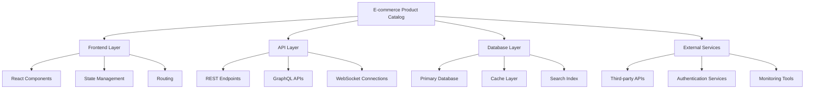

# Integration Requirements: E-commerce Product Catalog

## Context
Advanced product catalog with search, filtering, and recommendation engine

## Overview
System integration and compatibility requirements for E-commerce Product Catalog, ensuring seamless operation within the existing ecosystem and future scalability.

## Integration Architecture

### System Landscape


### Integration Points

#### Frontend Integration
1. **Component Integration**
   - **Location**: [COMPONENT_INTEGRATION_PATH]
   - **Dependencies**: [FRONTEND_DEPENDENCIES]
   - **Integration Method**: [INTEGRATION_APPROACH]
   - **State Management**: [STATE_INTEGRATION]

2. **Routing Integration**
   - **Route Structure**: [ROUTE_DEFINITIONS]
   - **Navigation Flow**: [NAV_INTEGRATION]
   - **Guard Conditions**: [ROUTE_GUARDS]
   - **Lazy Loading**: [LAZY_LOAD_STRATEGY]

3. **State Management Integration**
   - **Store Structure**: [STORE_INTEGRATION]
   - **Action Definitions**: [ACTION_INTEGRATION]
   - **Reducer Integration**: [REDUCER_INTEGRATION]
   - **Middleware Usage**: [MIDDLEWARE_INTEGRATION]

#### Backend Integration
1. **API Endpoints**
   ```typescript
   // API integration points
   const apiIntegration = {
     endpoints: {
       [ENDPOINT_1]: {
         method: '[HTTP_METHOD]',
         path: '[ENDPOINT_PATH]',
         integration: '[INTEGRATION_TYPE]',
         dependencies: '[ENDPOINT_DEPENDENCIES]'
       },
       [ENDPOINT_2]: {
         method: '[HTTP_METHOD]',
         path: '[ENDPOINT_PATH]',
         integration: '[INTEGRATION_TYPE]',
         dependencies: '[ENDPOINT_DEPENDENCIES]'
       }
     }
   };
   ```

2. **Database Integration**
   - **Schema Changes**: [SCHEMA_MODIFICATIONS]
   - **Migration Strategy**: [MIGRATION_APPROACH]
   - **Index Requirements**: [INDEX_STRATEGY]
   - **Relationship Management**: [RELATIONSHIP_HANDLING]

3. **Service Layer Integration**
   - **Business Logic Integration**: [SERVICE_INTEGRATION]
   - **Transaction Management**: [TRANSACTION_STRATEGY]
   - **Event Handling**: [EVENT_INTEGRATION]
   - **Cache Integration**: [CACHE_STRATEGY]

## External Service Integration

### Third-Party APIs

#### [EXTERNAL_SERVICE_1]
- **Purpose**: [SERVICE_PURPOSE_1]
- **Integration Type**: [INTEGRATION_TYPE_1]
- **Authentication**: [AUTH_METHOD_1]
- **Rate Limits**: [RATE_LIMIT_1]
- **Fallback Strategy**: [FALLBACK_1]

```typescript
// Service integration configuration
const [SERVICE_1]Config = {
  baseUrl: '[SERVICE_BASE_URL]',
  apiKey: process.env.[API_KEY_ENV_VAR],
  timeout: [TIMEOUT_VALUE],
  retryAttempts: [RETRY_COUNT],
  rateLimits: {
    requestsPerMinute: [RATE_LIMIT],
    burstLimit: [BURST_LIMIT]
  }
};
```

#### [EXTERNAL_SERVICE_2]
- **Purpose**: [SERVICE_PURPOSE_2]
- **Integration Type**: [INTEGRATION_TYPE_2]
- **Authentication**: [AUTH_METHOD_2]
- **Rate Limits**: [RATE_LIMIT_2]
- **Fallback Strategy**: [FALLBACK_2]

#### [EXTERNAL_SERVICE_3]
- **Purpose**: [SERVICE_PURPOSE_3]
- **Integration Type**: [INTEGRATION_TYPE_3]
- **Authentication**: [AUTH_METHOD_3]
- **Rate Limits**: [RATE_LIMIT_3]
- **Fallback Strategy**: [FALLBACK_3]

### Authentication & Authorization Integration

#### Identity Provider Integration
```typescript
// Authentication integration
const authIntegration = {
  provider: '[AUTH_PROVIDER]',
  configuration: {
    clientId: '[CLIENT_ID]',
    domain: '[AUTH_DOMAIN]',
    audience: '[API_AUDIENCE]',
    scopes: '[REQUIRED_SCOPES]'
  },
  tokenManagement: {
    storage: '[TOKEN_STORAGE]',
    refreshStrategy: '[REFRESH_STRATEGY]',
    expiration: '[TOKEN_EXPIRATION]'
  }
};
```

#### Role-Based Access Control
- **Permission Model**: [PERMISSION_STRUCTURE]
- **Role Definitions**: [ROLE_DEFINITIONS]
- **Resource Access**: [RESOURCE_ACCESS_RULES]
- **Integration Points**: [RBAC_INTEGRATION_POINTS]

## Data Integration

### Data Flow Architecture
```typescript
// Data flow configuration
const dataFlow = {
  sources: {
    [DATA_SOURCE_1]: {
      type: '[SOURCE_TYPE]',
      format: '[DATA_FORMAT]',
      frequency: '[UPDATE_FREQUENCY]',
      transformation: '[TRANSFORM_RULES]'
    },
    [DATA_SOURCE_2]: {
      type: '[SOURCE_TYPE]',
      format: '[DATA_FORMAT]',
      frequency: '[UPDATE_FREQUENCY]',
      transformation: '[TRANSFORM_RULES]'
    }
  },
  destinations: {
    [DATA_DESTINATION_1]: {
      type: '[DEST_TYPE]',
      format: '[OUTPUT_FORMAT]',
      schedule: '[SYNC_SCHEDULE]'
    }
  }
};
```

### Database Integration Strategy

#### Schema Integration
```sql
-- Database schema integration
CREATE TABLE [INTEGRATION_TABLE] (
  id [ID_TYPE] PRIMARY KEY,
  [FIELD_1] [TYPE_1] [CONSTRAINTS_1],
  [FIELD_2] [TYPE_2] [CONSTRAINTS_2],
  [FIELD_3] [TYPE_3] [CONSTRAINTS_3],

  -- Foreign key relationships
  FOREIGN KEY ([FK_FIELD]) REFERENCES [REFERENCE_TABLE]([REF_FIELD]),

  -- Indexes for performance
  INDEX idx_[INDEX_NAME] ([INDEXED_FIELDS])
);
```

#### Data Migration Strategy
1. **Migration Planning**
   - [ ] Data inventory and mapping
   - [ ] Migration sequence definition
   - [ ] Rollback procedure design
   - [ ] Data validation rules

2. **Migration Execution**
   ```sql
   -- Migration script template
   BEGIN TRANSACTION;

   -- Pre-migration validation
   [PRE_MIGRATION_CHECKS]

   -- Data transformation
   [DATA_TRANSFORMATION_QUERIES]

   -- Post-migration validation
   [POST_MIGRATION_VALIDATION]

   -- Commit or rollback based on validation
   [COMMIT_OR_ROLLBACK_LOGIC]
   ```

3. **Data Validation**
   - [ ] Row count verification
   - [ ] Data integrity checks
   - [ ] Referential integrity validation
   - [ ] Business rule compliance

### Cache Integration

#### Caching Strategy
```typescript
// Cache integration configuration
const cacheIntegration = {
  layers: {
    application: {
      provider: '[CACHE_PROVIDER]',
      ttl: [TTL_SECONDS],
      keys: '[KEY_PATTERN]',
      eviction: '[EVICTION_POLICY]'
    },
    database: {
      provider: '[DB_CACHE_PROVIDER]',
      strategy: '[CACHING_STRATEGY]',
      invalidation: '[INVALIDATION_RULES]'
    }
  },
  patterns: {
    cacheAside: '[CACHE_ASIDE_IMPLEMENTATION]',
    writeThrough: '[WRITE_THROUGH_IMPLEMENTATION]',
    writeBack: '[WRITE_BACK_IMPLEMENTATION]'
  }
};
```

## Event-Driven Integration

### Event Architecture
```typescript
// Event-driven integration
const eventIntegration = {
  eventBus: {
    provider: '[EVENT_BUS_PROVIDER]',
    configuration: '[EVENT_BUS_CONFIG]',
    topics: '[EVENT_TOPICS]'
  },
  publishers: {
    [PUBLISHER_1]: {
      events: '[PUBLISHED_EVENTS]',
      schema: '[EVENT_SCHEMA]',
      routing: '[ROUTING_RULES]'
    }
  },
  subscribers: {
    [SUBSCRIBER_1]: {
      events: '[SUBSCRIBED_EVENTS]',
      handler: '[EVENT_HANDLER]',
      errorHandling: '[ERROR_STRATEGY]'
    }
  }
};
```

### Event Definitions
1. **[EVENT_TYPE_1]**
   - **Schema**: [EVENT_SCHEMA_1]
   - **Producers**: [EVENT_PRODUCERS_1]
   - **Consumers**: [EVENT_CONSUMERS_1]
   - **Processing Rules**: [PROCESSING_RULES_1]

2. **[EVENT_TYPE_2]**
   - **Schema**: [EVENT_SCHEMA_2]
   - **Producers**: [EVENT_PRODUCERS_2]
   - **Consumers**: [EVENT_CONSUMERS_2]
   - **Processing Rules**: [PROCESSING_RULES_2]

3. **[EVENT_TYPE_3]**
   - **Schema**: [EVENT_SCHEMA_3]
   - **Producers**: [EVENT_PRODUCERS_3]
   - **Consumers**: [EVENT_CONSUMERS_3]
   - **Processing Rules**: [PROCESSING_RULES_3]

## API Integration Specifications

### REST API Integration
```typescript
// REST API integration client
class [API_CLIENT_NAME] {
  private baseUrl: string = '[API_BASE_URL]';
  private headers: HeadersInit = {
    'Content-Type': 'application/json',
    'Authorization': `Bearer ${[TOKEN_SOURCE]}`
  };

  async [METHOD_NAME]([PARAMETERS]): Promise<[RETURN_TYPE]> {
    const response = await fetch(`${this.baseUrl}/[ENDPOINT]`, {
      method: '[HTTP_METHOD]',
      headers: this.headers,
      body: JSON.stringify([REQUEST_BODY])
    });

    if (!response.ok) {
      throw new Error(`[API_ERROR_PREFIX]: ${response.statusText}`);
    }

    return response.json();
  }
}
```

### GraphQL Integration
```typescript
// GraphQL integration
const [GRAPHQL_CLIENT] = {
  queries: {
    [QUERY_NAME]: gql`
      query [QUERY_NAME]([QUERY_PARAMETERS]) {
        [QUERY_FIELDS]
      }
    `,
  },
  mutations: {
    [MUTATION_NAME]: gql`
      mutation [MUTATION_NAME]([MUTATION_PARAMETERS]) {
        [MUTATION_FIELDS]
      }
    `,
  },
  subscriptions: {
    [SUBSCRIPTION_NAME]: gql`
      subscription [SUBSCRIPTION_NAME]([SUBSCRIPTION_PARAMETERS]) {
        [SUBSCRIPTION_FIELDS]
      }
    `,
  }
};
```

### WebSocket Integration
```typescript
// WebSocket integration
class [WEBSOCKET_CLIENT] {
  private ws: WebSocket;
  private reconnectAttempts: number = 0;
  private maxReconnectAttempts: number = [MAX_RECONNECT];

  connect(): void {
    this.ws = new WebSocket('[WEBSOCKET_URL]');

    this.ws.onopen = () => {
      console.log('[WEBSOCKET_CONNECTED]');
      this.reconnectAttempts = 0;
    };

    this.ws.onmessage = (event) => {
      this.handleMessage(JSON.parse(event.data));
    };

    this.ws.onclose = () => {
      this.handleReconnection();
    };

    this.ws.onerror = (error) => {
      console.error('[WEBSOCKET_ERROR]:', error);
    };
  }

  private handleMessage(message: [MESSAGE_TYPE]): void {
    // Message handling logic
  }

  private handleReconnection(): void {
    if (this.reconnectAttempts < this.maxReconnectAttempts) {
      setTimeout(() => {
        this.reconnectAttempts++;
        this.connect();
      }, [RECONNECT_DELAY] * this.reconnectAttempts);
    }
  }
}
```

## Compatibility Requirements

### Browser Compatibility
- **Minimum Supported Versions**:
  - Chrome: [CHROME_VERSION]+
  - Firefox: [FIREFOX_VERSION]+
  - Safari: [SAFARI_VERSION]+
  - Edge: [EDGE_VERSION]+

- **Polyfills Required**:
  - [ ] [POLYFILL_1]: For [FEATURE_1] support
  - [ ] [POLYFILL_2]: For [FEATURE_2] support
  - [ ] [POLYFILL_3]: For [FEATURE_3] support

### Platform Compatibility
- **Operating Systems**:
  - [ ] Windows [WINDOWS_VERSIONS]
  - [ ] macOS [MACOS_VERSIONS]
  - [ ] Linux [LINUX_DISTRIBUTIONS]

- **Mobile Platforms**:
  - [ ] iOS [IOS_VERSIONS]
  - [ ] Android [ANDROID_VERSIONS]

### Technology Stack Compatibility
```typescript
// Technology compatibility matrix
const compatibilityMatrix = {
  framework: {
    react: '[REACT_VERSION_RANGE]',
    nextjs: '[NEXTJS_VERSION_RANGE]',
    typescript: '[TS_VERSION_RANGE]'
  },
  database: {
    postgresql: '[PG_VERSION_RANGE]',
    redis: '[REDIS_VERSION_RANGE]'
  },
  runtime: {
    nodejs: '[NODE_VERSION_RANGE]',
    npm: '[NPM_VERSION_RANGE]'
  }
};
```

## Security Integration

### Security Requirements
1. **Authentication Security**
   - [ ] JWT token validation
   - [ ] Session management
   - [ ] Multi-factor authentication support
   - [ ] Single sign-on integration

2. **Authorization Security**
   - [ ] Role-based access control
   - [ ] Resource-level permissions
   - [ ] API endpoint protection
   - [ ] Data access restrictions

3. **Data Security**
   - [ ] Encryption in transit (TLS 1.3)
   - [ ] Encryption at rest
   - [ ] PII data protection
   - [ ] Audit logging

### Security Integration Points
```typescript
// Security middleware integration
const securityMiddleware = {
  authentication: {
    provider: '[AUTH_PROVIDER]',
    validation: '[TOKEN_VALIDATION]',
    refresh: '[TOKEN_REFRESH]'
  },
  authorization: {
    rbac: '[RBAC_IMPLEMENTATION]',
    permissions: '[PERMISSION_CHECK]',
    resources: '[RESOURCE_PROTECTION]'
  },
  encryption: {
    transit: '[TLS_CONFIG]',
    rest: '[ENCRYPTION_CONFIG]',
    keys: '[KEY_MANAGEMENT]'
  }
};
```

## Performance Integration

### Performance Requirements
- **Response Time Targets**:
  - API endpoints: < [API_RESPONSE_TIME]ms
  - Database queries: < [DB_QUERY_TIME]ms
  - Page load time: < [PAGE_LOAD_TIME]ms
  - Time to interactive: < [TTI_TIME]ms

- **Throughput Targets**:
  - Concurrent users: [CONCURRENT_USERS]
  - Requests per second: [RPS_TARGET]
  - Database connections: [DB_CONNECTIONS]

### Performance Optimization Integration
```typescript
// Performance optimization configuration
const performanceConfig = {
  caching: {
    browser: '[BROWSER_CACHE_CONFIG]',
    cdn: '[CDN_CONFIG]',
    application: '[APP_CACHE_CONFIG]'
  },
  optimization: {
    bundling: '[BUNDLE_OPTIMIZATION]',
    compression: '[COMPRESSION_CONFIG]',
    minification: '[MINIFICATION_CONFIG]'
  },
  monitoring: {
    metrics: '[PERFORMANCE_METRICS]',
    alerts: '[PERFORMANCE_ALERTS]',
    dashboards: '[MONITORING_DASHBOARDS]'
  }
};
```

## Monitoring & Observability Integration

### Monitoring Stack Integration
```typescript
// Monitoring integration
const monitoringIntegration = {
  logging: {
    provider: '[LOGGING_PROVIDER]',
    levels: '[LOG_LEVELS]',
    aggregation: '[LOG_AGGREGATION]'
  },
  metrics: {
    provider: '[METRICS_PROVIDER]',
    collection: '[METRICS_COLLECTION]',
    visualization: '[METRICS_DASHBOARD]'
  },
  tracing: {
    provider: '[TRACING_PROVIDER]',
    sampling: '[TRACE_SAMPLING]',
    correlation: '[TRACE_CORRELATION]'
  },
  alerting: {
    provider: '[ALERTING_PROVIDER]',
    rules: '[ALERT_RULES]',
    channels: '[NOTIFICATION_CHANNELS]'
  }
};
```

### Health Check Integration
```typescript
// Health check endpoints
const healthChecks = {
  liveness: {
    endpoint: '/health/live',
    checks: '[LIVENESS_CHECKS]'
  },
  readiness: {
    endpoint: '/health/ready',
    checks: '[READINESS_CHECKS]'
  },
  dependencies: {
    database: '[DB_HEALTH_CHECK]',
    cache: '[CACHE_HEALTH_CHECK]',
    externalServices: '[EXTERNAL_SERVICE_CHECKS]'
  }
};
```

## Deployment Integration

### CI/CD Pipeline Integration
```yaml
# Deployment integration pipeline
deployment_integration:
  stages:
    - build:
        - Compile TypeScript
        - Bundle assets
        - Run tests
        - Generate artifacts

    - integration_tests:
        - Database migrations
        - Service integration tests
        - API contract tests
        - Performance benchmarks

    - deployment:
        - Blue-green deployment
        - Health check validation
        - Rollback procedures
        - Monitoring activation

  environments:
    development:
      database: '[DEV_DB_CONFIG]'
      services: '[DEV_SERVICES_CONFIG]'
      monitoring: '[DEV_MONITORING_CONFIG]'

    staging:
      database: '[STAGING_DB_CONFIG]'
      services: '[STAGING_SERVICES_CONFIG]'
      monitoring: '[STAGING_MONITORING_CONFIG]'

    production:
      database: '[PROD_DB_CONFIG]'
      services: '[PROD_SERVICES_CONFIG]'
      monitoring: '[PROD_MONITORING_CONFIG]'
```

### Environment Configuration
```typescript
// Environment-specific integration
const environmentConfig = {
  development: {
    apiUrl: '[DEV_API_URL]',
    database: '[DEV_DB_URL]',
    cache: '[DEV_CACHE_URL]',
    monitoring: '[DEV_MONITORING_CONFIG]'
  },
  staging: {
    apiUrl: '[STAGING_API_URL]',
    database: '[STAGING_DB_URL]',
    cache: '[STAGING_CACHE_URL]',
    monitoring: '[STAGING_MONITORING_CONFIG]'
  },
  production: {
    apiUrl: '[PROD_API_URL]',
    database: '[PROD_DB_URL]',
    cache: '[PROD_CACHE_URL]',
    monitoring: '[PROD_MONITORING_CONFIG]'
  }
};
```

## Risk Assessment & Mitigation

### Integration Risks
| Risk Category | Risk Description | Impact | Probability | Mitigation Strategy |
|---------------|------------------|--------|-------------|-------------------|
| [RISK_CATEGORY_1] | [RISK_DESC_1] | [IMPACT_1] | [PROB_1] | [MITIGATION_1] |
| [RISK_CATEGORY_2] | [RISK_DESC_2] | [IMPACT_2] | [PROB_2] | [MITIGATION_2] |
| [RISK_CATEGORY_3] | [RISK_DESC_3] | [IMPACT_3] | [PROB_3] | [MITIGATION_3] |

### Contingency Planning
1. **Service Degradation**
   - **Trigger**: [DEGRADATION_TRIGGER]
   - **Response**: [DEGRADATION_RESPONSE]
   - **Recovery**: [RECOVERY_PROCEDURE]

2. **Data Loss Prevention**
   - **Backup Strategy**: [BACKUP_STRATEGY]
   - **Recovery Procedures**: [RECOVERY_PROCEDURES]
   - **Data Validation**: [VALIDATION_PROCEDURES]

3. **Security Incidents**
   - **Detection**: [INCIDENT_DETECTION]
   - **Response**: [INCIDENT_RESPONSE]
   - **Communication**: [COMMUNICATION_PLAN]

## Testing & Validation

### Integration Testing Strategy
- [ ] Unit integration tests
- [ ] API integration tests
- [ ] Database integration tests
- [ ] End-to-end integration tests
- [ ] Performance integration tests
- [ ] Security integration tests

### Validation Criteria
1. **Functional Validation**
   - [ ] All integration points working correctly
   - [ ] Data flow validation
   - [ ] Error handling verification
   - [ ] Performance requirements met

2. **Non-Functional Validation**
   - [ ] Security controls working
   - [ ] Monitoring and alerting active
   - [ ] Backup and recovery tested
   - [ ] Scalability requirements met

---

**Template Version**: 2.0.0
**Last Updated**: 2025-09-29
**Integration Review Date**: [REVIEW_DATE]