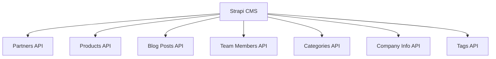

# Data Flow Diagram - Phase 1.2

## Overview
Visual representation of how data flows through the Next.js application from sources to presentation.

**Generated**: 2025-08-25  
**Analysis Scope**: Data sources, transformation pipelines, validation rules, presentation patterns

---

## Data Flow Architecture

```
[Data Sources] → [API Layer] → [Service Layer] → [Component Layer] → [Presentation]
       ↓              ↓             ↓               ↓               ↓
   Static Files   Strapi CMS   Cache/Transform   React Props    UI Components
  Legacy JSON      REST API     Data Service    Type Safety      User Interface
```

---

## 1. Data Sources

### Primary Sources

#### Strapi CMS (Production)
- **Endpoint**: `http://localhost:1337/api`
- **Authentication**: None (public content)
- **Content Types**: 7 collection types + 1 single type
- **Real-time**: No (static generation)



#### Legacy Data File (Fallback/Development)
- **Location**: `/superyacht_technology_research.json`
- **Size**: ~18 partners, ~36 products
- **Format**: Nested JSON structure
- **Usage**: Development and migration reference

### Secondary Sources

#### Environment Variables
- `STRAPI_API_URL` - Production Strapi endpoint
- `NEXT_PUBLIC_STRAPI_API_URL` - Client-side Strapi endpoint

---

## 2. API Layer (`/lib/strapi-client.ts`)

### Request Flow
```
Client Request → StrapiClient.request() → Strapi API → Response Processing → Type Conversion
```

### Key Methods and Data Transformation

#### Partners Flow
```typescript
getPartners(params?) → StrapiResponse<StrapiEntry[]> → Partner[]

Transformations:
- StrapiEntry.id (number) → Partner.id (string)
- attributes.category.data.attributes.name → category (string)
- attributes.tags.data[].attributes.name → tags (string[])
- attributes.slug || createSlug(name) → slug (string)
```

#### Products Flow  
```typescript
getProducts(params?) → StrapiResponse<StrapiEntry[]> → Product[]

Transformations:
- attributes.partner.data.id → partnerId (string)
- attributes.partner.data.attributes.name → partnerName (string)
- attributes.product_images.data[] → processProductImages() → images, mainImage
- attributes.features[].title → features (string[])
```

#### Image Processing Pipeline
```typescript
processProductImages(productImages[]) → { images: ProductImage[], mainImage?: ProductImage }

Logic:
1. Filter valid images (must have URL)
2. Transform Strapi structure to ProductImage interface
3. Identify main image (isMain: true or first image)
4. Return processed arrays
```

### Error Handling
```typescript
try {
  const response = await fetch(url)
  if (!response.ok) throw new Error(`Strapi API error: ${status}`)
  return await response.json()
} catch (error) {
  console.error('Request failed:', error)
  throw error // No fallbacks at this layer
}
```

---

## 3. Service Layer (`/lib/static-data-service.ts`)

### Caching Strategy
```typescript
Map<string, { data: T, timestamp: number }>
TTL: 5 minutes (300,000ms)
```

### Cache Flow
```
Request → Check Cache → [Hit: Return Cached] or [Miss: Fetch → Cache → Return]
```

### Data Processing Methods

#### Category Derivation (Blog Categories)
```typescript
getBlogCategories() → 
  getAllBlogPosts() → 
  Extract unique categories → 
  Generate Category objects with computed fields
```

#### Slug Generation Utilities
```typescript
getPartnerSlugs() → getAllPartners() → partners.map(p => p.slug).filter(Boolean)
getProductSlugs() → getAllProducts() → products.map(p => p.slug || p.id).filter(Boolean)  
getBlogPostSlugs() → getAllBlogPosts() → posts.map(p => p.slug).filter(Boolean)
```

#### Content Validation Pipeline
```typescript
validateCMSContent() → {
  1. Fetch all core data types
  2. Check required content exists (length > 0)
  3. Validate relationships (partnerId references)
  4. Check unique constraints (slug uniqueness)
  5. Return validation result
}
```

---

## 4. Component Data Flow

### Server Components (Static Generation)
```typescript
// Page Level
generateStaticParams() → Service Layer → Build-time Paths[]
Page Component → Service Layer → Static Props → Client Component

// Example: Partner Detail Page
generateStaticParams() → getAllPartners() → [{ slug: string }]
PartnerDetailPage() → getPartnerBySlug() → Partner → PartnerDetailClient
```

### Client Components (Runtime)
```typescript
// Props Flow
Server Props → Client Component → Local State → UI Updates

// Example: Products Client
ProductsClient({ initialProducts, initialCategories }) → 
  useState(products) → 
  Filtering Logic → 
  Pagination → 
  Render Product Cards
```

### Search and Filtering Pipeline
```typescript
// Search Flow  
User Input → searchQuery State → 
  Filter Logic (name/description contains) → 
  Filtered Results → 
  UI Update

// Category Filter
Category Selection → selectedCategory State →
  Filter Logic (category equals) → 
  Filtered Results →
  UI Update

// Combined Filters
Multiple Filters → useMemo(() => 
  Apply Search + Category + Partner filters
) → Filtered Results
```

---

## 5. Validation Rules

### Input Validation
```typescript
// URL Slug Generation
createSlug(name: string) → 
  toLowerCase() → 
  replace(/[^a-z0-9]+/g, '-') → 
  replace(/(^-|-$)/g, '')

// Required Field Validation
- All required fields checked at runtime
- TypeScript compile-time type checking
- Strapi schema validation at API level
```

### Business Logic Validation
```typescript
// ProductImage Main Image Logic  
processProductImages() → {
  const mainImage = images.find(img => img.isMain) || images[0]
  // Ensures there's always a main image if images exist
}

// Relationship Validation
validateCMSContent() → {
  const partnerIds = new Set(partners.map(p => p.id))
  const orphanedProducts = products.filter(p => 
    p.partnerId && !partnerIds.has(p.partnerId)
  )
  // Validates foreign key relationships
}
```

### Content Validation
```typescript
// CMS Content Validation
validateCMSContent() → Promise<{isValid: boolean, errors: string[]}> → {
  ✓ Partners count > 0
  ✓ Products count > 0  
  ✓ Categories count > 0
  ✓ All product.partnerId references exist
  ✓ All slugs are unique
  ✓ No business rule violations
}
```

---

## 6. Presentation Patterns

### Static Site Generation (SSG)
```typescript
// Build Time
generateStaticParams() → API Calls → Static Paths
getStaticProps() → API Calls → Static Props → HTML Generation

// Runtime  
Pre-generated HTML → Hydration → Interactive Components
```

### Component Patterns

#### List Display Pattern
```typescript
// Used by: Partners, Products, Blog Posts
Server Component → Fetch All Items → 
  Pass to Client Component → 
  Local State Management → 
  Filtering/Search → 
  Pagination → 
  Grid Display
```

#### Detail Display Pattern  
```typescript
// Used by: Partner Detail, Product Detail, Blog Post Detail
generateStaticParams() → All Item Slugs →
  Detail Page(slug) → Fetch Item by Slug →
  Pass to Client Component → 
  Display Details + Related Items
```

#### Feature Display Pattern
```typescript
// Used by: Featured Partners, Featured Blog Posts
Homepage → Fetch Featured Items →
  Limited Display (6 items) →
  "View All" Link → 
  Full Listing Page
```

---

## 7. Error Handling Patterns

### Service Layer Errors
```typescript
// Static Data Service (Build Time)
try {
  return await strapiClient.getMethod()
} catch (error) {
  throw new Error(`Static build failed: Unable to fetch ${type} from Strapi CMS`)
  // No fallbacks - build should fail if CMS unavailable
}
```

### Component Error Boundaries
```typescript
// Client Component Error States
if (!data || data.length === 0) {
  return <div>No {type} found. Please check back later.</div>
}

// Loading States  
const [loading, setLoading] = useState(false)
if (loading) return <Skeleton />
```

### Validation Error Handling
```typescript
// CMS Validation Errors
const { isValid, errors } = await validateCMSContent()
if (!isValid) {
  console.error('❌ CMS validation errors:', errors)
  // Log errors but continue with available data
}
```

---

## 8. Performance Optimization

### Caching Strategy
```typescript
// Service Layer Cache
- In-memory Map cache
- 5-minute TTL  
- Per-request caching
- Cache key includes parameters

// Next.js Build Cache
- Static generation at build time
- Pre-rendered HTML pages
- Incremental Static Regeneration (if enabled)
```

### Data Loading Optimization
```typescript
// Parallel Loading
Promise.all([
  getPartners(),
  getProducts(), 
  getCategories()
]) // Load related data concurrently

// Selective Loading
getPartners({ featured: true }) // Only load what's needed
getProducts({ category: 'Navigation' }) // Filter at API level
```

### Image Optimization
```typescript
// ProductImage Processing
processProductImages() → {
  1. Filter valid images only
  2. Identify main image efficiently  
  3. Provide fallback logic
  4. Support multiple formats
}

// Next.js Image Component
<Image 
  src={image.url}
  alt={image.altText || product.name}
  width={400} 
  height={300}
  loading="lazy" // Automatic lazy loading
/>
```

---

## 9. Data Transformation Summary

### Key Transformations

#### Strapi → Application Types
1. **ID Conversion**: `number` → `string`
2. **Nested Attributes**: `entry.attributes.field` → `field`  
3. **Relation Resolution**: `relation.data.attributes.name` → `name`
4. **Array Processing**: `tags.data[].attributes.name` → `string[]`
5. **Computed Fields**: Generate `slug`, `mainImage`, `partnerName`

#### Business Logic Transformations
1. **Slug Generation**: `name` → URL-safe string
2. **Image Processing**: Multiple images → main image selection
3. **Category Derivation**: Blog posts → unique categories
4. **Validation Rules**: Data consistency checks

#### Presentation Transformations
1. **Filtering**: Search queries → filtered datasets
2. **Pagination**: Large datasets → paginated views  
3. **Sorting**: Various criteria → ordered displays
4. **Formatting**: Raw data → display-ready content

---

## Next Steps: Phase 2 Analysis

This data flow analysis reveals:

1. **Well-structured pipeline** from CMS to presentation
2. **Robust error handling** at each layer
3. **Efficient caching** and validation systems
4. **Clear separation of concerns** between layers
5. **Strong type safety** throughout the flow

**Recommendation**: Proceed to Phase 2 (Relationship Mapping) to design optimal Strapi content architecture based on this data flow understanding.