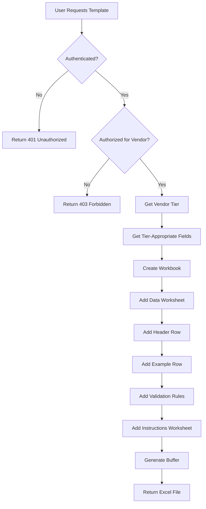
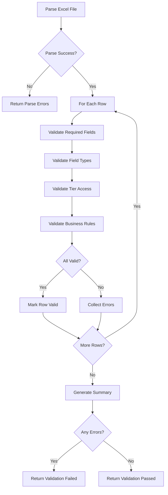
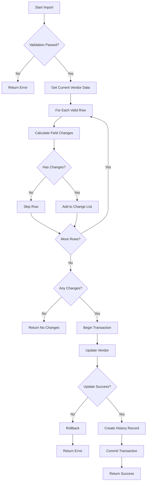

# Excel Import/Export Architecture Documentation

This document provides technical architecture details for the Excel Vendor Import/Export feature.

## Table of Contents

1. [System Overview](#system-overview)
2. [Architecture Layers](#architecture-layers)
3. [Component Interactions](#component-interactions)
4. [Data Flow Diagrams](#data-flow-diagrams)
5. [Service Layer Architecture](#service-layer-architecture)
6. [Database Schema](#database-schema)
7. [Security Architecture](#security-architecture)
8. [Integration Points](#integration-points)
9. [Performance Considerations](#performance-considerations)
10. [Error Handling Strategy](#error-handling-strategy)
11. [Testing Strategy](#testing-strategy)

---

## System Overview

The Excel Import/Export system enables vendors to manage their profile data through Excel files with comprehensive validation, preview, and audit capabilities.

### Key Design Principles

1. **Tier-Based Access**: Field availability determined by subscription tier
2. **Two-Phase Import**: Preview validation before commit
3. **Atomic Operations**: All-or-nothing import execution with rollback
4. **Comprehensive Audit**: Complete history of all imports
5. **Security First**: Authorization checks at every layer
6. **User-Friendly**: Clear validation messages and error handling

### Technology Stack

- **Frontend**: React components with TypeScript
- **Backend**: Next.js API routes with TypeScript
- **Database**: Payload CMS (SQLite dev / PostgreSQL prod)
- **Excel Processing**: ExcelJS library
- **Validation**: Custom validation service with configurable rules
- **Authentication**: JWT-based custom auth system

---

## Architecture Layers

```
┌─────────────────────────────────────────────────────────────┐
│                     PRESENTATION LAYER                       │
│  ┌─────────────────────────────────────────────────────┐   │
│  │  ExcelImportCard  │  ExcelExportCard  │  ImportHistoryCard  │
│  │  ExcelPreviewDialog                                 │   │
│  └─────────────────────────────────────────────────────┘   │
└─────────────────────────────────────────────────────────────┘
                            ↕
┌─────────────────────────────────────────────────────────────┐
│                        API LAYER                             │
│  ┌─────────────────────────────────────────────────────┐   │
│  │  /api/portal/vendors/[id]/excel-template     (GET)  │   │
│  │  /api/portal/vendors/[id]/excel-export       (GET)  │   │
│  │  /api/portal/vendors/[id]/excel-import       (POST) │   │
│  │  /api/portal/vendors/[id]/import-history     (GET)  │   │
│  └─────────────────────────────────────────────────────┘   │
└─────────────────────────────────────────────────────────────┘
                            ↕
┌─────────────────────────────────────────────────────────────┐
│                      SERVICE LAYER                           │
│  ┌─────────────────────────────────────────────────────┐   │
│  │  ExcelTemplateService  │  ExcelExportService        │   │
│  │  ExcelParserService    │  ImportValidationService   │   │
│  │  ImportExecutionService│  VendorProfileService      │   │
│  │  TierService          │  AuthService               │   │
│  └─────────────────────────────────────────────────────┘   │
└─────────────────────────────────────────────────────────────┘
                            ↕
┌─────────────────────────────────────────────────────────────┐
│                     DATA ACCESS LAYER                        │
│  ┌─────────────────────────────────────────────────────┐   │
│  │  Payload CMS API                                    │   │
│  │  - vendors collection                               │   │
│  │  - import_history collection                        │   │
│  │  - users collection                                 │   │
│  └─────────────────────────────────────────────────────┘   │
└─────────────────────────────────────────────────────────────┘
                            ↕
┌─────────────────────────────────────────────────────────────┐
│                     DATABASE LAYER                           │
│  ┌─────────────────────────────────────────────────────┐   │
│  │  SQLite (development) / PostgreSQL (production)     │   │
│  └─────────────────────────────────────────────────────┘   │
└─────────────────────────────────────────────────────────────┘
```

---

## Component Interactions

### Template Download Flow

```
User                ExcelExportCard      API Route           ExcelTemplateService    Payload
  │                       │                  │                       │                  │
  │ Click Download        │                  │                       │                  │
  │─────────────────────>│                  │                       │                  │
  │                       │ GET /excel-template                     │                  │
  │                       │─────────────────>│                       │                  │
  │                       │                  │ Authenticate          │                  │
  │                       │                  │────────────────────────────────────────>│
  │                       │                  │ Get vendor (tier)     │                  │
  │                       │                  │────────────────────────────────────────>│
  │                       │                  │<────────────────────────────────────────│
  │                       │                  │ generateTemplate(tier)│                  │
  │                       │                  │──────────────────────>│                  │
  │                       │                  │                       │ Create workbook  │
  │                       │                  │                       │ Add headers      │
  │                       │                  │                       │ Add examples     │
  │                       │                  │                       │ Add validation   │
  │                       │                  │                       │ Add instructions │
  │                       │                  │<──────────────────────│                  │
  │                       │ Excel Buffer     │                       │                  │
  │                       │<─────────────────│                       │                  │
  │ Download file         │                  │                       │                  │
  │<─────────────────────│                  │                       │                  │
```

### Export Data Flow

```
User                ExcelExportCard      API Route           ExcelExportService      Payload
  │                       │                  │                       │                  │
  │ Click Export          │                  │                       │                  │
  │─────────────────────>│                  │                       │                  │
  │                       │ GET /excel-export                       │                  │
  │                       │─────────────────>│                       │                  │
  │                       │                  │ Authenticate          │                  │
  │                       │                  │────────────────────────────────────────>│
  │                       │                  │ Get vendor data       │                  │
  │                       │                  │────────────────────────────────────────>│
  │                       │                  │<────────────────────────────────────────│
  │                       │                  │ exportVendor(data, tier)                │
  │                       │                  │──────────────────────>│                  │
  │                       │                  │                       │ Create workbook  │
  │                       │                  │                       │ Add metadata     │
  │                       │                  │                       │ Add headers      │
  │                       │                  │                       │ Add data rows    │
  │                       │                  │                       │ Apply formatting │
  │                       │                  │<──────────────────────│                  │
  │                       │ Excel Buffer     │                       │                  │
  │                       │<─────────────────│                       │                  │
  │ Download file         │                  │                       │                  │
  │<─────────────────────│                  │                       │                  │
```

### Import Data Flow (Two-Phase)

```
User         ExcelImportCard    API Route    Parser    Validator   Executor    Payload
  │                │                │            │          │           │           │
  │ Upload File    │                │            │          │           │           │
  │───────────────>│                │            │          │           │           │
  │                │ POST /excel-import?phase=preview      │           │           │
  │                │───────────────>│            │          │           │           │
  │                │                │ parse()    │          │           │           │
  │                │                │───────────>│          │           │           │
  │                │                │ ParseResult│          │           │           │
  │                │                │<───────────│          │           │           │
  │                │                │ validate() │          │           │           │
  │                │                │────────────────────>│           │           │
  │                │                │ ValidationResult     │           │           │
  │                │                │<────────────────────│           │           │
  │                │ Preview Result │            │          │           │           │
  │                │<───────────────│            │          │           │           │
  │ Review Preview │                │            │          │           │           │
  │<───────────────│                │            │          │           │           │
  │ Confirm Import │                │            │          │           │           │
  │───────────────>│                │            │          │           │           │
  │                │ POST /excel-import?phase=execute      │           │           │
  │                │───────────────>│            │          │           │           │
  │                │                │ (Re-parse & validate)│           │           │
  │                │                │ execute()  │          │           │           │
  │                │                │──────────────────────────────────>│           │
  │                │                │            │          │ Get vendor│           │
  │                │                │            │          │───────────────────────>│
  │                │                │            │          │<───────────────────────│
  │                │                │            │          │ Calculate changes      │
  │                │                │            │          │ Update vendor          │
  │                │                │            │          │───────────────────────>│
  │                │                │            │          │<───────────────────────│
  │                │                │            │          │ Create history         │
  │                │                │            │          │───────────────────────>│
  │                │                │            │          │<───────────────────────│
  │                │ Import Result  │            │          │           │           │
  │                │<───────────────│            │          │           │           │
  │ Success!       │                │            │          │           │           │
  │<───────────────│                │            │          │           │           │
```

---

## Data Flow Diagrams

### Template Generation Flow



### Import Validation Flow



### Import Execution Flow



---

## Service Layer Architecture

### ExcelTemplateService

**Responsibility**: Generate tier-appropriate Excel import templates

**Key Methods**:
- `generateTemplate(tier)`: Create complete workbook
- `createDataWorksheet()`: Add data sheet with headers/examples
- `createInstructionsWorksheet()`: Add usage instructions
- `applyDataValidation()`: Add Excel validation rules
- `generateFilename()`: Create download filename

**Dependencies**:
- Field mappings configuration
- ExcelJS library

### ExcelParserService

**Responsibility**: Parse uploaded Excel files into structured data

**Key Methods**:
- `parse(buffer, tier, filename)`: Main parsing method
- `validateFile()`: Check file size/type
- `parseHeaderRow()`: Map columns to fields
- `parseDataRow()`: Extract row data
- `getCellValue()`: Handle cell value extraction

**Dependencies**:
- Field mappings configuration
- ExcelJS library

**Output**: `ParseResult` with rows, errors, warnings, metadata

### ExcelExportService

**Responsibility**: Export vendor data to Excel format

**Key Methods**:
- `exportVendor(vendor, tier, options)`: Export single vendor
- `exportVendors(vendors, tier, options)`: Export multiple vendors
- `addMetadataSection()`: Add export metadata
- `addHeaderRow()`: Create formatted headers
- `addDataRow()`: Add vendor data
- `formatColumns()`: Apply formatting

**Dependencies**:
- Field mappings configuration
- ExcelJS library
- Vendor type definitions

### ImportValidationService

**Responsibility**: Validate parsed data against business rules

**Key Methods**:
- `validate(rows, tier, vendorId)`: Main validation method
- `validateRow()`: Validate single row
- `validateRequiredFields()`: Check required fields
- `validateTierAccess()`: Verify tier permissions
- `validateField()`: Validate individual field
- `validateEmail()`, `validateURL()`, etc.: Type-specific validation

**Dependencies**:
- Field mappings configuration
- ParseResult from ExcelParserService

**Output**: `ValidationResult` with row-by-row validation details

### ImportExecutionService

**Responsibility**: Execute validated imports with atomic operations

**Key Methods**:
- `execute(validatedRows, options)`: Main execution method
- `processRow()`: Process single row
- `calculateChanges()`: Determine what changed
- `createImportHistory()`: Log import results
- `preview()`: Dry-run mode

**Dependencies**:
- Payload CMS API
- ValidationResult from ImportValidationService

**Features**:
- Atomic operations (all-or-nothing)
- Rollback on error
- Change tracking
- Audit logging

---

## Database Schema

### import_history Collection

Payload CMS collection definition:

```typescript
{
  slug: 'import_history',
  fields: [
    {
      name: 'vendor',
      type: 'relationship',
      relationTo: 'vendors',
      required: true,
      index: true
    },
    {
      name: 'user',
      type: 'relationship',
      relationTo: 'users',
      required: true
    },
    {
      name: 'importDate',
      type: 'date',
      required: true,
      index: true,
      defaultValue: () => new Date().toISOString()
    },
    {
      name: 'status',
      type: 'select',
      required: true,
      options: [
        { label: 'Success', value: 'success' },
        { label: 'Partial', value: 'partial' },
        { label: 'Failed', value: 'failed' }
      ],
      index: true
    },
    {
      name: 'rowsProcessed',
      type: 'number',
      required: true,
      min: 0
    },
    {
      name: 'successfulRows',
      type: 'number',
      required: true,
      min: 0
    },
    {
      name: 'failedRows',
      type: 'number',
      required: true,
      min: 0
    },
    {
      name: 'filename',
      type: 'text',
      required: true
    },
    {
      name: 'changes',
      type: 'json',
      required: false
    },
    {
      name: 'errors',
      type: 'json',
      required: false
    }
  ],
  timestamps: true,
  access: {
    read: ({ req: { user } }) => {
      if (user?.role === 'admin') return true;
      return {
        vendor: {
          equals: user?.vendorId
        }
      };
    },
    create: () => false, // Only system can create
    update: () => false, // Immutable
    delete: ({ req: { user } }) => user?.role === 'admin'
  }
}
```

### Database Indexes

**Recommended Indexes**:
```sql
-- For vendor history queries
CREATE INDEX idx_import_history_vendor ON import_history(vendor);

-- For date range queries
CREATE INDEX idx_import_history_date ON import_history(importDate);

-- For status filtering
CREATE INDEX idx_import_history_status ON import_history(status);

-- For composite queries
CREATE INDEX idx_import_history_vendor_date
  ON import_history(vendor, importDate DESC);
```

### Storage Considerations

**Average Record Size**: ~2KB
- Vendor ID: 36 bytes
- User ID: 36 bytes
- Dates: 50 bytes
- Status: 20 bytes
- Counts: 12 bytes
- Filename: 100 bytes
- Changes JSON: ~1KB (varies)
- Errors JSON: ~500 bytes (varies)

**Storage Growth**:
- 100 imports/day = ~200KB/day = ~73MB/year
- 1000 imports/day = ~2MB/day = ~730MB/year

---

## Security Architecture

### Authentication Layer

```
┌─────────────────────────────────────────────────┐
│         AUTHENTICATION MIDDLEWARE                │
│  ┌───────────────────────────────────────────┐ │
│  │  1. Extract token (Bearer or cookie)      │ │
│  │  2. Validate JWT signature                │ │
│  │  3. Check expiration                      │ │
│  │  4. Extract user context                  │ │
│  └───────────────────────────────────────────┘ │
└─────────────────────────────────────────────────┘
                      ↓
┌─────────────────────────────────────────────────┐
│          AUTHORIZATION LAYER                     │
│  ┌───────────────────────────────────────────┐ │
│  │  1. Check vendor ownership                │ │
│  │     user.vendorId === vendor.id           │ │
│  │  2. OR check admin role                   │ │
│  │     user.role === 'admin'                 │ │
│  │  3. Check tier access                     │ │
│  │     TierService.hasAccess()               │ │
│  └───────────────────────────────────────────┘ │
└─────────────────────────────────────────────────┘
                      ↓
┌─────────────────────────────────────────────────┐
│          VALIDATION LAYER                        │
│  ┌───────────────────────────────────────────┐ │
│  │  1. File type/size validation             │ │
│  │  2. Data format validation                │ │
│  │  3. Business rule validation              │ │
│  │  4. Tier-based field access validation    │ │
│  └───────────────────────────────────────────┘ │
└─────────────────────────────────────────────────┘
```

### Security Controls

**Authentication**:
- JWT tokens with 1-hour expiration
- Refresh tokens with 7-day expiration
- HTTPS required for production

**Authorization**:
- Vendor ownership verification
- Admin role checking
- Tier-based access control

**Input Validation**:
- File size limits (5MB max)
- File type whitelist (.xlsx, .xls)
- Data type validation
- SQL injection prevention (Payload ORM)
- XSS prevention (data sanitization)

**Rate Limiting** (planned):
- 100 template downloads per hour per vendor
- 20 import attempts per hour per vendor
- 1000 history queries per day per vendor

---

## Integration Points

### Payload CMS Integration

**Collections Used**:
- `vendors`: Source of vendor data
- `users`: Authentication and authorization
- `import_history`: Audit trail storage

**API Methods**:
```typescript
// Read vendor data
await payload.findByID({ collection: 'vendors', id: vendorId });

// Update vendor data
await payload.update({
  collection: 'vendors',
  id: vendorId,
  data: updateData
});

// Create import history
await payload.create({
  collection: 'import_history',
  data: historyRecord
});

// Query import history
await payload.find({
  collection: 'import_history',
  where: { vendor: { equals: vendorId } },
  sort: '-importDate'
});
```

### Field Mappings Integration

**Configuration File**: `/lib/config/excel-field-mappings.ts`

**Functions Used**:
- `getImportableFieldsForTier(tier)`: Get fields vendor can import
- `getExportableFieldsForTier(tier)`: Get fields vendor can export
- `getFieldMapping(fieldName)`: Get field configuration
- `hasFieldAccess(tier, fieldName)`: Check tier access

**Field Mapping Structure**:
```typescript
interface FieldMapping {
  fieldName: string;           // Database field name
  excelColumn: string;         // Excel column header
  accessLevel: VendorTier;     // Minimum tier required
  dataType: FieldDataType;     // Data type
  required: boolean;           // Required field?
  maxLength?: number;          // Max text length
  minValue?: number;           // Min number value
  maxValue?: number;           // Max number value
  allowedValues?: string[];    // Enum values
  description?: string;        // Field description
  example?: string;            // Example value
  importTransform?: (value: string) => any;  // Import transformation
  exportTransform?: (value: any) => string;  // Export transformation
  customValidator?: (value: any) => string | null;  // Custom validation
}
```

### Vendor Profile Service Integration

Used for vendor data access with built-in authorization:

```typescript
// Get vendor with authorization check
const vendor = await VendorProfileService.getVendorForEdit(
  vendorId,
  userId,
  isAdmin
);
```

### Tier Service Integration

Used for tier-based access control:

```typescript
// Check if vendor has sufficient tier
const hasAccess = TierService.isTierOrHigher(
  vendor.tier,
  'tier2'
);

// Get tier features
const features = TierService.getTierFeatures(vendor.tier);
```

---

## Performance Considerations

### Template Generation

**Performance**: ~50-100ms for typical template
**Optimization**:
- Template structure cached in memory
- Field mappings pre-computed
- Minimal database queries (1 query for vendor tier)

### Data Export

**Performance**: ~100-500ms depending on data size
**Optimization**:
- Single vendor query with all needed data
- Streaming buffer generation
- Efficient ExcelJS usage

### File Parsing

**Performance**: ~200-1000ms depending on file size
**Bottlenecks**:
- Large files (near 5MB limit)
- Many rows (100+ rows)
- Complex cell formulas

**Optimization**:
- Stream-based parsing (ExcelJS)
- Early validation (fail fast)
- Minimal memory footprint

### Data Validation

**Performance**: ~50-200ms per 100 rows
**Optimization**:
- Parallel field validation
- Cached field mappings
- Optimized regex patterns

### Import Execution

**Performance**: ~500-2000ms depending on changes
**Bottlenecks**:
- Database transaction time
- History record creation
- Many field updates

**Optimization**:
- Batch updates where possible
- Single transaction for atomicity
- Efficient change calculation

### Database Queries

**Query Performance**:
- Vendor lookup: ~10ms (indexed)
- History insert: ~20ms
- History query (paginated): ~50ms (indexed)

**Optimization**:
- Proper indexes on foreign keys
- Index on importDate for sorting
- Limit result sets with pagination

---

## Error Handling Strategy

### Error Categories

1. **Client Errors (4xx)**
   - Authentication failures (401)
   - Authorization failures (403)
   - Validation errors (400)
   - Not found errors (404)

2. **Server Errors (5xx)**
   - Database errors (500)
   - File system errors (500)
   - Unexpected exceptions (500)

### Error Response Format

```typescript
interface ErrorResponse {
  error: string;           // Human-readable error message
  details?: string;        // Technical details (dev mode only)
  code?: string;           // Machine-readable error code
  field?: string;          // Field that caused error (validation)
  suggestion?: string;     // How to fix error
}
```

### Error Handling Layers

**Layer 1: Input Validation**
- File size/type validation
- Authentication/authorization
- Query parameter validation

**Layer 2: Business Logic**
- Data parsing errors
- Validation rule violations
- Tier access violations

**Layer 3: Data Access**
- Database connection errors
- Query errors
- Transaction failures

**Layer 4: System**
- Out of memory
- Timeout errors
- Unexpected exceptions

### Rollback Strategy

**Import Execution Rollback**:
```typescript
try {
  // Start transaction (implicit in Payload)
  const updatedVendor = await payload.update({
    collection: 'vendors',
    id: vendorId,
    data: changes
  });

  // Create history record
  await payload.create({
    collection: 'import_history',
    data: historyRecord
  });

  // Commit (implicit)
  return success;
} catch (error) {
  // Automatic rollback (Payload handles this)
  return error;
}
```

---

## Testing Strategy

### Unit Tests

**Services Testing**:
```typescript
describe('ExcelTemplateService', () => {
  test('generates valid template for tier 2');
  test('includes tier-appropriate fields only');
  test('adds validation rules correctly');
  test('creates instructions worksheet');
});

describe('ExcelParserService', () => {
  test('parses valid Excel file');
  test('handles missing columns');
  test('extracts row data correctly');
  test('detects empty rows');
});

describe('ImportValidationService', () => {
  test('validates required fields');
  test('validates data types');
  test('validates tier access');
  test('validates email format');
  test('validates URL format');
});

describe('ImportExecutionService', () => {
  test('executes successful import');
  test('creates import history');
  test('calculates changes correctly');
  test('handles rollback on error');
});
```

### Integration Tests

**API Routes Testing**:
```typescript
describe('POST /api/portal/vendors/[id]/excel-import', () => {
  test('preview phase returns validation results');
  test('execute phase updates vendor data');
  test('requires authentication');
  test('requires authorization');
  test('requires tier 2+');
  test('handles file upload');
  test('validates file size');
  test('validates file type');
});
```

### E2E Tests

**User Workflows**:
```typescript
describe('Excel Import Workflow', () => {
  test('download template → edit → upload → preview → import');
  test('export data → edit → re-import');
  test('validation error → fix → re-import');
  test('view import history');
});
```

### Performance Tests

**Load Testing**:
- 100 concurrent template downloads
- 50 concurrent exports
- 20 concurrent imports
- Large file imports (4.9MB)
- Many-row imports (1000 rows)

### Security Tests

**Penetration Testing**:
- Authentication bypass attempts
- Authorization escalation attempts
- SQL injection attempts
- XSS attempts
- File upload exploits
- Large file DoS attacks

---

## Future Enhancements

### Planned Features

1. **Batch Operations**
   - Import multiple vendors at once (admin only)
   - Schedule imports
   - Recurring imports

2. **Advanced Validation**
   - External data validation (check URLs, verify emails)
   - Duplicate detection across vendors
   - Data quality scoring

3. **Import Templates**
   - Save/load field mappings
   - Custom column ordering
   - Pre-filled templates

4. **Webhook Integration**
   - Notify on import completion
   - Integrate with external systems
   - Trigger workflows

5. **Advanced Reporting**
   - Import analytics dashboard
   - Data quality metrics
   - Trend analysis

### Performance Improvements

1. **Caching**
   - Cache vendor tier lookups
   - Cache field mappings
   - Redis for session data

2. **Async Processing**
   - Queue large imports
   - Background processing
   - Progress notifications

3. **Database Optimization**
   - Additional indexes
   - Query optimization
   - Connection pooling

---

## Maintenance and Operations

### Monitoring

**Key Metrics**:
- Import success rate
- Average import duration
- Error rates by type
- File size distribution
- Tier usage distribution

**Alerts**:
- Error rate > 10%
- Import duration > 10 seconds
- Failed imports > 5 per hour
- Database connection issues

### Logging

**Log Levels**:
- ERROR: Import failures, system errors
- WARN: Validation warnings, performance issues
- INFO: Successful imports, user actions
- DEBUG: Detailed execution flow (dev only)

**Log Format**:
```json
{
  "timestamp": "2025-11-07T14:30:00Z",
  "level": "INFO",
  "action": "import_execute",
  "vendorId": "vendor_123",
  "userId": "user_456",
  "status": "success",
  "rowsProcessed": 1,
  "duration": 1234
}
```

### Backup and Recovery

**Data Backup**:
- Import history backed up daily
- Vendor data backed up hourly
- Retention: 90 days

**Disaster Recovery**:
- Import history can be regenerated from database backups
- Vendor data primary source of truth
- No file storage to recover (files not retained)

---

**Last Updated**: 2025-11-07
**Architecture Version**: 1.0
**System Version**: Next.js 14 + Payload CMS 2.x
