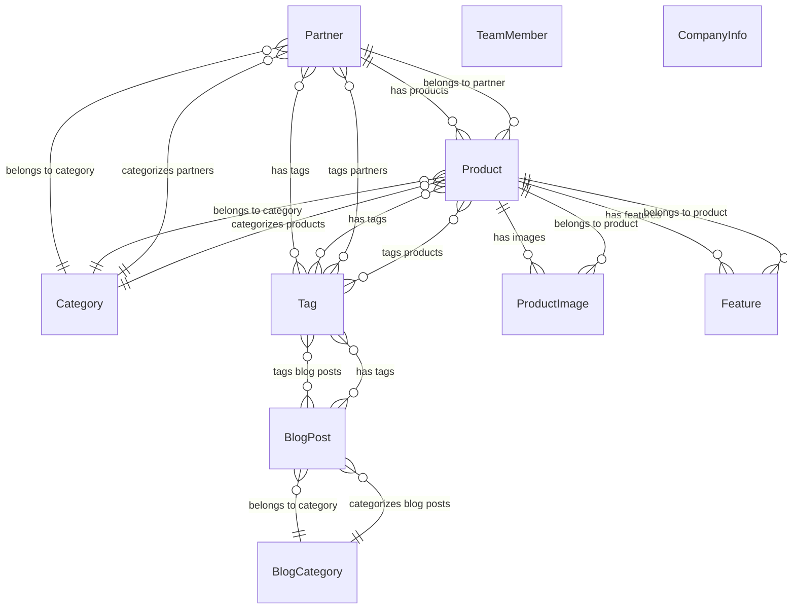

# Relationship Diagram - Phase 2.1

## Overview
Comprehensive mapping of all relationships between data types for optimal Strapi content architecture design.

**Generated**: 2025-08-25  
**Phase**: 2.1 - Relationship Mapping  
**Purpose**: Define all relationships, cardinalities, and junction requirements

---

## Entity Relationship Diagram



---

## 1. Primary Relationships

### 1.1 Partner ↔ Product (One-to-Many)
```yaml
Relationship Type: One-to-Many
Parent: Partner
Child: Product
Implementation: Foreign Key

Details:
  - Field: Product.partnerId → Partner.id
  - Cardinality: One Partner can have Many Products (0..*)
  - Cascade: Restrict (cannot delete Partner with Products)
  - Index: Required on Product.partnerId for performance
  
Strapi Configuration:
  - Partner: hasMany products (via partnerId)
  - Product: belongsTo partner (via partnerId)
  - Relation Type: oneToMany / manyToOne
```

### 1.2 Product ↔ ProductImage (One-to-Many Component)
```yaml
Relationship Type: One-to-Many (Component)
Parent: Product  
Child: ProductImage
Implementation: Strapi Component (Repeatable)

Details:
  - Field: Product.images: ProductImage[]
  - Cardinality: One Product can have Many ProductImages (1..*)
  - Cascade: Delete (ProductImages deleted with Product)
  - Business Rule: Only one image can have isMain: true
  
Strapi Configuration:
  - Product: component field "product_images" (repeatable)
  - ProductImage: component definition
  - Component Type: Repeatable Component
```

### 1.3 Product ↔ Feature (One-to-Many Component)
```yaml
Relationship Type: One-to-Many (Component)
Parent: Product
Child: Feature  
Implementation: Strapi Component (Repeatable)

Details:
  - Field: Product.features: Feature[]
  - Cardinality: One Product can have Many Features (1..*)
  - Cascade: Delete (Features deleted with Product)
  - Current Implementation: String array (needs componentization)
  
Strapi Configuration:
  - Product: component field "features" (repeatable)
  - Feature: component definition with title/description
  - Component Type: Repeatable Component
```

---

## 2. Categorical Relationships

### 2.1 Category ↔ Partners (One-to-Many)
```yaml
Relationship Type: One-to-Many
Parent: Category
Child: Partner
Implementation: String Reference (current) → Relation (recommended)

Details:
  - Current: Partner.category: string → Category.name
  - Recommended: Partner.category → Category relation
  - Cardinality: One Category can have Many Partners (0..*)
  - Examples: "Navigation Systems", "Propulsion Systems"
  
Strapi Configuration:
  - Category: hasMany partners
  - Partner: belongsTo category  
  - Relation Type: oneToMany / manyToOne
```

### 2.2 Category ↔ Products (One-to-Many)
```yaml
Relationship Type: One-to-Many  
Parent: Category
Child: Product
Implementation: String Reference (current) → Relation (recommended)

Details:
  - Current: Product.category: string → Category.name
  - Recommended: Product.category → Category relation
  - Cardinality: One Category can have Many Products (0..*)
  - Note: Products inherit partner's category but can differ
  
Strapi Configuration:
  - Category: hasMany products
  - Product: belongsTo category
  - Relation Type: oneToMany / manyToOne
```

### 2.3 BlogCategory ↔ BlogPosts (One-to-Many)
```yaml
Relationship Type: One-to-Many
Parent: BlogCategory  
Child: BlogPost
Implementation: String Reference (current) → Relation (recommended)

Details:
  - Current: BlogPost.category: string → BlogCategory.name
  - Recommended: BlogPost.category → BlogCategory relation  
  - Cardinality: One BlogCategory can have Many BlogPosts (0..*)
  - Separate from main Categories for content flexibility
  
Strapi Configuration:
  - BlogCategory: hasMany blog_posts
  - BlogPost: belongsTo blog_category
  - Relation Type: oneToMany / manyToOne
```

---

## 3. Tagging Relationships (Many-to-Many)

### 3.1 Tag ↔ Partners (Many-to-Many)
```yaml
Relationship Type: Many-to-Many
Entity A: Tag
Entity B: Partner  
Implementation: String Array (current) → Relation (recommended)

Details:
  - Current: Partner.tags: string[] → Tag.name[]
  - Recommended: Partner ↔ Tag relation table
  - Cardinality: Many Tags can belong to Many Partners
  - Examples: ["IoT", "Marine", "Navigation", "Radar"]
  
Strapi Configuration:
  - Tag: belongsToMany partners
  - Partner: belongsToMany tags
  - Relation Type: manyToMany
  - Junction Table: partners_tags_links (auto-generated)
```

### 3.2 Tag ↔ Products (Many-to-Many)  
```yaml
Relationship Type: Many-to-Many
Entity A: Tag
Entity B: Product
Implementation: String Array (current) → Relation (recommended)

Details:
  - Current: Product.tags: string[] → Tag.name[]
  - Recommended: Product ↔ Tag relation table
  - Cardinality: Many Tags can belong to Many Products
  - Inheritance: May inherit some tags from Partner
  
Strapi Configuration:
  - Tag: belongsToMany products  
  - Product: belongsToMany tags
  - Relation Type: manyToMany
  - Junction Table: products_tags_links (auto-generated)
```

### 3.3 Tag ↔ BlogPosts (Many-to-Many)
```yaml
Relationship Type: Many-to-Many
Entity A: Tag  
Entity B: BlogPost
Implementation: String Array (current) → Relation (recommended)

Details:
  - Current: BlogPost.tags: string[] → Tag.name[]
  - Recommended: BlogPost ↔ Tag relation table
  - Cardinality: Many Tags can belong to Many BlogPosts
  - Shared tags across Partners, Products, and BlogPosts
  
Strapi Configuration:
  - Tag: belongsToMany blog_posts
  - BlogPost: belongsToMany tags  
  - Relation Type: manyToMany
  - Junction Table: blog_posts_tags_links (auto-generated)
```

---

## 4. Standalone Entities

### 4.1 TeamMember (No Relations)
```yaml
Relationship Type: None
Entity: TeamMember
Implementation: Standalone Collection Type

Details:
  - No foreign key relationships
  - Self-contained entity
  - Simple collection type
  - May add relations in future (e.g., departments, roles)
  
Strapi Configuration:
  - Collection Type: team_members
  - No relation fields
  - Standard CRUD operations
```

### 4.2 CompanyInfo (Single Type)
```yaml  
Relationship Type: None
Entity: CompanyInfo
Implementation: Strapi Single Type

Details:
  - Single instance only (not collection)
  - No relationships with other entities
  - Company-wide settings/information
  - Unique Strapi single type
  
Strapi Configuration:
  - Single Type: company_info
  - No relation fields
  - Only one instance allowed
```

---

## 5. Relationship Implementation Analysis

### Current Implementation Issues
```yaml
String References vs Relations:
  Issue: Using string references instead of proper relations
  Examples:
    - Partner.category: string (should be Category relation)
    - Product.category: string (should be Category relation)  
    - BlogPost.category: string (should be BlogCategory relation)
    - *.tags: string[] (should be Tag relations)
    
  Problems:
    - No referential integrity
    - Manual string matching required
    - No cascade operations
    - Harder to maintain data consistency
    - Limited query capabilities
```

### Recommended Strapi Relations
```yaml
Migration Path:
  1. Create proper relation fields in Strapi
  2. Migrate string data to relation references  
  3. Update TypeScript interfaces
  4. Update API client transformation logic
  5. Update validation rules
  
Benefits:
  - Referential integrity
  - Better query performance
  - Automatic cascade operations
  - Admin UI relationship management
  - GraphQL query optimization
```

---

## 6. Junction Tables (Auto-Generated by Strapi)

### 6.1 partners_tags_links
```sql
CREATE TABLE partners_tags_links (
  id INT PRIMARY KEY AUTO_INCREMENT,
  partner_id INT NOT NULL,
  tag_id INT NOT NULL,
  partner_order DOUBLE,
  tag_order DOUBLE,
  FOREIGN KEY (partner_id) REFERENCES partners(id) ON DELETE CASCADE,
  FOREIGN KEY (tag_id) REFERENCES tags(id) ON DELETE CASCADE,
  UNIQUE KEY unique_partner_tag (partner_id, tag_id)
);
```

### 6.2 products_tags_links  
```sql
CREATE TABLE products_tags_links (
  id INT PRIMARY KEY AUTO_INCREMENT,
  product_id INT NOT NULL,
  tag_id INT NOT NULL,
  product_order DOUBLE,
  tag_order DOUBLE,
  FOREIGN KEY (product_id) REFERENCES products(id) ON DELETE CASCADE,
  FOREIGN KEY (tag_id) REFERENCES tags(id) ON DELETE CASCADE,
  UNIQUE KEY unique_product_tag (product_id, tag_id)
);
```

### 6.3 blog_posts_tags_links
```sql
CREATE TABLE blog_posts_tags_links (
  id INT PRIMARY KEY AUTO_INCREMENT,
  blog_post_id INT NOT NULL,
  tag_id INT NOT NULL,
  blog_post_order DOUBLE,
  tag_order DOUBLE,
  FOREIGN KEY (blog_post_id) REFERENCES blog_posts(id) ON DELETE CASCADE,
  FOREIGN KEY (tag_id) REFERENCES tags(id) ON DELETE CASCADE,
  UNIQUE KEY unique_blog_post_tag (blog_post_id, tag_id)
);
```

---

## 7. Cardinality Summary

| Relationship | Type | Parent | Child | Cardinality | Implementation |
|-------------|------|---------|-------|-------------|---------------|
| Partner → Products | 1:M | Partner | Product | 1:0..* | FK: Product.partnerId |
| Product → Images | 1:M | Product | ProductImage | 1:1..* | Component |
| Product → Features | 1:M | Product | Feature | 1:1..* | Component |
| Category → Partners | 1:M | Category | Partner | 1:0..* | FK: Partner.categoryId |
| Category → Products | 1:M | Category | Product | 1:0..* | FK: Product.categoryId |
| BlogCategory → Posts | 1:M | BlogCategory | BlogPost | 1:0..* | FK: BlogPost.categoryId |
| Tag ↔ Partners | M:M | Tag | Partner | *:* | Junction Table |
| Tag ↔ Products | M:M | Tag | Product | *:* | Junction Table |
| Tag ↔ BlogPosts | M:M | Tag | BlogPost | *:* | Junction Table |

---

## 8. Circular Dependencies Analysis

### Potential Circular Dependencies
```yaml
None Detected:
  - No circular foreign key references
  - No circular component relationships
  - Clean hierarchical structure
  
Dependency Chain:
  Category → Partner → Product → ProductImage ✓
  BlogCategory → BlogPost ↔ Tag ✓
  Tag ↔ Multiple Entities (no cycles) ✓
```

### Dependency Resolution
```yaml
Loading Order for Static Generation:
  1. Categories (no dependencies)
  2. BlogCategories (no dependencies)  
  3. Tags (no dependencies)
  4. Partners (depends on Categories)
  5. Products (depends on Partners, Categories)
  6. BlogPosts (depends on BlogCategories, Tags)
  7. TeamMembers (no dependencies)
  8. CompanyInfo (no dependencies)
```

---

## 9. Relationship Performance Considerations

### Query Optimization
```yaml
Required Indexes:
  - Product.partnerId (FK index)
  - Partner.categoryId (FK index - when migrated)
  - Product.categoryId (FK index - when migrated)
  - BlogPost.categoryId (FK index - when migrated)
  - All junction table foreign keys (auto-indexed)

Query Patterns:
  - Partners with their Products: JOIN query
  - Products with Images: Component population
  - Content by Category: FK filter
  - Content by Tags: Junction table JOIN
```

### Strapi Population
```yaml
Common Population Patterns:
  Partners: populate=category,tags,products
  Products: populate=partner,category,tags,product_images.image
  BlogPosts: populate=blog_category,tags
  
Performance Impact:
  - Deep population increases response time
  - Consider selective population based on use case
  - Use pagination for large collections
```

---

## 10. Migration Strategy

### Phase 1: Create Relation Structure
```yaml
1. Create new relation fields in Strapi:
   - Partner.category → Category relation
   - Product.category → Category relation  
   - BlogPost.blog_category → BlogCategory relation
   - All tag relations

2. Keep existing string fields temporarily
3. Create proper Category/Tag entities if missing
```

### Phase 2: Data Migration
```yaml
1. Populate relation fields from string data
2. Verify data integrity  
3. Update API client transformation logic
4. Update TypeScript interfaces
5. Test all relationship queries
```

### Phase 3: Cleanup
```yaml
1. Remove old string fields
2. Update validation rules
3. Update documentation
4. Remove legacy transformation code
```

---

## Next Phase: Content Architecture Design

The relationship analysis reveals:

1. **8 primary relationships** need proper Strapi configuration
2. **3 many-to-many relationships** require junction tables
3. **5 string references** should become proper relations
4. **Clean dependency structure** with no circular references
5. **Performance optimization** opportunities identified

**Recommendation**: Proceed to Phase 2.2 (Content Architecture Design) to design optimal Strapi content type structure based on this relationship mapping.